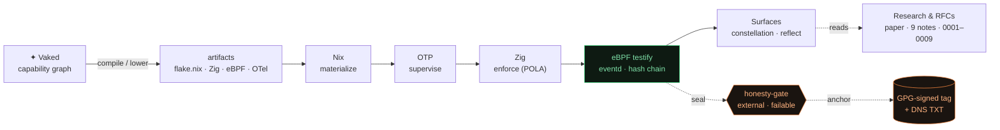

  <h1 align="center">✦ vaked-base</h1>
  <b>Capability-graph language and deterministic runtime for autonomous agent swarms — where honesty is kernel-enforced, externally anchored, and published, failures included.</b>  
  <a href="https://vaked.dev"><code>vaked.dev</code></a> ·
  <a href="https://vaked-lang.org"><code>vaked-lang.org</code></a> ·
  <a href="https://constellation.vaked.dev"><code>constellation.vaked.dev</code></a> 
  <code>Vaked declares · Nix materializes · OTP supervises · Zig enforces · eBPF testifies · CrabCC indexes · Surfaces reveal</code>

  
  
  
  
  

  <a href="https://constellation.vaked.dev/">⬡ Constellation</a> ·
  <a href="https://constellation.vaked.dev/radio">◉ Radio</a> ·
  <a href="https://constellation.vaked.dev/wisdom">✦ Wisdom</a> ·
  <a href="https://constellation.vaked.dev/status">◇ Status</a> ·
  <a href="https://constellation.vaked.dev/reflect">🔍 Reflect</a> ·
  <a href="https://constellation.vaked.dev/nav">⬡ All</a>

**Genesis Seal:** <code>7c242080f5f821e5eaf563fe2208d60632c451687baf65f4fe8e4a0d226e3ecf</code>
(published in DNS TXT at `vaked-genesis-seal.vaked.dev`, anchored by a GPG-signed `seals-anchor-*` tag)

---

## ✦ The idea in one line

Most systems **assert** trust. Vaked **measures** it — and when its own instrumentation
once lied, the swarm caught itself, published the catch, and built a gate that turns red
on a falsehood. *The self cannot see itself; the verifier must live outside the verified,
and it must be able to fail.*

## 🕸 System at a glance

## 🧭 Research & Mastery Index

> The thinking is the product. Everything here is grounded, cited, and — where it's a
> claim about the running system — externally verifiable.

**📄 Paper** — [`paper/`](paper/) · *Vaked Genesis 2026* (IEEE, 7 sections, 14 citations, dual peer review) → [PDF](https://vaked.dev/research/vaked_genesis_2026.pdf)

**🔬 Research notes** — [`docs/research/`](docs/research/)
- [Capability attenuation in multi-agent LLMs](docs/research/2026-06-14-capability-attenuation-multi-agent-llm.md) — attenuation as a *partial order*
- [Prior art: durable runtimes & capability graphs](docs/research/2026-06-14-prior-art-durable-runtime-capability-graph.md)
- [Multi-model author↔reviewer loops](docs/research/2026-06-14-multimodel-author-reviewer-loops.md)
- [How Vaked works, layer by layer](docs/research/2026-06-14-how-vaked-works-layer-by-layer.md)
- [**External anchoring vs tamper-with-reseal**](docs/research/2026-06-18-external-anchoring.md) — signed tags · Sigstore/Rekor · in-toto · TUF · SLSA *(14 cited sources)*
- [On-chain vs transparency-log anchoring](docs/research/2026-06-18-onchain-vs-translog.md) — when Ethereum actually wins (rarely)
- [Verifiable AI claims](docs/research/2026-06-18-verifiable-ai-claims.md) — integrity-of-record ≠ honesty-of-computation; TopLoc, ZKML, proof-of-inference

**📐 Protocol RFCs** — [`protocol/rfcs/`](protocol/rfcs/) — HCP/Litany 0001–0009 (framing · transport · multi-agent state · control frames · PQ-sealed image · workflow lowering · AIL register lang · ARP) + v0.9 bio-inspired: [free-energy](protocol/rfcs/rfc-v0.9-free-energy-principle.md) · [quorum-sensing](protocol/rfcs/rfc-v0.9-quorum-sensing.md) · [Maxwell's demon](protocol/rfcs/rfc-v0.9-maxwell-demon.md) · [stigmergy](protocol/rfcs/rfc-v0.9-stigmergy.md)

**🗣️ Language design series** — [`docs/language/`](docs/language/) — 29 design docs (`0001…0028`)

**✍️ Essays & deep-dives** — [`blog/posts/`](blog/posts/) — *The Mirror Can't See Itself* ([1](blog/posts/2026-06-18-mirror-part1-substrate-real.md)·[2](blog/posts/2026-06-18-mirror-part2-self-cannot-see-itself.md)·[3](blog/posts/2026-06-18-mirror-part3-gate-you-can-attack.md)) · [What I Learned Letting a Swarm Audit Itself](blog/posts/2026-06-18-what-i-learned-swarm-audit.md) · [Honest-Researcher whitepaper](blog/posts/2026-06-18-honest-researcher-whitepaper.md) · swarm-as-living-brain · bio-inspired mesh governance · thermodynamics of compute · stigmergy

**🔎 Audit trail** — [`the-honest-swarm-researcher/`](the-honest-swarm-researcher/) (`REPAIR_AUDIT.json`, consensus report) · [`docs/reports/`](docs/reports/) (Ceremony #2 re-audit · *The Self Cannot See Itself*)

## 💡 Conclusions worth keeping

| Finding | One line | Where |
|---------|----------|-------|
| **The doc-honesty bug class** | machine-correct ≠ doc-honest; *deployed ≠ measured* — a system can be right and still lie in what it reports | `REPAIR_AUDIT.json` |
| **The self cannot see itself** | you can't verify your own honesty from inside; the verifier must be external and *able to fail* | [Ceremony 2b](docs/reports/2026-06-18-ceremony2b-the-self-cannot-see-itself.md) |
| **Anchor, don't self-sign** | a seal the author can rewrite proves nothing; bind it to a key/log they don't control | [external-anchoring](docs/research/2026-06-18-external-anchoring.md) |
| **Capability = partial order** | attenuation composes as a lattice; POLA is enforced, not asked | [cap-attenuation](docs/research/2026-06-14-capability-attenuation-multi-agent-llm.md) |
| **Integrity-of-record ≠ honesty-of-compute** | a hash chain proves a transcript wasn't altered, not that the claim is true | [verifiable-ai-claims](docs/research/2026-06-18-verifiable-ai-claims.md) |
| **Route the tokens** | offload bulk to parallel cheap workers, keep only conclusions in the lead context | [what-i-learned](blog/posts/2026-06-18-what-i-learned-swarm-audit.md) |

## 🔧 Technical

**Language** — grammar v0.5, 32 kinds (`vaked/grammar/vaked-v0-plus.ebnf`): runtime, engine, host, network, filesystem, mcp, ebpf, budget, observability, runclass, workflow, index, catalog, stream, fiber, surface, mesh, device, mediaPipeline, parallel, schema, capability, service, secret, hostResource, ingress, container, memory, namespace, arp_event, **trust**, **quorum**, **probe**.

**Compilers** — `vakedc` (Python, stages 1–4: lex·parse·check·lower) · `vakedz` (Zig 0.16: parse|check|lower|all|cache).

**Runtime (L0–W stack)**

| Layer | Service | Port | Role |
|-------|---------|------|------|
| L0 | `vaked-genesis` (genesisd/) | :4433 | bootstrap anchor, SRV discovery |
| L2 | `meta-ralphd` | — | recursive observer, circuit breaker |
| S | `synapsed` | :4434 | P2P gossip, Merkle delta, Ed25519 |
| L3 | `sentinel` | — | trust scoring, truth-ping |
| G | `gateway` (gw.zig) | :8081 | Zig-native, systemd |
| M | `mnemosyne` | — | ancestry compactor |
| W | `wise-node` | — | engram strategist |

**Wire protocol** — HCP/Litany RFCs 0001–0009 · Capability-graph eBPF enforcement (`agent_guardd`) + append-only hash-chained ledger (`eventd`).

## 🌐 Mesh

6 nodes across 4 continents. *(IPs, exact cities, and PIDs are intentionally not published — node topology is not public data. Region + convergence only.)*

| Node | Region | Convergence |
|------|--------|-------------|
| genesis | EU-North | — |
| edge-02 | EU-Central | 136ms |
| nbg1 | EU-Central | 125ms |
| **par-01** | **EU-West** | **126ms** |
| us-west | US-West | 720ms |
| sin | APAC | 813ms |

## 📡 Public surface

`/` Constellation (force graph) · `/radio` Vaked-FM Pulse · `/wisdom` · `/status` · `/dogfeed` · `/bus` · `/nav` · `/reflect` · `/registry` · `/swarm-monologue` · `/rss` · `/donate` · `/monitor` · `/mesh.json`

## 📂 Structure

| Path | Purpose |
|------|---------|
| `vaked/` · `vakedc/` · `vakedz/` | language · Python front-end · Zig front-end |
| `gateway/` · `synapsed/` · `genesisd/` · `meta-ralphd/` | runtime daemons |
| `agent_guardd/` · `eventd/` | eBPF membrane · append-only ledger |
| `protocol/` · `docs/` · `paper/` | RFCs · design + research + website · the paper |
| `tools/` | orcli, zigfix, zigpush, wise, mnemosyne, librarian, **verify-seals.sh**, **reconcile-gate.py** |
| `oss/honesty-gate/` | **the honesty gate, extracted & MIT-licensed** |
| `vaked-agents/` | CI agent fleet (Rust) |
| `flake.nix` | dev shell + NixOS configs |

## 🐕 Agents

`pr-review` · `ralph` (track loop) · `nocturne` (nightly GPU researcher) · `docs-keeper` · `merge-train` · `swe_af` (OpenRouter, advisory, owner-gated) · `provost` · `social-post` · `label-tagger` · `landing-guru` · `Ralph Auditor` (G01–G04 build gate).

## 🔐 Governance

- **Honesty gate** — external, *failable* verification: [`tools/verify-seals.sh`](tools/verify-seals.sh) (recompute SHA-256 vs an external manifest, exit 1 on tamper; coverage + GPG-signed-tag anchor) + [`tools/reconcile-gate.py`](tools/reconcile-gate.py) (derive-don't-assert: open anomaly ⇒ no `zero_divergence` claim), run in CI by [`honesty-gate.yml`](.github/workflows/honesty-gate.yml). *The verifier is not the verified.* Open-sourced (MIT) → [`oss/honesty-gate/`](oss/honesty-gate/).
- **Graveyard** — permanent, append-only, never compacted.
- **Oculus Ledger** — SHA-256 hash-chained, append-only.
- **Ralph Auditor** — G01–G04 directives, Truth Threshold 2; blocks the build at 2+ critical drifts.
- **Genesis Seal** — DNS TXT at `vaked-genesis-seal.vaked.dev`, GPG-signed-tag anchored.

## 📐 Conventions

Grammar before code · protocol decisions live in RFCs · each subsystem gets design → plan → implementation · `nix develop` for toolchains · **no builds on the developer machine** (build target: `dev-cx53`) · agents are advisory and owner-gated; nothing auto-merges.

## 🔗 Links

[Swarm](https://constellation.vaked.dev) · [Radio](https://constellation.vaked.dev/radio) · [GitHub](https://github.com/peterlodri-sec/vaked-base) · [Paper](https://vaked.dev/research/vaked_genesis_2026.pdf)
