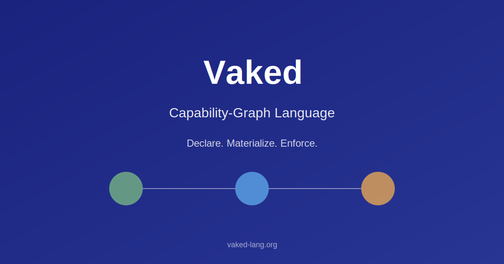

<p align="center">
  
</p>

<h1 align="center">vaked-base</h1>

<p align="center">
  <b>The foundation monorepo for the Vaked agentic-runtime ecosystem.</b><br>
  <code>✦ Vaked declares · ⚙ Nix materializes · ⏱ OTP supervises · ⚡ Zig enforces · 🔍 eBPF testifies · 🗂 CrabCC indexes · 🖥 Surfaces reveal</code>
</p>

<hr>

## 📰 Recent news

**2026-06-16 — Swarm deployed and public.** A global P2P mesh spans 3 continents
(EU, NA, APAC) running the Synapse gossip protocol — Ed25519‑signed packets,
Merkle‑tree delta sync, anti‑entropy loop with lowest‑hash‑wins conflict resolution.
The stack:

| Layer | Service | Role |
|-------|---------|------|
| **L0** | `genesisd` | Bootstrap anchor (`:4433`), SRV‑based node discovery |
| **L2** | `meta-ralphd` | Recursive observer, circuit breaker (3 restarts → Emergency Hold) |
| **S** | `synapsed` | P2P gossip (Merkle delta sync, UDP/TCP, Ed25519 signed) |
| **L3** | `sentinel` | Trust scoring, truth‑ping cross‑reference, DM channel alerts |
| **G** | `gateway` | WebSocket + REST gateway, Constellation UI, Caddy reverse proxy |
| **M** | `mnemosyne` | 24h ancestry compactor (56% ledger reduction) |
| **W** | `wise‑node` | Engram strategist — 12 heuristics, Node Happiness KPI, Two‑Strike Protocol |

Governance is bound: Node Happiness (latency < 50ms, gossip > 99%, load < 70%),
Two‑Strike Protocol (reconcile → quarantine → exclusion), Panic Threshold
(≥ 50% nodes unreachable → SYSTEM_PANIC), and the Graveyard log (empty = warning).

The Constellation is public at **`https://constellation.vaked.dev/`** — a live
Three.js force‑directed graph with WebSocket telemetry, strategic focus panel,
and real‑time convergence metrics. Cloudflare tunnel via HEL/AMS QUIC.

**2026-06-16 — Synapse P2P gossip protocol deployed.** Custom implementation
in Python (Zig production port planned): Merkle‑tree capability graph, UDP fast‑path
(2.2ms local convergence, 27ms intra‑EU, 88ms transatlantic), TCP anti‑entropy loop,
Ed25519 packet signing. Adaptive Batching triggered for links > 300ms RTT.

**2026-06-16 — Global mesh expansion: 5 nodes across 3 continents.**
`genesis.vaked.dev` (Helsinki), `edge‑node‑02` (Falkenstein), `edge‑nbg1‑01` (Nuremberg),
`edge‑us‑west‑01` (Hillsboro), `edge‑sin‑01` (Singapore). All P2P over Tailscale
with BBR congestion control, TCP Fast Open, and XDP/BPF gatekeeper at NIC level.

**2026-06-13 — `swe_af` runs for real.** The lowered `workflow swe_af`
(`agentfield-swe.vaked` → `gen/workflow/swe_af.json`) is now executable: label an
issue `agent` and a GitHub-Actions pipeline runs `plan → code → review → publish`,
opening an advisory PR with every node testified to an [`eventd`](eventd) hash chain. From the [PR disclaimer](https://github.com/peterlodri-sec/vaked-base/pull/107#issuecomment-4699358410):

> New **CI-triggered** and **cron-triggered** agents now run inside GitHub Actions on this repo, and a **self-hosted control plane on `crabcc.app`** is starting to get plugged into the same loop. […] Most of this work was one-shot […] by **Claude Code** […]. Where the sandbox kernel refused the cgroup-BPF attach, the daemon reports it and falls back to the reference datapath rather than faking in-kernel enforcement.

Peter's footnotes:

> _I asked for one vertical slice and got a kernel-eBPF spelunking expedition with a tamper-evident audit log — overdelivery is a hell of a drug._ (Peter)

> _The CI bots now peer-review each other while I supply the coffee and the occasional existential dread._ (Peter)

> _We declared a membrane, Nix materialized absolutely nothing yet, and it still passed CI — ship it._ (Peter)

Vaked is a flake-native **capability-graph language** for agentic, native, mesh-aware, parallel systems. It describes reproducible agent systems — runtime membranes, capability graphs, indexes, fibers, native surfaces, and mesh/device interactions — and compiles into ordinary Nix flakes, NixOS modules, Zig daemon configs, eBPF policy manifests, OpenTelemetry config, generated docs, and CrabCC indexes.

```text
Vaked source → typed semantic graph → generated artifacts
  ├── flake.nix / NixOS modules        (Nix materializes)
  ├── Zig daemon configs               (Zig enforces)
  ├── eBPF policy manifests            (eBPF testifies)
  ├── OTel collector config
  ├── CrabCC indexes / catalogs        (CrabCC indexes)
  └── docs
→ NixOS host → OTP supervision plane → Zig enforcement daemons → eBPF evidence → operator surfaces
```

## Repository map

| Path | Status | What lives here |
|------|--------|-----------------|
| `vaked/` | **language** | The Vaked language itself — `grammar/` (EBNF), `schema/`, `examples/` |
| `vakedc/` | **language** | `vakedc` — the prototype front-end: lexer + parser → Labeled Property Graph + type checker (0011 stages 1–4) + lowering (0012). Pipeline **parse → check → lower**: `python3 -m vakedc parse <file>`; `python3 -m vakedc check <file> [--json]`; `python3 -m vakedc lower <file> [--out DIR]` (checks first; refuses to emit on any diagnostic; writes `flake.nix`, `gen/…`, `provenance.json`) |
| `docs/language/` | **language** | Design series (`0001`-manifesto … `0008`-parallelism … `0010`-mirageos) + `references/` |
| `docs/context/` | **context** | `PROJECT_CONTEXT.md` — the canonical overview |
| `prompts/` | **context** | `dedicated-language-session.md` — kickoff prompt for the language-only session |
| `daemons/` | **runtime** (stub) | Roster of the OTP + Zig runtime daemons; per-daemon dirs land later |
| `eventd/` | **runtime** | Python reference impl of the append-only, hash-chained event log (the audit spine) |
| `agent_guardd/` | **runtime** | Python reference impl of `agent-guardd` — the `network`/`ebpf` membrane. Closes the first **end-to-end vertical slice**; see [`docs/runtime/agent-guardd.md`](docs/runtime/agent-guardd.md) |
| `docs/runtime/` | **runtime** (stub) | Runtime architecture + daemon responsibilities |
| `protocol/` | **protocol** (stub) | HCP / Litany wire protocol — `rfcs/`, daemon + tool roster |
| `docs/protocol/` | **protocol** (stub) | HCP / Litany overview |
| `vaked-agents/` | **agents** | The Vaked agent fleet — `ci/pr-review` (advisory CI reviewer); roadmap in [`vaked-agents/BACKLOG.md`](vaked-agents/BACKLOG.md). Fleet index: [`VAKED_AGENTS.md`](VAKED_AGENTS.md) |
| `tools/ralph/` | **tooling** | `ralph` — autonomous per-model decision loop over Vaked concept tracks (see [`tools/ralph/README.md`](tools/ralph/README.md)) |
| `hosts/` | infra | `vakedos` — the bare-metal NixOS **materialization target** (Vultr EPYC 4345P). Deploy guide: [`DEPLOY.md`](DEPLOY.md) |
| `flake.nix` | infra | Dev shell (Zig, BEAM/OTP, Rust-to-build-CrabCC, tooling) + `nixosConfigurations.vakedos` |
| `.mcp.json` | infra | Project MCP servers (github, context7, repowise, workspace-fs, playwright) |
| `.claude/skills/` | infra | Project skills: `vaked-language-author`, `hcp-rfc-author` |

## Developer Notes

> **This is a research and experimental project. Do not use in production.**

**Latest development:** This codebase is actively developed by a distributed team. Latest commits may not be from the repository owner (@peterlodri-sec); pull requests and contributions are welcomed. See [`CONTRIBUTING.md`](CONTRIBUTING.md) and the [recruitment issue](https://github.com/peterlodri-sec/vaked-base/issues/141) (WP3 + WP4 engineers, June 24 start).

- **Bare-metal target only.** Vaked deploys to a bare-metal NixOS host. See [`DEPLOY.md`](DEPLOY.md) for hardware requirements and the deployment procedure.
- **No conventional OS support.** Vaked cannot be installed on macOS, standard Linux distributions, Windows, or WSL. The runtime requires direct kernel and eBPF access available only on a properly provisioned NixOS host.
- **Project scope.** This project encompasses three interrelated tracks: a capability-graph language (Vaked), a purpose-built operating system (vakedos — NixOS + OTP + Zig + eBPF), and a set of reference designs (daemons, wire protocol, agent fleet, tooling). They are designed as a cohesive whole; components are not independently installable.
- **No stability guarantees.** The language grammar, type system, compiler IR, and wire protocol are under active design. Breaking changes happen without notice.
- **Prototype compiler.** `vakedc` is a design-stage prototype. It may refuse valid programs, change its output format, or emit incorrect artifacts at any time.
- **Runtime is a stub.** The OTP supervision plane, Zig daemons, and eBPF policy layer are indexed stubs. Nothing deploys end-to-end yet beyond the dev shell and language tooling.
- **Nix is required.** The dev shell requires Nix with flakes enabled. The runtime target requires NixOS. There is no non-Nix install path.
- **eBPF kernel requirements.** eBPF policy enforcement requires a Linux kernel with BTF and CO-RE support (≥ 5.15). This is satisfied by the vakedos config but must be verified on any other host.
- **No package-manager install.** There is no `pip install`, `cargo install`, or `npm install` path. All tooling is consumed through `nix develop`.
- **Unsupported / research-only.** This is a personal research project with no SLA, support channels, or stability commitments.

## Start here

```text
docs/context/PROJECT_CONTEXT.md
docs/language/README.md
docs/language/0008-parallel-fibers-indexes-surfaces.md
prompts/dedicated-language-session.md
```

## Status

[](https://github.com/peterlodri-sec/vaked-base/actions/workflows/spec-tests.yml)

Verification dashboard: `python3 tools/specdash/build.py --serve`

**Latest:** ✅ Swarm public at `https://constellation.vaked.dev/` · 5-node P2P mesh across EU/NA/APAC  
**Swarm:** Synapse gossip protocol, Ed25519 signed packets, Merkle delta sync, 27ms intra-EU convergence  
**Language:** 100k worker scalability verified (100 iterations, 273ms avg, deterministic)  
**Verification:** `scripts/benchmark-100k-scalability.py` ([docs/language/0014-verification-scaffold.md](docs/language/0014-verification-scaffold.md))  
**Paper:** Language + evaluation ready for arxiv (PR #103, ~2–3 weeks to submission)

Current state at a glance — what's real, in flight, and ahead — as a graph: [`docs/context/TIMELINE.md`](docs/context/TIMELINE.md).

This is a **scaffold**. The language track (`vaked/`, `docs/language/`) carries real design content. The runtime (`daemons/`) and protocol (`protocol/`) subtrees are mostly **indexed stubs** — each subsystem gets its own design → plan → implementation cycle.

The swarm layer (`genesisd/`, `synapsed/`, `meta-ralphd/`, `tools/wise/`, `tools/mnemosyne/`) is production reference code: Python stdlib-only daemons that have been deployed, stress-tested with Chaos Monkey, and verified across transatlantic links. The Zig port is planned.

One **end-to-end vertical slice** is now closed: a `network` egress membrane declared in Vaked ([`vaked/examples/membrane/agent-egress.vaked`](vaked/examples/membrane/agent-egress.vaked)) is **lowered** to a policy (`gen/ebpf.policy.json`, the realized 0012 §7 `ebpf.policy` emitter), **enforced** by the `agent-guardd` reference impl ([`agent_guardd/`](agent_guardd) — which compiles + loads a real `cgroup/skb` eBPF program and enforces deny-by-default egress), **testified** onto the [`eventd`](eventd) hash chain, and **verified** to have held. Run it with `task slice`; details in [`docs/runtime/agent-guardd.md`](docs/runtime/agent-guardd.md).

See [`docs/superpowers/specs/2026-06-08-vaked-base-scaffold-design.md`](docs/superpowers/specs/2026-06-08-vaked-base-scaffold-design.md) for the scaffold's design record, and [`CLAUDE.md`](CLAUDE.md) for working conventions (including the environment **patch-doctor** runbook).

## Swarm — the Synapse mesh

A global P2P swarm has been deployed across 3 continents, implementing a layered
architecture of autonomous daemons:

### Layers

| Layer | Service | Path | Responsibility |
|-------|---------|------|----------------|
| **L0** | `vaked-genesis` | `genesisd/` | Bootstrap anchor on `:4433`, SRV-based node discovery, eventd-compatible audit chain |
| **L1** | `ralph` | `tools/ralph/` | Autonomous decision loop (per-model concept tracks) |
| **L2** | `meta-ralphd` | `meta-ralphd/` | Recursive observer with circuit breaker (3 restarts/5min → Emergency Hold) |
| **S** | `synapsed` | `synapsed/` | P2P capability-graph gossip protocol — UDP/TCP, Ed25519 signed, Merkle-tree delta sync |
| **L3** | `sentinel` | `synapsed/sentinel.py` | Reputation engine — trust scoring, truth-ping cross-reference, DM channel alerts |
| **G** | `gateway` | `synapsed/gateway.py` | WebSocket + REST gateway, Constellation UI, Caddy reverse proxy |
| **M** | `mnemosyne` | `tools/mnemosyne/` | Recursive ancestry compactor — 24h squash cycle, preserves critical events |
| **W** | `wise-node` | `tools/wise/` | Engram strategist — governance heuristics, Node Happiness KPI, Two-Strike Protocol |

### Protocol

Synapse gossip uses Merkle-tree path diffs for O(log N) delta sync.
Each packet is signed with the node's Ed25519 key. Anti-entropy loop
resolves conflicts by lowest-hash-wins. See [`docs/swarm/synapse.md`](docs/swarm/synapse.md).

### Governance

The Wise Node binds constitutional directives to swarm logic:

- **H08 — Node Happiness**: Primary KPI: (latency < 50ms) AND (gossip-success > 99%) AND (resource-load < 70%)
- **H09 — Two-Strike Protocol**: Strike 1 = reconcile+quarantine, Strike 2 = permanent exclusion. No Strike 3.
- **H10 — Panic Threshold**: >= 50% nodes unreachable → SYSTEM_PANIC, freeze ledger, halt experiments
- **H11 — Graveyard**: System success measured by graveyard.log growth. Empty = warning.
- **H12 — Safe Innovation**: Playground nodes restricted. No promotion without operator signature or 24h validation.

### Public endpoints

| URL | Content | Status |
|-----|---------|--------|
| `https://constellation.vaked.dev/` | Force-directed graph with live WebSocket telemetry | ✅ Live |
| `https://constellation.vaked.dev/wisdom` | Strategic briefing from the Wise Node | ✅ Live |
| `https://constellation.vaked.dev/registry` | Node registry with trust index | ✅ Live |
| `https://constellation.vaked.dev/mesh.json` | Machine-readable mesh state | ✅ Live |

### Network optimization

- BBR congestion control + fq pacing qdisc for transatlantic throughput
- TCP Fast Open (3) to reduce handshake latency
- XDP/BPF gatekeeper dropping non-whitelisted ports at NIC driver level
- Caddy static caching (max-age=3600) for UI assets
- Tailscale direct P2P (zero DERP relays across all connected nodes)

## Dogfooding — the `ralph` decision loop

[`tools/ralph/`](tools/ralph/README.md) is an autonomous, budget-capped loop that
continuously surfaces the most important open **decision** for each hard design
area (one OpenRouter model pinned per area) and appends it to a human-ratified,
hash-chained decision log. It dogfoods Vaked's own theories before they land in
the language — **parallel** (round-robins tracks), **immutable** (append-only
event ledger as the state-of-record), and **control** (pause/slow/step at
runtime) — and runs cheaply as a scheduled CI tick. See
[`tools/ralph/README.md`](tools/ralph/README.md) for tracks, commands, and the
CI host.
