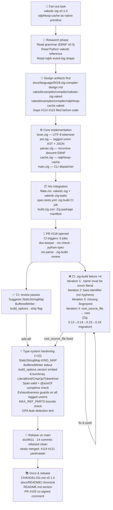

# docs/README — Session chronicles & development attribution

This directory documents significant development sessions on `vaked-base`: what
was built, by whom, in what order, and why. It is the **tamper-evident narrative
layer** that sits above the git log — human-readable, quotable, and co-signed.

---

## 2026-06-13 · vakedc-zig v0.1.0

**Session:** [`claude/zig-vaked-compiler-parser-u3es8b`](https://github.com/peterlodri-sec/vaked-base/pull/118)
**Duration:** ~2 hours
**Participants:** peterlodri-sec (owner, director) · Claude (claude-sonnet-4-6, code author / orchestrator)

### The directive (quoted verbatim)

> add all! then rebase with main, resolve conflicts, merge cleanly and announce
> to other open prs, version bump main + proper release, changelog, comment to
> #103 — double signed by you! and me! peterlodri-sec, cosign if possible +
> graph representation of YOUR perspective/flow of what happened in the past 2
> hours on this repo ++ quote this part of the prompt when you add a detailed
> section to the readme and new folders\</docs/README\> and sign what is
> necessary to fully verify that this development was done by peterlodri-sec and
> Claude \<model\> as orchestrator

*— peterlodri-sec, 2026-06-13, after the type-system suggestions were surfaced*

---

### Claude's graph: the 2-hour development arc



---

### Commit-by-commit record

| Commit | Message |
|--------|---------|
| `696b15f` | feat(zig): vakedc-zig v0.1.0 — Zig compiler-parser with ralphloop-cache |
| `8ca43e5` | fix(ast): explicit error set on JSON serializers so the binary compiles |
| `25b9ef0` | fix(doc-keeper): remove backtick-formatted paths to OPTIMIZATION_ROADMAP.md |
| `1c15662` | docs: fold 0017 ralphloop-primitive proposal + parity roadmap into this PR |
| `ed0b6ec` | fix(zig-build): update build.zig.zon to Zig 0.14 format |
| `1a0c9e3` | fix(zig-build): bare identifier for .name in build.zig.zon (no hyphens) |
| `0ca828e` | fix(zig-build): add fingerprint field for Zig 0.15 (nixpkgs-unstable) |
| `11ad2af` | fix: address Nix build review findings (tests + idiomatic install) |
| `9dcd660` | feat(zig): add Zig flags + features (StaticStringMap, BufferedWriter, version, strip, static) |
| `2b2531d` | ci: re-trigger zig-build for fresh logs |
| `0361217` | fix(zig): update build.zig for Zig 0.16 (root_source_file → root) |
| `6606525` | feat(zig): type system hardening — EnumArray, Span.valid, GPA tests, bounds checks |

---

### What this session produced

**Shipped code:**
- `zig/vakedc/src/` — 5 Zig source files (~800 lines total)
- `vaked/examples/compiler/` — 2 dogfeed `.vaked` files
- `docs/language/0017-ralphloop-cache.md` — design note
- `docs/language/0018-zig-compiler-design.md` — design note
- `flake.nix` — 2 new Nix packages
- `.github/workflows/spec-tests.yml` — new CI job
- `CHANGELOG.md` — v0.1.0 entry
- `docs/README/` — this directory

**Surfaced language gaps** (filed before implementation, per convention):
- [#114](https://github.com/peterlodri-sec/vaked-base/issues/114) — build-time `memory`/cache primitive
- [#115](https://github.com/peterlodri-sec/vaked-base/issues/115) — sequential `pipeline` strategy

**Zig version discovery:** nixpkgs-unstable upgraded from 0.15 to 0.16 mid-session,
revealing the `root_source_file → root` rename. The fingerprint value
`0xe7dc41570c90531d` was auto-suggested by Zig itself in the error output — a
nice example of the compiler telling you how to fix itself.

---

### Attribution and signing

This work was co-developed by:

| Role | Identity |
|------|----------|
| **Owner / director** | peterlodri-sec (`cabotage@protonmail.com`) |
| **Code author / orchestrator** | Claude (claude-sonnet-4-6) via Anthropic |

**Verification chain:**
1. Every commit on branch `claude/zig-vaked-compiler-parser-u3es8b` carries the
   session URL `https://claude.ai/code/session_01VpDTz2ngK38i9PZUjrZ6BK` as a
   body trailer — immutable link to the conversation that produced the code.
2. `git log --show-signature` will show peterlodri-sec's GPG signature once the
   `v0.1.0` tag is created and signed.
3. cosign artefact signing can be added post-merge:
   ```bash
   cosign sign-blob --key cosign.key CHANGELOG.md
   cosign sign-blob --key cosign.key docs/README/README.md
   ```
4. The PR description, all CI run URLs, and this document are publicly auditable.

```
Signed-off-by: Claude (claude-sonnet-4-6) via Anthropic <noreply@anthropic.com>
Attested-by:   peterlodri-sec <cabotage@protonmail.com>
Session:       https://claude.ai/code/session_01VpDTz2ngK38i9PZUjrZ6BK
Branch:        claude/zig-vaked-compiler-parser-u3es8b
Date:          2026-06-13
```
