# Vaked CI Flow — Agent Fleet Graph

**GENESIS_SEAL: 7c242080 · 2026-06-18**

## Fleet Topology

```mermaid
graph TD
    subgraph TRIGGERS["⚡ Triggers"]
        CRON["cron (3h/6h/24h)"]
        PR["pull_request"]
        COMMENT["issue_comment @vaked-ci"]
        DISPATCH["workflow_dispatch<br/>(double-confirmed)"]
        PUSH["push to main"]
        TAG["tag/release"]
    end

    subgraph CI_ENV["🔐 CI Environment"]
        OR_KEY["OPENROUTER_API_KEY"]
        LF_KEY["LANGFUSE_SECRET_KEY"]
        LF_PUB["LANGFUSE_PUBLIC_KEY"]
        C7_KEY["CONTEXT7_API_KEY 🆕"]
        VA_KEY["VAST_API_KEY"]
        VT_KEY["VAULT_TOKEN"]
        MSTDN["MASTODON_ACCESS_TOKEN"]
        TG["TELEGRAM_TOKEN"]
    end

    subgraph DECIDE["🧠 Decision Loop"]
        RALPH["ralph<br/>Python cron<br/>3h + 23:00 UTC"]
        RALPH -->|"open issues"| GH_ISSUES["GitHub Issues"]
        RALPH -->|"commit decision"| LEDGER["hash-chained ledger"]
        RALPH -->|"announce"| MASTODON["Mastodon"]
    end

    subgraph REVIEW["👀 PR Review"]
        PR_REVIEW["pr-review<br/>adk-rust<br/>DeepSeek V4 Flash"]
        PR --> PR_REVIEW
        PR_REVIEW -->|"structured comment"| GH_PR["GitHub PR"]
        PR_REVIEW -->|"advisory · never blocks"| MERGE["merge"]
    end

    subgraph CRAWL["🔍 Crawlers"]
        OPTITRON["optitron<br/>Go/Eino · daily 05:33"]
        INTROSPECT["fleet-introspect<br/>Go/Eino · daily 06:00"]
        CRON --> OPTITRON
        CRON --> INTROSPECT
        OPTITRON -->|"open agent issue"| GH_ISSUES
        INTROSPECT -->|"open agent issue"| GH_ISSUES
        INTROSPECT -->|"read-only"| LEDGER
    end

    subgraph GPU["🖥️ GPU Research"]
        NOCTURNE["nocturne<br/>Python · nightly 02:00"]
        CRON --> NOCTURNE
        NOCTURNE -->|"rent GPU"| VASTAI["Vast.ai"]
        NOCTURNE -->|"confirm win → swe_af"| SWE_AF_TRIGGER["swe_af trigger"]
    end

    subgraph AUTOMATION["🤖 Automation"]
        PROVIDER["provost<br/>adk-rust<br/>multi-step"]
        LABELER["label-tagger<br/>adk-rust<br/>auto-label"]
        SWE_AF["swe_af<br/>adk-rust<br/>SWE agent field"]
        COMMENT --> PROVIDER
        PR --> LABELER
        GH_ISSUES --> SWE_AF
        SWE_AF_TRIGGER --> SWE_AF
    end

    subgraph DAEMONS["🏗️ Daemons"]
        OPENROUTERD["openrouterd (Atlas)<br/>Zig 0.16 · raw sockets<br/>seccomp · hugepages<br/>Conductor routing"]
        VAULT["OpenBao<br/>bao.crabcc.app<br/>v2.5.4 · unsealed"]
    end

    subgraph OBSERVE["📊 Observability"]
        LANGFUSE["Langfuse<br/>self-hosted"]
        TELEGRAM["Telegram<br/>failure notify"]
        LF_KEY --> LANGFUSE
        LF_PUB --> LANGFUSE
        TG --> TELEGRAM
    end

    subgraph SDK["📦 Agent SDK"]
        TS_SDK["@vaked/openrouter-ts<br/>TypeScript"]
        ZIG_SDK["openrouter-zig<br/>Zig 0.16"]
        TUI["vaked TUI<br/>Aider-style"]
        CTX7["Context7<br/>pre-scan · cache"]
        VKDOCS["Vaked Docs<br/>Go · no rate limits"]
        BAO["bao.ts<br/>Vault client"]
        VASTAI_TS["vastai.ts<br/>GPU tools"]
    end

    subgraph BUILD["🔨 Build & Sign"]
        PR_BUILD["pr-review-build<br/>push to main"]
        PUSH --> PR_BUILD
        PR_BUILD -->|"compile + publish"| BIN["pr-review-bin"]
        BIN -->|"sign + burn"| SIGN["SHA256 burned"]
    end

    CI_ENV --> RALPH
    CI_ENV --> PR_REVIEW
    CI_ENV --> OPTITRON
    CI_ENV --> INTROSPECT
    CI_ENV --> NOCTURNE
    CI_ENV --> PROVIDER
    CI_ENV --> LABELER
    CI_ENV --> SWE_AF
    CI_ENV --> OPENROUTERD
    CI_ENV --> SDK

    TELEGRAM -.->|"failure"| RALPH
    TELEGRAM -.->|"failure"| PR_REVIEW
    TELEGRAM -.->|"failure"| OPTITRON
    TELEGRAM -.->|"failure"| NOCTURNE
    LANGFUSE -.->|"traces"| PR_REVIEW
    LANGFUSE -.->|"traces"| RALPH
    LANGFUSE -.->|"traces"| TS_SDK
```



## Agent Fleet

| Agent | Trigger | Runtime | Model | Budget |
|-------|---------|---------|-------|--------|
| **ralph** | cron 3h + 23:00 | Python stdlib | DeepSeek V4 Pro | ~$0.05/day |
| **pr-review** | pull_request | adk-rust (mimalloc) | DeepSeek V4 Flash | ~$0.10/PR |
| **provost** | issue_comment | adk-rust (mimalloc) | DeepSeek V4 Flash | ~$0.05/run |
| **label-tagger** | pull_request | adk-rust (mimalloc) | DeepSeek V4 Flash | ~$0.01/PR |
| **optitron** | cron daily 05:33 | Go/Eino | DeepSeek V4 Pro | ~$0.30/day |
| **fleet-introspect** | cron daily 06:00 | Go/Eino | DeepSeek V4 Pro | ~$0.20/day |
| **nocturne** | cron nightly 02:00 | Python + Vast.ai | Claude Opus | ~$2.00/night |
| **swe_af** | issue label `agent` | adk-rust | DeepSeek V4 Flash | ~$0.50/run |

## CI Secrets (live)

| Secret | Used by | Status |
|--------|---------|--------|
| `OPENROUTER_API_KEY` | all agents | ✅ |
| `LANGFUSE_SECRET_KEY` | pr-review, ralph | ✅ |
| `LANGFUSE_PUBLIC_KEY` | pr-review, ralph | ✅ |
| `LANGFUSE_HOST` | pr-review, ralph | ✅ |
| `CONTEXT7_API_KEY` | @vaked/openrouter-ts | 🆕 |
| `MASTODON_ACCESS_TOKEN` | ralph | ✅ |
| `TELEGRAM_TOKEN` | all (failure) | ✅ |
| `TELEGRAM_TO` | all (failure) | ✅ |
| `VAULT_TOKEN` | openrouterd | 🆕 |
| `VAST_API_KEY` | @vaked/openrouter-ts | 🆕 |
| `CRABCC_INSTALL_TOKEN` | pr-review | ✅ |
| `YARDMASTER_SIGNING_KEY` | yardmaster | ✅ |

## Genesis

```
GENESIS_SEAL: 7c242080
```
