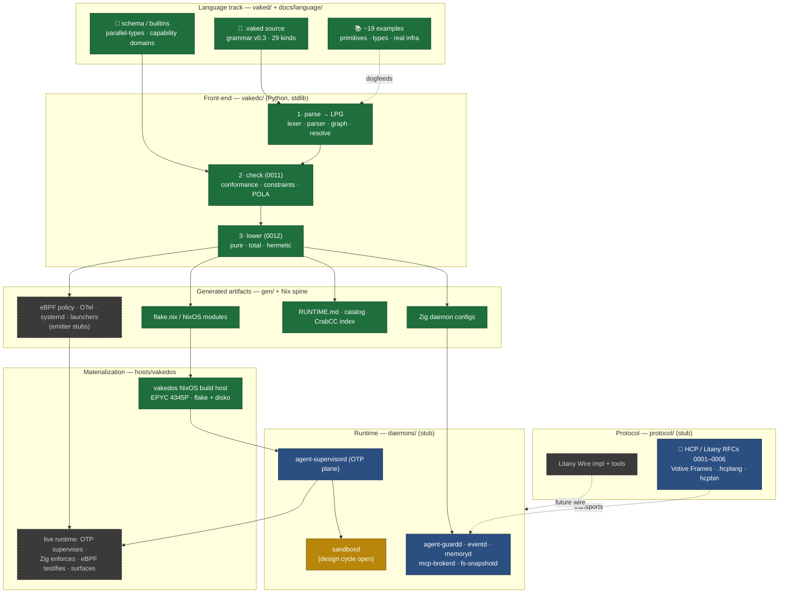
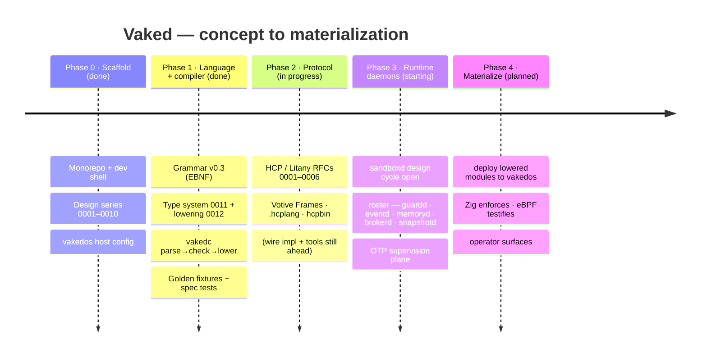

# Vaked Timeline

**A state-of-the-repo widget: what's real, what's in flight, what's ahead — as a graph.**

> Vaked declares. Nix materializes. OTP supervises. Zig enforces. eBPF testifies. CrabCC indexes. Surfaces reveal.

**Snapshot:** 2026-06-13 · **Grammar:** v0.3 · **Front-end:** `vakedc` (parse → check → lower)

This page is the single place to read the project's *posture*: the language and its
front-end compiler are real and verified; the wire protocol is in active RFC design;
the runtime daemons and host materialization are still ahead. Everything below is
grounded in what currently exists in this repo — not in the roadmap.

## Legend

| Mark | State | Meaning |
|------|-------|---------|
| ✅ | **done** | Real content, exercised by tests / fixtures |
| 🟡 | **in progress** | An active design → plan → implement cycle |
| 🟦 | **stub (indexed)** | Roster / contracts defined; no implementation yet |
| ⬜ | **planned** | Named in the design, not yet started |

## Ecosystem graph

The spine follows the mantra: a `.vaked` source flows through the front-end into
boring artifacts, which a NixOS host materializes into a supervised, enforced,
testified runtime. Node color = state.

✅ green = done · 🟡 amber = in progress · 🟦 blue = stub (indexed) · ⬜ dashed grey = planned.

## Phase timeline

## Per-track status

| Track | Path | State | Evidence |
|-------|------|-------|----------|
| Language — grammar/schema/examples | `vaked/` | ✅ done | EBNF v0.3 · `schema/{parallel-types.md,builtins.vaked}` · ~19 examples |
| Compiler front-end (`vakedc`) | `vakedc/` | ✅ done | `parse → check → lower`; refuses to emit on any diagnostic |
| Type system (Goal 2) & lowering (Goal 3) | `docs/language/0011`, `0012` | ✅ done | Specs + byte-exact fixtures in `vaked/examples/lowering*/` |
| Verification | `tests/spec/` | ✅ done | Differential oracle · golden snapshots · determinism checks |
| Design series | `docs/language/0001…0016` | ✅ done | Manifesto, primitives, MLIR (staged), memory, workflow, substrate triage |
| Protocol (HCP / Litany) | `protocol/`, `docs/protocol/` | 🟦 stub | RFCs 0001–0006 drafted; no wire impl or tools yet |
| Runtime daemons | `daemons/`, `docs/runtime/` | 🟦 stub · 🟡 `sandboxd` | Roster + membrane mapping defined; `sandboxd` design cycle open |
| Host materialization | `hosts/vakedos`, `flake.nix` | ✅ build host · ⬜ runtime | Clean NixOS build host; no daemons wired yet |
| Deferred emitters | `vakedc/lower.py` | ⬜ planned | eBPF policy · OTel · systemd · surface launchers are no-op stubs |

---

**See also:** [`../../README.md`](../../README.md) (repo map) · [`PROJECT_CONTEXT.md`](PROJECT_CONTEXT.md) (canonical overview) · [`../language/README.md`](../language/README.md) (design series).
