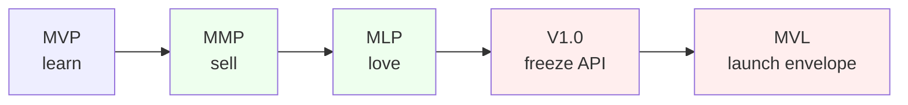

# Release Governance: From Minimum Viable Product to Minimum Viable Launch

> Opening conceptual frame for the Vaked V1.0 technical whitepaper.

## 1. Section diagnosis

**Thesis:** "Version 1.0" is not a feature count or a calendar date; it is a *governance commitment* that the public surface of a system has stabilized enough for others to depend on it, and the continuum MVP -> MMP -> MLP -> V1.0 -> MVL is the ladder of escalating commitments that justifies that promise.

**What makes it publication-grade:** it separates four ideas that industry prose routinely conflates (learning, marketing, lovability, stability), anchors each to a verifiable originator or specification, and is honest about which terms in the continuum carry real pedigree (MVP, MLP, semver 1.0.0) and which are weaker agency coinage (MVL). It then grounds the abstraction in Vaked's own gating criteria rather than asserting marketing readiness.

## 2. Claim audit table

| # | Claim | Tag | Source anchor / action |
|---|-------|-----|------------------------|
| C1 | MVP was coined by Frank Robinson (2001) and popularized by Steve Blank and Eric Ries. | [PM-LIT] | Primary: SyncDev MVP page (Robinson's own company), 2016 web.archive snapshot - "Since our first use of the term in 2001," with Frank Robinson (CEO, SyncDev) and Steve Blank ("Frank coined the term 'minimum viable product'") on record. Cross-checked against Wikipedia "Minimum viable product" (whose sole citation is this same SyncDev page). |
| C2 | Ries defines the MVP as the version that yields "the maximum amount of validated learning about customers with the least effort." | [PM-LIT] | Ries, *The Lean Startup* / Ries primer (Medium) |
| C3 | The MVP is a learning vehicle / risk-reduction tool whose value is knowledge, not revenue. | [PM-LIT] | Roman Pichler, "MVP and the MMP" |
| C4 | The MMP (Minimal Marketable Product) is the smallest feature set that addresses initial users' needs and can be marketed/sold; it follows the MVP and is shaped by MVP feedback. | [PM-LIT] | Roman Pichler; userpilot; Boldare |
| C5 | The MMP delivers a solid working experience and customer value, where the MVP may deliberately deliver none. | [PM-LIT] | userpilot; Pichler |
| C6 | The Minimum Lovable Product (MLP) was introduced by Aha! co-founder Brian de Haaff in 2013 and expanded in his 2017 book *Lovability*. | [PM-LIT] | aha.io guide; de Haaff (Medium) |
| C7 | The MLP targets delight / love rather than mere viability; it is a counterpoint to the MVP. | [PM-LIT] | aha.io; de Haaff |
| C8 | Semantic Versioning states "Version 1.0.0 defines the public API." | [PM-LIT] | semver.org |
| C9 | Under semver, major version zero (0.y.z) is for initial development and the public API SHOULD NOT be considered stable. | [PM-LIT] | semver.org |
| C10 | Semver guidance: if software is in production, or has a stable API users depend on, or you worry about backward compatibility, it should already be 1.0.0. | [PM-LIT] | semver.org |
| C11 | "Minimum Viable Launch" is trademarked agency/consultancy coinage, not a term with a canonical PM-literature originator. | [CITE?] | theScribeSmith ("Minimum Viable Launch™"); Custom Technologies; Introworks. No primary academic/founder source found. |
| C12 | MVL's primary documented framing is physical-product launch readiness (manufacturing, supply chain, shipping, retail channel). | [CITE?] | Custom Technologies; theScribeSmith |
| C13 | MVL adapts to infrastructure-heavy software as "minimum viable business and operational processes around the product" (time-to-first-value, billing, support, observability), not just the artifact. | [REFRAME] | Inferred from MVL sources + Vaked context; reframed from physical-product origin. Mark "needs better citation" for the software adaptation. |
| C14 | The continuum maps cleanly onto a single rising axis (risk posture, evidence threshold, failure mode). | [INTERNAL] | Author synthesis across Pichler (risk) + semver (evidence). Failure-mode column is internal interpretation. |
| C15 | Vaked currently sits at the MVP/MMP band by its own criteria: WP1 (language) and WP2 (vakedc) are done; WP3 (wire-protocol) and WP4 (daemons) are pending. | [INTERNAL] | Repo `CLAUDE.md` Status section (2026-06-13) |
| C16 | Vaked V1.0 should gate on grammar frozen, RFCs Accepted, and reference daemons running under supervision. | [INTERNAL] | Author proposal grounded in `CLAUDE.md` + `PROJECT_CONTEXT.md`. Not a current-state assertion. |
| C17 | Vaked's artifact surface (the public API that 1.0.0 freezes) is the generated-artifact contract: flake.nix, NixOS modules, Zig daemon configs, eBPF manifests, OTel config, CrabCC indexes. | [INTERNAL] | `PROJECT_CONTEXT.md` core stack |

## 3. The section (publication-ready)

### 3.1 Why "release" is a governance question

A release is a promise about change. Each named milestone on the road to a stable system encodes a different promise, and confusing them is the most common failure in release planning: teams ship an MVP and apologize for its rough edges as if it were a 1.0, or they delay a 1.0 indefinitely while polishing toward a lovability standard that the milestone never required.

The literature gives us a continuum, not a synonym set. Four of its five stations have firm provenance; one does not, and we say so plainly.

**MVP, the learning vehicle.** The term was coined by Frank Robinson in 2001 and popularized through Steve Blank's Customer Development work and Eric Ries's *The Lean Startup* [C1]. Ries's definition is deliberately epistemic: the MVP is "that version of a new product which allows a team to collect the maximum amount of validated learning about customers with the least effort" [C2]. Roman Pichler frames it as a risk-reduction tool whose currency is knowledge, not revenue; an MVP may legitimately deliver no lasting value because its job is to retire uncertainty, not to serve a market [C3].

**MMP, the marketable release.** The Minimal Marketable Product is the smallest feature set that genuinely addresses the needs of initial users and can therefore be sold [C4]. It comes after the MVP and is shaped by what the MVP learned. The distinction is sharp: the MMP delivers a solid working experience and real customer value where the MVP may deliberately deliver none [C5]. The boundary between MVP and MMP is the boundary between *learning* and *committing*.

**MLP, the lovable release.** Brian de Haaff, co-founder of Aha!, introduced the Minimum Lovable Product in 2013 and expanded it in his 2017 book *Lovability* [C6]. The MLP is an explicit counterpoint to the MVP: it asks not what is sufficient to be viable but what is sufficient to be loved [C7]. It raises the bar on experience without expanding scope.

**V1.0, the stability commitment.** Here the question stops being a product-marketing question and becomes a versioning contract. Semantic Versioning is unambiguous: "Version 1.0.0 defines the public API" [C8]. Before it, under major version zero, "anything MAY change at any time" and the public API "SHOULD NOT be considered stable" [C9]. The spec's own readiness test is behavioral, not aspirational: if the software is in production, if it has a stable API users depend on, or if you find yourself worrying about backward compatibility, you should already be at 1.0.0 [C10]. V1.0 is therefore not a quality grade. It is a promise that breaking changes now cost a major-version bump.

**MVL, the launch envelope (weakest pedigree).** "Minimum Viable Launch" does not belong in this list as a peer. We could not locate a canonical originator in the product-management literature; the term appears as trademarked agency and consultancy coinage ("Minimum Viable Launch™") [C11], and its primary documented framing is physical-product readiness: manufacturing, supply chain, shipping paperwork, and a retail channel [C12]. Its useful core, once stripped of the physical-goods framing, is that launching is more than shipping the artifact: it is standing up the minimum viable *business and operational processes* around the product, billing, support, observability, and time-to-first-value [C13]. For an infrastructure-heavy software system this adaptation is real but under-cited, and we flag it as such rather than dignify the trademark.

### 3.2 The governance comparison

Research supports adding the three governance columns the task asked us to evaluate. Pichler supplies the **risk posture** distinction directly (MVP = investment-risk reduction; MMP = time-to-market-risk reduction) [C3][C4]. Semver supplies the **evidence threshold** for V1.0 (a stable public API that users depend on) [C10]. The **failure-mode** column is author synthesis, marked [INTERNAL] [C14]; it is included because it is the column an operator actually reasons about.

| Milestone | Primary promise | Risk posture | Evidence threshold | Characteristic failure mode |
|-----------|-----------------|--------------|--------------------|-----------------------------|
| **MVP** | Learn whether the idea is worth building [C2] | Spend the least to retire the most uncertainty [C3] | Validated learning from real users | Mistaking a learning artifact for a product; shipping it to customers who expected support |
| **MMP** | Be sellable to early adopters [C4] | Reduce time-to-market risk via intentional scope [C4] | A working experience that delivers value [C5] | Feature creep erasing the "minimal"; or shipping MVP-grade quality under a marketable banner |
| **MLP** | Be loved, not merely tolerated [C7] | Reduce churn/differentiation risk | Measurable delight, not just task completion [C7] | Polishing past the point of return; confusing lovability with scope |
| **V1.0** | Freeze the public API [C8] | Reduce dependency risk for downstream consumers [C10] | A stable public API users depend on [C10] | Declaring 1.0 without freeze discipline, then breaking it in a minor version |
| **MVL** | Stand up the launch and ops envelope [C13] | Reduce operational-failure risk at go-live | Minimum viable business/ops processes present [C13] | Treating MVL as the finish line and under-investing post-launch [C12] |

The single axis underneath the table is *escalating commitment*: from "we promise nothing" (MVP) to "we promise this API will not break under you" (V1.0) to "we promise the surrounding machine will keep running" (MVL).

## 4. Release maturity ladder (diagram proposal)

A proposal, not a rendered asset. ASCII form for the whitepaper body:

```
 commitment
   ^
   |                                              +--------+
   |                                       MVL -> | launch |  ops/business envelope live
   |                                              +--------+
   |                                  +---------+
   |                          V1.0 -> | freeze  |  public API stable (semver 1.0.0)
   |                                  +---------+
   |                       +--------+
   |               MLP ->  | loved  |  delight, not just function
   |                       +--------+
   |            +---------+
   |    MMP ->  | sell    |  marketable, delivers value
   |            +---------+
   | +-------+
   | | learn |  <- MVP   validated learning, may deliver no value
   | +-------+
   +-------------------------------------------------------------> maturity / time
        learning  ............ committing ............ guaranteeing
```

Described mermaid alternative (flowchart, left-to-right), for a rendered figure:



The color bands encode the three regimes (learning / committing / guaranteeing). MVL is drawn last but dashed-in editorially: it is the operational wrapper, not a higher quality grade than V1.0.

## 5. Vaked-specific V1.0 interpretation

Vaked compiles a declaration into a typed semantic graph and then into a fixed set of artifacts: `flake.nix`, NixOS modules, Zig daemon configs, eBPF policy manifests, OTel collector config, and CrabCC indexes ([C17], from `PROJECT_CONTEXT.md`). That generated-artifact contract *is* Vaked's public API in the semver sense: it is the surface downstream NixOS hosts, daemons, and operator tooling come to depend on. Vaked V1.0 is therefore the promise that this artifact contract will not break under a minor version.

Concretely, we propose V1.0 gates on three conditions, all internal proposals [C16]:

1. **Grammar frozen.** The Vaked EBNF and kind set are committed as the 1.0 surface; new constructs require a major bump or an additive, non-breaking minor.
2. **RFCs Accepted.** The HCP / Litany protocol RFCs that define the wire and control surface reach Accepted status (not Draft). This must be verified against the RFC index before any 1.0 declaration, not assumed. As of this audit (2026-06-14), this gate is **UNMET**: every RFC in `protocol/rfcs/` (0001-0007) carries a `Status:` header of Draft (0001 "Draft / skeleton (stub)", 0007 "Draft / exploration", the rest plain "Draft"). No HCP / Litany RFC has reached Accepted, which is one concrete reason Vaked is pre-1.0 today [C16][C15]. Current per-RFC status is tabulated below.

The RFC status audit, verbatim from each file's `Status:` header on 2026-06-14 [INTERNAL] (repo fact, from `protocol/rfcs/`):

| RFC | Title | Status (verbatim) |
|-----|-------|-------------------|
| 0001 | HCP (Harness Control Protocol) | Draft / skeleton (stub) |
| 0002 | `.hcplang` (HCP schema language) | Draft |
| 0003 | Litany Wire (HCP transport & framing) | Draft |
| 0004 | Multi-Agent State Dependency | Draft |
| 0005 | Control-Plane Frames | Draft |
| 0006 | Transport Identity & Distribution | Draft |
| 0007 | Post-Quantum Litany & Sealed Image-as-Code Attestation | Draft / exploration |
3. **Reference daemons running.** At least the membrane (`agent_guardd`) and event-log (`eventd`) daemons run under the OTP supervision plane against the lowered artifacts, proving the graph-to-runtime path end to end.

By these criteria Vaked is honestly *pre-1.0 today* [C15]. The repository Status (2026-06-13) records WP1 (language) and WP2 (vakedc) as done, with WP3 (wire-protocol) and WP4 (daemons) pending. In the continuum above, Vaked sits at the **MVP/MMP band**: the language and compiler are proven (100k workers verified, deterministic), which is validated-learning-plus-marketable-core, but the API-freeze and running-daemon commitments that V1.0 demands are not yet met. Naming this plainly is itself the governance discipline the section argues for.

## 6. Suggested figures / tables

- **Figure 1** -- Release maturity ladder (Section 4), rendered from the mermaid source with the three-regime color bands.
- **Table 1** -- Governance comparison (Section 3.2), promoted to a numbered table.
- **Figure 2** (proposed) -- Vaked's artifact contract as "the public API that 1.0.0 freezes": a one-row version of the `PROJECT_CONTEXT.md` core-stack diagram, annotating which arrow is the frozen surface.
- **Callout box** -- the semver readiness test (C10) quoted verbatim as a sidebar.

## 7. Follow-up research tasks

1. ~~Verify the current Accepted/Draft status of HCP / Litany RFCs 0001-0007 against `protocol/rfcs/` before any V1.0 language ships (gate condition 2).~~ DONE (2026-06-14): audited every `Status:` header in `protocol/rfcs/`. Result: all seven RFCs are Draft (0001 "Draft / skeleton (stub)", 0007 "Draft / exploration", 0002-0006 "Draft"). Gate condition 2 is UNMET; no RFC has reached Accepted. The verbatim status table is recorded in section 5.
2. Find a stronger primary source for the software-adaptation of MVL, or drop the term from the continuum and replace it with a documented "launch readiness" framework (e.g. operational-readiness review literature).
3. ~~Confirm the Frank Robinson 2001 MVP attribution against a primary source~~ DONE: confirmed against the SyncDev MVP page (Robinson's own company), 2016 web.archive snapshot - "Since our first use of the term in 2001," with Robinson and Steve Blank on record. C1's anchor now cites this primary source; the live SyncDev page has since dropped the attribution (not a refutation - the 2016 snapshot is the version Wikipedia cites).
4. Decide whether Vaked adopts semver formally for the artifact contract, and if so, document the mapping from "grammar/RFC/daemon" gates to major/minor/patch semantics.

## 8. Appendix: research digest

Primary-leaning sources consulted:

- [Semantic Versioning 2.0.0, semver.org](https://semver.org/) -- definitions of 1.0.0, 0.y.z, and the production/stable-API/backward-compat readiness test (C8, C9, C10).
- [Roman Pichler, "The Minimum Viable Product and the Minimal Marketable Product"](https://www.romanpichler.com/blog/minimum-viable-product-and-minimal-marketable-product/) -- MVP as learning vehicle / risk-reduction tool vs. MMP as marketable release (C3, C4, C5).
- [Aha!, "What is a Minimum Lovable Product"](https://www.aha.io/roadmapping/guide/plans/what-is-a-minimum-lovable-product) and [Brian de Haaff, "It Is Time for the Minimum Lovable Product" (Medium)](https://medium.com/@bdehaaff/it-is-time-for-the-minimum-lovable-product-a506a14b35cf) -- MLP origin, de Haaff 2013 / *Lovability* 2017 (C6, C7).
- [SyncDev, "Minimum Viable Product" (Frank Robinson's company), 2016 web.archive snapshot](https://web.archive.org/web/20160525101214/http://www.syncdev.com:80/minimum-viable-product/) -- **primary** source for the Robinson 2001 coinage: "Since our first use of the term in 2001," plus Robinson (CEO, SyncDev) and Steve Blank ("Frank coined the term 'minimum viable product'") on record (C1). The live syncdev.com page no longer carries this attribution; the 2016 snapshot is the version Wikipedia cites.
- [Wikipedia, "Minimum viable product"](https://en.wikipedia.org/wiki/Minimum_viable_product) and [Eric Ries, "The Minimum Viable Product: A Primer" (Medium)](https://medium.com/galleys/the-minimum-viable-product-a-primer-3d9a76dd5213) -- secondary corroboration of the Robinson 2001 coinage (Wikipedia's sole citation is the SyncDev page above), Blank/Ries popularization, validated-learning definition (C1, C2).
- [userpilot, "MVP vs Minimum Marketable Product"](https://userpilot.com/blog/minimum-viable-product-vs-minimum-marketable-product/) -- MMP value/experience contrast (C4, C5).
- [theScribeSmith, "Minimum Viable Launch™"](https://www.thescribesmith.com/post/minimum-viable-launch) and [Custom Technologies, "MVP vs. Minimum Viable Launch™"](https://customtechnologies.com/a-minimum-viable-product-vs-our-minimum-viable-launch/) -- MVL as trademarked launch-readiness coinage, physical-product framing, churn caution (C11, C12, C13).
- Repository: `CLAUDE.md` Status section (2026-06-13) and `docs/context/PROJECT_CONTEXT.md` core stack, Vaked WP status and artifact contract (C15, C16, C17).

**Method note:** abstain-safe verification was applied. The Frank Robinson 2001 MVP coinage (C1) was confirmed against a primary source this session: WebFetch is categorically blocked from web.archive.org, so the 2016 SyncDev snapshot (the source Wikipedia cites) was loaded via a headless browser instead, confirming "Since our first use of the term in 2001" with Robinson and Steve Blank on record. The live syncdev.com page no longer carries that attribution - treated as drift, NOT refutation. Claims that lack a confirmable primary source are tagged [CITE?] or [REFRAME] on the merits (notably MVL, C11-C13), not because a verifier abstained.
