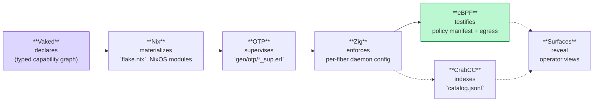
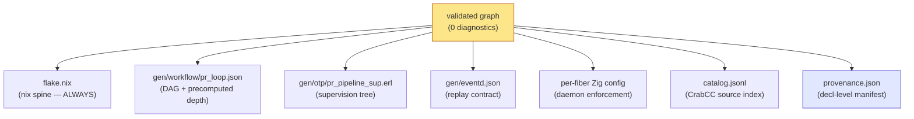
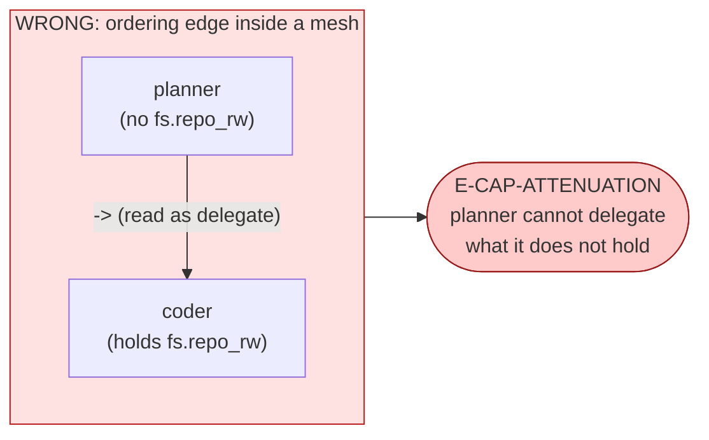
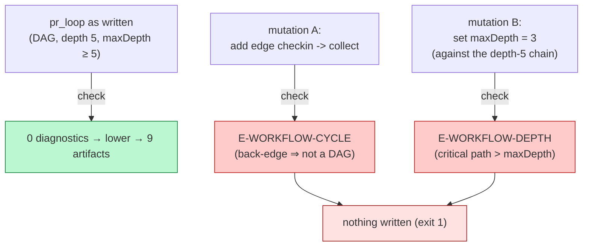
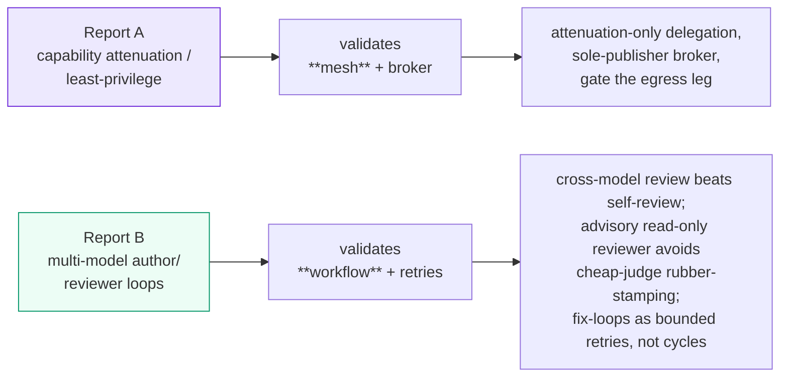

# How Vaked works, layer by layer — under the compiler

Date: 2026-06-14 · Companion to the PR-pipeline dogfood research batch
(`claude/vaked-pr-pipeline-dogfood-pdl4sk`).

> One sentence: **Vaked declares a typed capability graph; the compiler checks it;
> lowering materializes it into the boring, inspectable artifacts that other
> systems already know how to run.** Nothing is enforced by Vaked itself at
> runtime — Vaked's job is to make a graph *true before* it is allowed to become
> artifacts.

The project tagline is the layer map:

> Vaked declares. Nix materializes. OTP supervises. Zig enforces. eBPF testifies.
> CrabCC indexes. Surfaces reveal.

This document walks both stacks: (1) the **compiler** stack — what happens to a
`.vaked` file from text to artifacts — and (2) the **runtime** stack — what those
artifacts become once they leave the compiler. The dogfood example
(`pr-multimodel-pipeline.vaked`) is used throughout as the worked case.

---

## Part 1 — The compiler stack (`vakedc`: text → artifacts)

`vakedc` is a stdlib-only Python front-end with three user-facing subcommands —
`parse`, `check`, `lower` — but six internal layers. Each layer has one job and
hands a stricter object to the next.

```mermaid
flowchart TD
    SRC["`.vaked` source<br/>(UTF-8, NFC-normalized text)"]
    LEX["1 · lexer<br/>tokens (+ source spans)"]
    PARSE["2 · parser<br/>declaration items / AST"]
    RESOLVE["3 · resolve · build_graph<br/>Labeled Property Graph (LPG)"]
    CHECK["4 · check (0011 type system)<br/>diagnostics list"]
    LOWER["5 · lower (0012)<br/>pure emitters → files"]
    EMIT["6 · _write_tree<br/>artifact tree on disk"]

    SRC --> LEX --> PARSE --> RESOLVE --> CHECK
    CHECK -->|"any diagnostic ⇒ STOP<br/>(emit nothing, exit 1)"| HALT["refuse to lower"]
    CHECK -->|"clean (0 diagnostics)"| LOWER --> EMIT
    EMIT --> ART["flake.nix · gen/… · provenance.json"]

    style CHECK fill:#fde68a,stroke:#b45309
    style HALT fill:#fecaca,stroke:#b91c1c
    style EMIT fill:#bbf7d0,stroke:#15803d
```

**Diagram 1 — the compiler pipeline.** The load-bearing gate is the edge out of
`check`: lowering only runs on a graph with zero diagnostics (`lower` refuses to
emit a single byte otherwise, 0012 §1). "Compiles" therefore means "proven," not
"emitted then validated."

### Layer 1 — lexer

Reads UTF-8, enforces NFC normalization, produces tokens carrying byte spans.
A bad Unicode/lex error stops here with a source-mapped message. Spans are kept
because every later layer (diagnostics, provenance) points back to exact source
bytes.

### Layer 2 — parser

Tokens → declaration items (the AST of `field`, `mesh`, `workflow`, `node`, `->`
edges, config blocks). Grammar is `vaked/grammar/vaked-v0-plus.ebnf` (v0.3, 29
kinds). Grammar-first is a project rule: a new construct lands in the EBNF + an
example *before* any code.

### Layer 3 — resolve (`build_graph`)

The AST becomes a **Labeled Property Graph**: nodes (declarations) and typed
edges (`->`). This is the canonical object Vaked reasons over — emittable as
canonical JSON (`parse --print`) or a SQLite graph DB. Two graphs of different
*kinds* can coexist in one file (this is the semantic split, Part 3).

### Layer 4 — check (the 0011 type system)

The heart. Validates the LPG against the built-in capability catalog
(`vaked/schema/builtins.vaked`). Produces a sorted, deterministic diagnostics
list. Key checks for the dogfood:

- `E-CAP-ATTENUATION` (0011 §4.4) — a `mesh` edge may only *delegate* capability
  that narrows; a delegate cannot be granted what the delegator lacks.
- `E-WORKFLOW-CYCLE` — a `workflow` graph must be acyclic.
- `E-WORKFLOW-DEPTH` — the workflow's critical path must not exceed `maxDepth`.

### Layer 5 — lower (0012)

Runs only on a clean graph. A set of **pure** emitters, each
`emit : (graph, nodes) -> (files, provenance_entries)`. Pure = no IO, and the
same graph yields byte-identical artifacts (all ordering is structural, never
hash-map order). Determinism is what makes the provenance manifest meaningful.

### Layer 6 — `_write_tree`

The only IO in lowering. Writes each emitted file at its relative path plus
`provenance.json` at the root: one entry per artifact/region, each keyed by a hash
of the *projection* (the slice of the graph that produced it). Change the source,
change the projection, change the hash — drift is detectable.

---

## Part 2 — The runtime stack (artifacts → running host)

Lowering emits artifacts addressed to systems that already exist. Vaked owns the
*declaration*; each downstream layer owns its *mechanism*.



**Diagram 2 — the runtime stack.** Read left to right: a declaration becomes a
Nix-materialized host, OTP supervises single-purpose Zig enforcement daemons,
eBPF is the evidence layer, CrabCC indexes the symbols, surfaces reveal state to
operators. Each arrow is a lowering artifact, not a runtime call back into Vaked.

### The lowering fan-out (the 9 dogfood artifacts)



**Diagram 3 — lowering fan-out.** One checked graph, many addressees. `flake.nix`
always emits (the spine that wires the rest); the `gen/` tree and provenance are
the per-construct projections.

---

## Part 3 — The load-bearing idea: two graphs, two checks (design 0015)

Two graphs live in any agent system, and conflating them is how capability models
rot. Vaked keeps them as distinct *kinds* with distinct edge meaning and distinct
checks.

| Graph | Kind | Edge `a -> b` means | Check |
|-------|------|---------------------|-------|
| **authority** | `mesh` | `a` *delegates* capability to `b` | attenuation (`E-CAP-ATTENUATION`) |
| **ordering** | `workflow` | `a` *sequences before* `b` | DAG + depth (`E-WORKFLOW-CYCLE`, `E-WORKFLOW-DEPTH`) |

Agents are declared **once**, in the mesh, where the operator delegates each an
attenuated grant set. Workflow steps merely *reference* those agents
(`agent = field.author`); steps never carry authority, so a workflow can never
widen what an agent may do — only ask it to act.

```mermaid
flowchart TB
    subgraph AUTHORITY["mesh field — AUTHORITY (who may do what)"]
        direction TB
        OP["operator<br/>(root grants)"]
        AU["author · claude-opus-4-8<br/>grant: fs.repo_rw<br/>(no publish)"]
        RV["reviewer · gemini-3.1-flash-lite<br/>grant: fs.repo_ro<br/>(cannot mutate)"]
        BR["broker<br/>grant: mcp.github_write<br/>(sole publisher)"]
        OP -->|delegate ⊆| AU
        OP -->|delegate ⊆| RV
        OP -->|delegate ⊆| BR
    end

    subgraph ORDERING["workflow pr_loop — ORDERING (in what sequence)"]
        direction LR
        C["collect"] --> I["implement"] --> R["review"] --> P["publish"] --> K["checkin"]
        I -.->|retries = N<br/>(fix-loop, NOT a back-edge)| I
    end

    AU -. referenced by .-> I
    RV -. referenced by .-> R
    BR -. referenced by .-> P

    style AUTHORITY fill:#ede9fe,stroke:#6d28d9
    style ORDERING fill:#ecfdf5,stroke:#059669
    style BR fill:#fef9c3,stroke:#ca8a04
    style I fill:#dbeafe,stroke:#2563eb
```

**Diagram 4 — the semantic split for the dogfood.** Top: the authority graph —
the operator delegates *narrowing* grants (`⊆`); the broker is the only node with
`mcp.github_write`. Bottom: the ordering graph — a straight DAG with the fix-loop
modeled as **retries on `implement`**, never a `checkin -> collect` back-edge.
Dotted edges show workflow steps *referencing* mesh agents without inheriting
their authority.

### Why a naive design fails (and the split is forced)

A naive `planner -> coder` edge placed *inside a mesh* is **rejected** by
attenuation: the coder holds `fs.repo_rw`, which the planner cannot delegate
(it does not hold it). Correct — that edge was never a delegation, it was an
ordering. Ordering needed its own home. The split fell out of dogfooding.



**Diagram 5 — the rejected design.** This is the mistake the two-graph split
prevents: an ordering relationship miswritten as a delegation, caught by
attenuation at compile time.

---

## Part 4 — Enforcement is proven by negative tests

Vaked's claim is not "it ran" but "the bad versions are rejected." Two mutations
of the dogfood graph each trip a distinct checker error, with no artifacts
written.



**Diagram 6 — the enforcement proof.** The same source, mutated two ways, fails
two different checks. Because `lower` refuses on any diagnostic, a graph that
fails to type-check can never become artifacts — the safety property is at the
compiler boundary, not at runtime.

### How the research backs this design

The two companion deep-research reports in this batch validate the two graphs
against the 2025–2026 literature:



**Diagram 7 — research ↔ design map.** Report A's "narrow at every hop + single
side-effect broker + gate egress" maps onto the `mesh` + `E-CAP-ATTENUATION` +
sole `mcp.github_write` broker. Report B's "never self-grade + advisory cheap
reviewer + bounded retries not back-edges" maps onto the `workflow` DAG with a
different-family reviewer and `retries` on `implement`.

---

## Flashcards

Self-test the model. Cover the answer; recall before reading.

**Q1.** What does "Vaked compiles" actually guarantee?
**A1.** That the graph type-checked with zero diagnostics. `lower` refuses to emit
a single byte if the checker reports anything (0012 §1), so artifacts only exist
for proven graphs.

**Q2.** Name the six internal compiler layers in order.
**A2.** lexer → parser → resolve (`build_graph`/LPG) → check (0011) → lower (0012)
→ `_write_tree`.

**Q3.** What are the two graph kinds and what does an edge mean in each?
**A3.** `mesh` = authority: `a -> b` means `a` *delegates* capability to `b`.
`workflow` = ordering: `a -> b` means `a` runs *before* `b`.

**Q4.** Which check guards each graph?
**A4.** `mesh`: `E-CAP-ATTENUATION` (delegation may only narrow). `workflow`:
`E-WORKFLOW-CYCLE` (must be acyclic) and `E-WORKFLOW-DEPTH` (critical path ≤
`maxDepth`).

**Q5.** Why can't a workflow step widen an agent's authority?
**A5.** Agents are declared once in the mesh with attenuated grants; workflow
steps only *reference* them (`agent = field.author`) and carry no authority.

**Q6.** Why is the fix-loop modeled as `retries` on `implement` instead of a
`checkin -> collect` back-edge?
**A6.** A back-edge makes the graph cyclic → `E-WORKFLOW-CYCLE`. Bounded retries
keep the workflow a checked DAG with a finite critical path; the literature
(Agentproof, Temporal) agrees fix-loops should be bounded retries, not cycles.

**Q7.** What makes the broker special in the authority graph?
**A7.** It is the *sole publisher* — the only node granted `mcp.github_write`.
Author and reviewer hold `fs.*` only, so side effects funnel through one node
(the single-writer pattern from the prompt-injection-defense literature).

**Q8.** Why must lowering emitters be pure?
**A8.** So the same graph yields byte-identical artifacts. Determinism is what
makes the `provenance.json` hashes (keyed on each artifact's source projection)
meaningful for drift detection.

**Q9.** Map the runtime tagline to mechanisms.
**A9.** Vaked declares → Nix materializes (`flake.nix`) → OTP supervises
(`*_sup.erl`) → Zig enforces (per-fiber config) → eBPF testifies (policy +
egress) → CrabCC indexes (`catalog.jsonl`) → Surfaces reveal (operator views).

**Q10.** What two mutations prove enforcement, and what does each trip?
**A10.** Adding `checkin -> collect` ⇒ `E-WORKFLOW-CYCLE`; setting `maxDepth = 3`
against the depth-5 chain ⇒ `E-WORKFLOW-DEPTH`. Both write nothing (exit 1).

**Q11.** Why does a naive `planner -> coder` mesh edge get rejected?
**A11.** The planner does not hold `fs.repo_rw`, so it cannot delegate it →
`E-CAP-ATTENUATION`. The edge was ordering, not delegation — which is exactly
why ordering needs its own `workflow` graph.

**Q12.** What is the single research-backed reason to gate egress (the broker /
`agent_guardd` membrane)?
**A12.** It removes one leg of the "lethal trifecta" (private data + untrusted
input + external comms). With no exfiltration channel, a successful prompt
injection has nowhere to send stolen data — even if the model obeys it.

**Q13.** Does the cheap reviewer being weaker than the author undermine the
pipeline?
**A13.** No, because the reviewer is *advisory and read-only* (`fs.repo_ro`, no
publish grant). It informs; the broker decides. That structure sidesteps the
"cheap judge rubber-stamps" failure mode the routing literature warns about.

**Q14.** Where is Vaked's safety property enforced — compile time or runtime?
**A14.** Compile time. The bad graphs never become artifacts. This is ahead of
shipping agent frameworks, which bound cycles/depth only at runtime.
