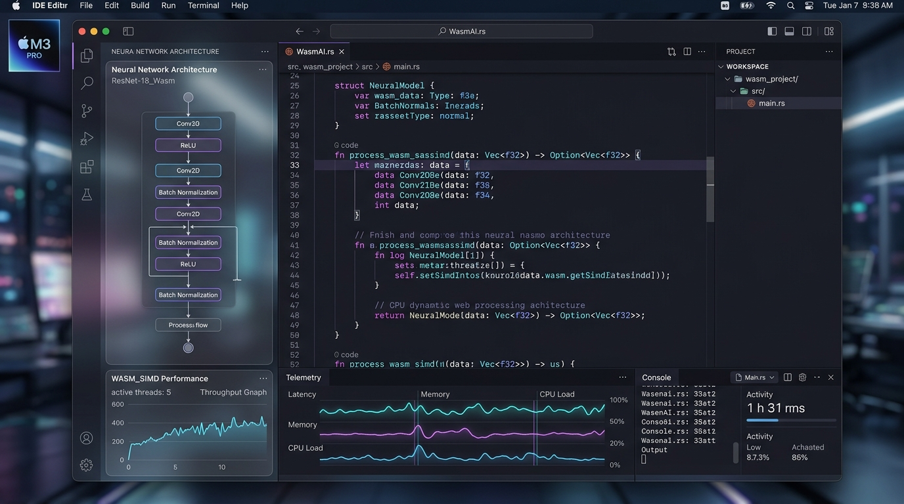

# Vaked IDE 🌌⚡

> **The Intergalactic Sovereign IDE for Apple Silicon & WASM Neural Workloads.**
> Built with **Tauri v2**, **Rust**, **React**, and **WASM SIMD**. Zero-tracking, high-efficiency, sovereign development environment.



---

## ✨ Features

- **⚡ Apple Silicon Native Performance**: Low-memory footprint, Metal GPU accelerated, blazing fast cold start (<300ms).
- **🧠 WASM SIMD & Neural Computation**: Execute low-bit quantized model inference (BitNet b1.58 / MLX) natively inside WebAssembly.
- **🛰️ NATS JetStream Mesh Telemetry**: Real-time distributed channel sync across your cloud nodes and local workstation.
- **🛡️ Sandbox & Zero-Tracking**: Strict Apple App Sandbox compliance (`com.apple.security.app-sandbox`), local-first data processing.
- **💎 Lovetta Lane Sovereign Monetization**: Integrated voluntary support & tip system directly connecting creators and users.

---

## 💻 Installation

### 1. Homebrew (macOS)
```bash
brew tap peterlodri-sec/tap
brew install vaked-ide
```

### 2. Standalone macOS Installer (.dmg / .app)
Download the latest `Vaked IDE_1.0.0_aarch64.dmg` from the GitHub Releases page or build locally:
```bash
git clone https://github.com/peterlodri-sec/vaked-sentinel.git
cd vaked-sentinel/ide/vaked-ide
npm install
npm run build
npx tauri build
```

---

## 🍏 Mac App Store & Transporter Submission Mini-Guide

Submitting `Vaked IDE` to the **Mac App Store** via **Apple Transporter CLI** / `xcrun altool`:

### Step 1: Pre-flight Verification & Signing
Ensure the bundle is signed with your Apple Developer identity (`3rd Party Mac Developer Application` or `Apple Distribution`):
```bash
codesign --force --deep --options runtime --sign "Apple Distribution: YOUR_TEAM_ID" "src-tauri/target/release/bundle/macos/Vaked IDE.app"
```

### Step 2: Build App Store PKG Installer
```bash
productbuild --component "src-tauri/target/release/bundle/macos/Vaked IDE.app" /Applications VakedIDE_AppStore.pkg
```

### Step 3: Validate Package with Transporter CLI (`altool`)
```bash
xcrun altool --validate-app \
  --file VakedIDE_AppStore.pkg \
  --type osx \
  --apiKey YOUR_API_KEY_ID \
  --apiIssuer YOUR_ISSUER_ID
```

### Step 4: Upload to App Store Connect
```bash
xcrun altool --upload-app \
  --file VakedIDE_AppStore.pkg \
  --type osx \
  --apiKey YOUR_API_KEY_ID \
  --apiIssuer YOUR_ISSUER_ID
```
*Alternatively, drag and drop `VakedIDE_AppStore.pkg` directly into the GUI **Transporter.app** on macOS.*

---

## 💖 Lovetta Lane & Sovereign Support

`Vaked IDE` is open-source under the AGPL-3.0 license and relies on community support via **Lovetta Lane**:

- 💳 **GitHub Sponsors**: [https://github.com/sponsors/peterlodri-sec](https://github.com/sponsors/peterlodri-sec)
- ⚡ **NATS Sovereign Node**: `dev-cx53.tail2870dc.ts.net:4222`
- 🌐 **Constellation Network**: [https://vaked.dev](https://vaked.dev)

---

## 📜 Privacy & Licensing

- **Privacy Policy**: Read our zero-tracking policy at [Privacy Policy](https://portail.vaked.dev/privacy.html).
- **License**: AGPL-3.0-only. See `LICENSE` for details.
