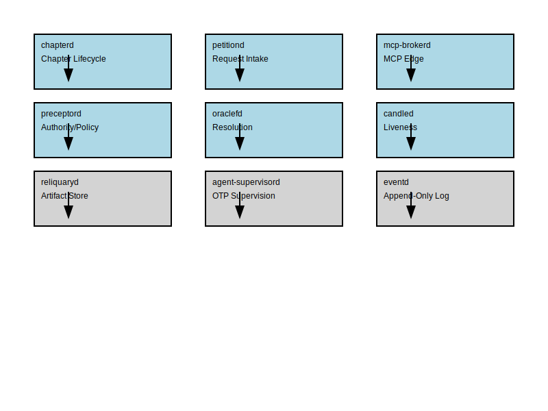
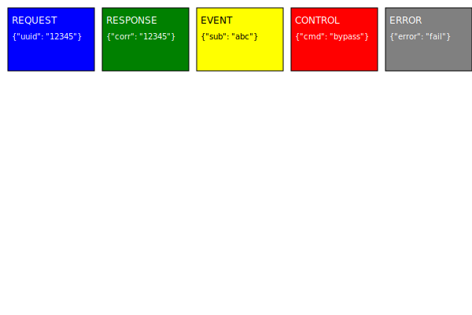

# RFC 0001 — HCP (Harness Control Protocol)

- **Status:** Draft / skeleton (stub)
- **Created:** 2026-06-08
- **Track:** Protocol

## Abstract

HCP (Harness Control Protocol) is the IPC/wire protocol for agent ↔ harness ↔ tool
communication in the Vaked runtime. It carries brokered tool calls, supervision/control
messages, and the event stream that operator surfaces subscribe to. **Litany** is its
reference implementation.

This RFC is an **overview and navigation hub** for the HCP protocol family. The detailed
normative specifications live in RFCs 0002–0006:

- **RFC 0002** — `.hcplang` schema language and `hcpbin` canonical binary encoding
- **RFC 0003** — Litany Wire framing, transport binding, and handshake protocol
- **RFC 0004** — Multi-agent state dependency model (write-ahead logging and checkpointing)
- **RFC 0005** — Control-plane request frames (pause, resume, step, rewind)
- **RFC 0006** — Inter-host fabric (SPIFFE/SPIRE identity and NATS distribution)

This document (RFC 0001) defines the frame model conceptually, identifies the roles
of runtime daemons in the protocol, explains design trade-offs, and cross-references
the child RFCs for normative detail.

## Terminology

| Term | Definition |
|------|------------|
| HCP | Harness Control Protocol; this protocol. |
| Litany | Reference implementation of HCP (wire format, frame model, schema language, binary encoding, daemons). |
| Litany Wire | The on-the-wire byte protocol: length-prefixed framing, transport-agnostic contract, preamble handshake. |
| Votive Frame | A single HCP message; consists of implicit header (kind/corr/stream/seq/end) + payload body. |
| Frame class | One of five message types: request, response, event, control, error. |
| `.hcplang` | Schema / IDL language describing frame and message types. |
| `hcplang` grammar | EBNF specification of `.hcplang` (RFC 0002 §2–3). |
| `hcpbin` | Canonical, deterministic binary encoding of frames (RFC 0002 §6). |
| Canonicality | Encoding is minimal, tag-ordered, default-omitted, NFC-normalized; required for eventd tamper-evidence. |
| Chapter | One logical conversation spanning one physical connection; has open/close lifecycle. |
| Correlation id | UUID matching requests to responses/errors and events to subscriptions. |
| Schema digest | Hash of normalized `.hcplang` source; used to negotiate frame schemas at handshake. |
| Stream | One independent request/response or event sequence within a chapter; has monotonic seq and credit. |
| Credit | Per-stream backpressure budget; frame count or octet window (RFC 0003 §7). |
| `eventd` | Append-only hash-chained log of applied actions; canonical frames only; single source of truth. |
| Reliquae | Artifacts (snapshots, checkpoints, proofs) stored in `reliquaryd` and referenced by hash in frames. |
| Tamper-evidence | Hash chain of eventd enforced by canonicality; byte-level modification breaks chain detectably. |

## Design Principles

The HCP protocol is structured around seven core principles:



1. **Transport-agnostic default, deployment-specific bindings** — HCP defines an abstract transport contract (RFC 0003 §3) independent of stdio, sockets, or vsock. Concrete bindings are profile specifications (RFC 0003 §12), not protocol requirements. This enables the same frame model across diverse deployment contexts (host-to-host, parent-to-child, host-to-guest VM, unikernel surfaces).

2. **Correlation, streaming, chunking are structural** — Frame header carries implicit fields (kind, correlation id, stream id, sequence, end flag) that enable pipelined requests, ordered delivery within streams, and multicast subscription without hand-rolled fields in every payload. This keeps frame body schemas minimal and the correlation model uniform.

3. **Tamper-evidence requires canonicality end-to-end** — Only frames with strictly canonical encoding (RFC 0002 §6.8: minimal varints, tag-ordered fields, default-omitted, NFC-normalized strings) are appended to the eventd hash chain. Non-canonical frames are frame-level errors, not chained. This makes the chain tamper-evident: any byte-level modification either breaks the length prefix or fails canonicality check.

4. **Authority is preceptord's, not the wire's** — HCP is transport; policy is orthogonal. The wire carries frames; `preceptord` decides what frame operations are admitted before dispatch. Unknown frame content is forwarded (forward-compat) but never executed. This separates concerns: wire is protocol-complete; authority is policy-complete.

5. **Control frames bypass data backpressure** — Ping/pong and flow-control frames take a separate send path exempt from data stream credit. This is the **deadlock-free guarantee**: the control plane always makes progress even if data backpressure is stuck, enabling liveness monitoring and graceful pause/rewind under load.

6. **Schema digests are identity** — Frame schemas are pinned by digest (hash of normalized `.hcplang` source), not by frame type name. Handshake negotiates schema-digest intersection (RFC 0003 §5.4). This decouples version evolution (minor = add optional field, major = breaking) from connection negotiation, enabling mixed-version peers and side-by-side deployments.

7. **Votive Frames ≠ Vaked AST** — The frame model in RFC 0001 is wire semantics, not a Vaked language feature. Vaked's `vaked.consume` directive lowers to `DependencyRegistration` frames (RFC 0004) at compile time, but frames are orthogonal to grammar. This avoids conflating transport with language evolution.

## 1. Frame model (Votive Frames)

A Votive Frame is the atomic unit of HCP communication. Every frame has an **implicit header** (never declared in `.hcplang`) carrying structural metadata (kind, correlation id, streaming coordinates), followed by a **body** whose schema is declared in `.hcplang` and encoded canonically via `hcpbin`.

The frame model consists of five frame classes, each serving a distinct role in request/response, event subscription, connection management, and error handling.

### Frame classes

- **request** — A peer asks another to perform an action. Carries a fresh correlation uuid and optional stream id for pipelined requests. The body schema depends on the target service (e.g., control requests, tool calls, state queries).

- **response** — A terminal reply to a request on the same correlation id. Echoes the request's correlation, stream id, and sequence number. Body is the result or structured error (if the frame *body* itself is erroneous; transport-level errors use error frames).

- **event** — An unsolicited or subscription-driven message. Carries a subscription correlation id (allowing multicast groups) and optional stream id. Used for streaming state updates, log entries, and operator surface subscriptions.

- **control** — Connection and session lifecycle frames (open, close, ping, pong, credit, pause, resume). These **bypass data backpressure** and take a separate send path to guarantee deadlock-free operation (see Design Principle 5).

- **error** — Terminal frame indicating a frame-level or protocol violation. Can terminate a request stream, a single stream, or the entire chapter (connection). Carries `error_kind` enum and optional message. Error frames are **not appended** to the eventd hash chain (non-canonical or protocol-level violations).



### Frame header (implicit, reserved)

The frame header is **not declared in `.hcplang`** but is implicit in every frame. Tag space `@0` is reserved for header extensions; authors declare fields starting at `@1`.

- `kind: enum FrameKind` — Frame class (0=request, 1=response, 2=event, 3=control, 4=error)
- `corr: uuid` — Correlation id. Requests generate fresh corr (uuid4); responses and errors echo corr to match requests. Events link to subscription corr to distinguish multicast groups.
- `stream: u64?` — Stream id for multi-frame exchanges. Absent = single-shot request/response. Present = one independent pipelined request or subscription within the chapter.
- `seq: u64?` — Monotonic sequence number within stream (1, 2, 3, …). Paired with stream; orders frames for reliable delivery within streams.
- `end: bool` — Set on terminal frame of a stream. Sender sets `end=true` on final frame; receiver knows no more frames will arrive on this stream. Single-shot request/response has `end=true`.

For exact byte-level encoding of frame header fields, see RFC 0003 §4.4.1 (header encoding detail with worked examples).

### Correlation and streaming

Every request generates a unique `corr` (uuid4). Responses and error frames on that correlation allow clients to match replies without maintaining explicit state. Events are linked to subscription `corr`, enabling one-to-many subscription groups within a chapter.

The `stream` id enables **pipelined requests**: one chapter can carry multiple independent request/response or event sequences, each with its own stream id and per-stream credit (RFC 0003 §7). Frames on different streams are independent; frames within a stream are ordered by `seq`.

### Chunking and backpressure

The `stream` and `seq` fields enable the sender to break large payloads into multiple frames:

```
request 1  (stream=1, seq=1, corr=ABC, end=false, body=first-chunk)
request 2  (stream=1, seq=2, corr=ABC, end=false, body=second-chunk)
request 3  (stream=1, seq=3, corr=ABC, end=true,  body=final-chunk)
```

Per-stream credit (RFC 0003 §7) enforces backpressure: sender waits for `credit` frames before sending more frames on the same stream.

### Error frames

Error frames carry:

- `error_kind: enum` — e.g., `transport`, `frame_level`, `protocol_version`, `schema_digest`, `authority`, `unknown_target`
- `message: string?` — Human-readable error description
- `context: map<string,string>?` — Debugging context (affected stream id, offending digest, policy reason, etc.)

**Key property:** Error frames do **not** advance the eventd hash chain. Frame-level errors (non-canonical encoding, unknown schema digest, frame syntax) are not appended to the log; they are transport failures. Control-plane refusals (policy denials) are also errors but may be logged at a higher level (operator decision).

For normative details on frame header fields, encoding, and error taxonomy, see RFC 0003 §4 and RFC 0002 §4.

## 2. Wire (Litany Wire)

Litany Wire is the on-the-wire framing and transport layer for HCP. It defines an **abstract transport contract** (RFC 0003 §3) that applies identically to stdio, Unix domain sockets, vsock, and other transport mediums. The protocol is transport-agnostic; concrete bindings (stdio profile, socket profile, vsock profile) are non-normative specifications (RFC 0003 §12).

### Transport contract

Litany Wire requires only six properties from the transport:

1. Reliable ordered delivery (no duplication, no reordering)
2. Byte-level fidelity (no corruption, no padding insertion)
3. One-way direction per stream (each side has dedicated read and write channels)
4. No framing delimiters or escape sequences needed
5. Support for graceful close (EOF signaling)
6. Optional: heartbeat/keep-alive (negotiated per connection)

### Framing (length-prefixed records)

Frames are transmitted as `varint(length) || frame-bytes`, where:

- `varint(length)` is an unsigned LEB128 varint in minimal encoding (no leading zeros)
- `frame-bytes` is the serialized frame (header + body)
- `length` counts `frame-bytes` only (not the length field itself)
- No padding or alignment; consecutive frames are placed end-to-end

The length prefix enables the decoder to skip unknown frames and allows streaming of large payloads without length introspection. For normative framing details, see RFC 0003 §4.

### Handshake and chapter lifecycle

When a new connection opens, the initiator sends a `HELLO` control frame (RFC 0003 §5.2) containing:

- Supported schema digests (e.g., the digest of `hcp.wire`, plus any application-specific schemas)
- Maximum frame size the initiator can accept
- Heartbeat parameters (idle timeout, liveness timeout)

The responder replies with `HELLO-ACK` control frame containing:

- **Intersection** of supported schema digests (only digests both sides support)
- Negotiated maximum frame size (minimum of the two sides' advertised limits)
- Negotiated heartbeat parameters

For a worked handshake example with byte-level traces, see RFC 0003 §5.8.

A chapter (session) is the logical conversation spanning one physical connection. All frames on that connection share the chapter context. Chapter state transitions (OPEN → STREAMING / PAUSED / REWINDING / RUNNING → CLOSED) are managed by `chapterd` (RFC 0003 §6). For chapter state machine diagram, see RFC 0003 §11. Connection close is implicit chapter close.

### Streaming and multiplexing

One chapter carries multiple independent streams (different stream ids). Each stream maintains:

- **Ordering:** Frames within a stream are ordered by `seq` (monotonic)
- **Credit:** Sender keeps a per-stream frame-count or octet-window budget (negotiated at handshake); `credit` control frames adjust budget as receiver consumes
- **Independence:** Frames across streams do not interfere; per-stream backpressure does not block other streams

### Liveness and flow control

Control frames (`ping`, `pong`, `credit`, `pause`, `resume`) are exempt from data stream backpressure. Senders maintain a **separate send path** for control frames (prioritized over data frames). Receivers **continuously read** control frames regardless of per-stream credit state.

This is the **deadlock-free guarantee**: the control plane always makes progress, enabling:

- Heartbeat monitoring (`ping`/`pong`) to detect dead peers within negotiated timeout
- Per-stream pausing (pause one stream while others flow)
- Global chapter pause/resume (pause all streams simultaneously)
- Rewind signaling (`pause` → apply state rollback → `resume`)

For normative flow control and liveness specifications, see RFC 0003 §7–8. For worked examples of credit grant and pause/resume flow, see RFC 0003 §8.4.1. For heartbeat interaction with control-plane pause, see RFC 0003 §7.5.

### Error handling

Two categories of errors:

1. **Transport faults** (connection reset, truncated frame, non-minimal varint length) — Close the connection immediately.
2. **Frame-level errors** (non-canonical encoding, unknown schema digest, frame syntax violation, authority denial) — Send an error frame; connection survives unless a subsequent error triggers transport close.

Frame-level errors **do not append** to eventd (not canonical or policy-approved). For a taxonomy of frame-level error kinds (malformed_frame, schema_digest_mismatch, unknown_service, authority_denied, etc.), see RFC 0003 §9.2.1. Depending on error severity and peer behavior, either side may initiate graceful close via `close` control frame or abrupt connection close.

### Concrete transport bindings

**stdio** (inherited stdin/stdout): Parent launches child with pipes connected to inherited file descriptors. Initiator role is defined per-deployment (parent-initiates or child-initiates, not negotiated).

**Unix domain socket** (fs-path named socket): Initiator connects to socket path; responder listens and accepts. Standard TCP-like semantics.

**vsock** (host-to-guest VM): Initiator connects to (cid, port) pair; responder listens. Enables host-to-unikernel communication without TCP/IP overhead (RFC 0010 MirageOS surface).

For normative transport profiles, see RFC 0003 §12.

## 3. Encoding (`hcpbin`)

`hcpbin` is the canonical, deterministic binary encoding for Votive Frames. Canonicality is **load-bearing**: only canonical frames are appended to the eventd hash chain (RFC 0002 §9). Non-canonical frames are frame-level errors, rejected by the wire layer, and **never logged**. This design closes the "two byte-strings per frame" hole: there is exactly one valid encoding per frame.

### Determinism as infrastructure

Canonical encoding is foundational for:

1. **Tamper-evidence** — eventd hash chain integrity depends on every appended frame having a unique byte representation. Byte-level modifications either break the length prefix (detected at frame boundary) or violate canonicality (detected at field decode). The chain is tamper-evident because the alternative (re-encode to maintain canonicality) introduces detectable artifacts.

2. **Replay and reproducibility** — `litanyreplay` reads eventd log and deterministically replays applied actions. Two independent players starting from the same log converge to identical state iff frames are encoded canonically and digests are deterministic.

3. **Introspection and debugging** — `litanydump` decodes captured frames. Without canonicality, the same frame could decode multiple ways, breaking binary search, binary diff, and forensic inspection.

4. **Source-mapping** — Vaked lowering (RFC 0012 §Pass 2) emits frames from the typed semantic graph. Frames carry optional `@source` annotations (source file, line, column). If frame encoding is canonical, frame digest = source digest identity: same `.vaked` source → same frame digest. This enables error messages pointing back to source.

### Canonical encoding rules

**LEB128 varints:** Minimal encoding, no leading zeros. Decoder rejects overlong varints as encoding violation.

**Zig-zag integers:** Negative numbers encoded as `(n << 1) ^ (n >> 63)`. Decoder validates bounds per declared width (i8, i16, i32, i64).

**Strings and Unicode:** Strings are UTF-8 with NFC normalization pinned to **Unicode 15.1.0** (RFC 0002 §6.4). Decoder rejects non-NFC strings as encoding violation. This locks string identity to a specific Unicode version for determinism (breaking change if ever updated).

**NaN canonicalisation:** f32 and f64 NaN payloads are stripped to canonical forms (`0x7FC00000` and `0x7FF8000000000000`), ignoring sign bit and mantissa variation.

**Records (struct-like types):** Fields must be emitted in ascending tag order (numerical). Non-optional fields equal to their default value must be omitted (space and identity savings). Optional fields absent from the instance must also be omitted. Unknown tags are accepted and skipped (forward-compat) but preserved for round-trip if the enclosing record is length-prefixed.

**Unions (sum types):** Each union arm is `tag || varint(arm-length) || arm-bytes`. The length prefix enables decoders to skip unknown union arms. Duplicate or out-of-order cases are encoding violations.

**Maps (key-value collections):** Entries must be sorted by canonical key encoding (not insertion order). Duplicate keys are encoding violations.

### Relationship to Vaked and source-mapping

Vaked compiler (RFC 0012 lowering pass) emits HCP frames from the typed semantic graph (RFC 0011). Frames are deterministic artifacts of compilation: same source → same semantic graph → same frames (modulo nondeterministic UUID generation, which is tagged separately).

Frames carry optional `@source` field (source file, line, column) enabling error messages that point back to `.vaked` source. The Vaked compiler is responsible for ensuring frame emission is deterministic; the wire layer enforces canonicality.

For normative encoding specifications and canonicality validation, see RFC 0002 §6.

## 4. Schema language (`.hcplang`)

`.hcplang` is the schema and interface definition language (IDL) for HCP frames. Every frame class has a schema (declared in `.hcplang`, named, versioned by digest) describing its required and optional fields. The language is small, typed, and deterministic: compiling two identical `.hcplang` sources produces the same digest.

### Grammar and type system

`.hcplang` supports top-level declarations:

- **records** (struct-like): named fields with numeric tags, types, defaults, constraints
- **unions** (sum types): named cases, each with numeric tag and optional payload
- **enums** (named integer constants): for frame class ids, error kinds, control verbs
- **type aliases**: for reusable types (e.g., `timestamp = i64` in nanoseconds UTC)

Type constructors: `bool`, `i8`…`i64`, `u8`…`u64`, `f32`, `f64`, `string`, `bytes`, `uuid`, `hash`, `vec<T>`, `map<K,V>`, `optional<T>`, `oneof<T1,T2,…>`.

Field constraints (advisory for codegen, not wire-enforced):

- **default** — Default value for omission in canonical encoding
- **range** `[min, max]` — Valid integer or string length range
- **regex** — Pattern for string fields
- **nonempty** — vec or map must have at least one element

See RFC 0002 §2–3 for normative grammar and type system.

### Versioning and evolution

Every field has an immutable numeric **tag** (e.g., `@1`, `@2`, …). Tags are never reused, even after field deletion.

**Minor version:** Add an optional field, add a union case, add an optional type parameter (safe; old decoders skip unknown fields/cases).

**Major version:** Remove a field, change tag semantics, break union layout (backward incompatible; new decoder required).

Version negotiation happens at handshake: handshake exchanges schema digests (hashes of normalized `.hcplang` sources). Only frames with digests in the negotiated intersection are allowed (RFC 0003 §5.4). Mixed-version peers are supported by filtering to common digests.

### Codegen targets

**Zig:** Struct and union types matching `.hcplang` records and unions; packed-integer helpers for deterministic encoding; encoder/decoder hooks enforcing canonicality rules.

**BEAM/Elixir:** Map-based records (tag → value tuples) and union tags; Erlang term codec integration for efficient serialization.

Code generators must enforce canonicality (minimal varints, NFC normalization, tag ordering, default omission).

### Schema formatter (`litanyfmt`)

`litanyfmt` reads `.hcplang` source and outputs normalized form: consistent whitespace, tag alignment, comment preservation. The normalized form is **canonical** per schema versioning. Schema digest = hash of formatter output, enabling de-duplication (two schemas normalize identically ↔ same digest).

Example:

```
record DependencyRegistration
  @1 consumer_id: uuid
  @2 producer_id: uuid
  @3 consumed_at_step: u64
  @4 topology_epoch: u32 = 0
```

After `litanyfmt`, whitespace and tag alignment are normalized; digest = SHA256(normalized-bytes).

For normative grammar, type system, and evolution rules, see RFC 0002.

## 5. Roles / Daemons

HCP frames flow through a constellation of daemons under OTP supervision. Each daemon has a specific protocol responsibility. Daemons are deployed per-host (in the supervision tree) or per-connection (spawned per chapter).

### Connection lifecycle: `chapterd`

`chapterd` (chapter daemon) manages the lifecycle of a chapter (logical session) spanning one physical connection. Its responsibilities:

- Initiates `Open` control frame at connection start with supported schema digests and heartbeat parameters
- Tracks chapter state (OPEN / PAUSED / REWINDING / CLOSED)
- Sends `Close` control frame at graceful shutdown
- Notifies peers (via `candled` liveness monitoring) of chapter transitions
- Integrated with `agent-supervisord` for pause/resume/rewind operations

Each chapter has a unique uuid. When a chapter closes, all streams on that chapter are implicitly terminated.

### Authority and policy: `preceptord`

`preceptord` (precept daemon, from canonical rules) evaluates policies for incoming requests. It is the **authority plane** of the system.

`preceptord` checks if a peer (identified by SPIFFE ID from TLS, RFC 0006) may:

- Access a named capability (network, filesystem, mcp, eBPF, process, memory)
- Invoke a named daemon or command
- Read, write, or delete state of a named agent or relic

Policy decisions are **independent of the wire**. HCP carries frames; `preceptord` decides what is admitted before dispatch to the handler.

Denied requests produce error frames with typed `ControlRefusal` reason (RFC 0005). Authority is scoped by:

- **Peer identity** (SPIFFE ID, authenticated at TLS layer)
- **Agent identity** (target agent or supervisor name, resolved by `oraclefd`)
- **Capability set** (network, filesystem, mcp, eBPF, process, memory; inherited from parent supervisor or session)
- **Policy state** (current Vaked security policies, Nix modules, and runtime ACLs)

Unknown frame content is forwarded unchanged (forward-compat) but never executed.

### Durable storage: `reliquaryd`

`reliquaryd` (relic daemon) is the artifact store for large or expensive-to-serialize data referenced by frames.

Frame bodies may reference a relic by hash: `@relic(hash)` instead of inline. Examples:

- Snapshots (agent state at specific checkpoint)
- Checkpoints (consumer/producer boundary markers)
- Proofs (Merkle tree paths for cross-host verification)
- Corpora (raw or compressed log entries)

`reliquaryd` resolves hash → artifact on demand. Garbage collection is **dependency-aware** (RFC 0004): the GC floor is pinned by active consumer checkpoints. Artifacts below the GC floor may be deleted; artifacts above the floor are retained.

### Liveness monitoring: `candled`

`candled` (candle daemon, from vigil) monitors heartbeats and peer liveness. Its responsibilities:

- Initiates `ping` control frames at regular intervals (default ~15 s idle timeout)
- Receives `pong` control frames and updates liveness state
- Closes chapter if heartbeat deadline expires
- Reports peer status to operator surfaces and supervision tree

`candled` is integrated with the Erlang supervisor; if heartbeats fail, the supervisor may restart the chapter or escalate.

### Request intake: `petitiond`

`petitiond` (petition daemon) accepts incoming request frames and routes them to appropriate handlers.

Its responsibilities:

- Demultiplex request frames by target service (e.g., control requests → `agent-supervisord`, tool calls → `mcp-brokerd`)
- Buffer responses and send back as response frames on the same correlation id
- Enforce per-stream credit bookkeeping: refuse requests if stream credit exhausted (send error frame)
- Track open streams and correlations

### Name and capability resolution: `oraclefd`

`oraclefd` (oracle daemon, from oracle) resolves names to identities and answers capability queries.

Its responsibilities:

- Resolve agent names, daemon names, capability names to UUIDs
- Answer capability questions: "does agent X have network access?"
- Maintain the **roster** of known agents, their supervising tree, and inherited capabilities
- Consulted by `preceptord` for authority decisions
- Consulted by RFC 0005 control-plane handlers for target name → AgentId resolution

The roster is built from Vaked compiled artifacts (RFC 0012 lowering) and updated dynamically as agents spawn/die.

### MCP tool call broker: `mcp-brokerd`

`mcp-brokerd` (MCP broker daemon) is the edge broker for tool calls. It speaks HCP internally and MCP externally.

Its responsibilities:

- Receives tool call `request` frames from agents over HCP
- Translates to MCP tool calls to Claude API or user-provided tools
- Returns results as HCP `response` frames
- **Does not tunnel MCP inside HCP**; MCP is at the boundary
- Authority: `preceptord` gates which tools may be called

Brokered call flow:

```
agent → request frame (tool_name, args) 
     → mcp-brokerd → MCP call 
     → Claude/tool → MCP result 
     → mcp-brokerd → response frame (result or error)
     → agent
```

Each tool call gets a correlation id; responses are matched back to originating agent by correlation.

### Supervision and state dependencies: `agent-supervisord`

`agent-supervisord` is the core orchestration daemon. It supervises agent child processes under OTP supervision tree, manages state dependencies, and applies control-plane operations.

Its responsibilities:

- Supervise agent child processes; restart on failure per supervision strategy
- Receive control request frames (RFC 0005 §1): `PauseControl`, `ResumeControl`, `SetIntervalControl`, `StepControl`, `RewindControl`. For control semantics (pause = graceful, step = single tick), see RFC 0005 §2.1–2.2. For worked examples of each control verb, see RFC 0005 §3.1–3.4.
- **Write-ahead logging**: Log every applied control action to eventd *before* effect (RFC 0004 §3.1, RFC 0005 §3). For worked examples of checkpoint and rewind sequences, see RFC 0004 §5.
- Manage state dependencies (RFC 0004):
  - Register `DependencyRegistration` frames before agent consumes state
  - Maintain `ConsumerCheckpoint` durable acknowledgements
  - Verify cold-start dependency anchors before RUNNING (RFC 0004 §6.1 algorithm)
  - Emit `RewindEvent` to void anchors above rewind point (RFC 0004 §3.3 semantics)
- Block dependent agents on entry until producer dependencies are satisfied
- Maintain topology epochs and reject stale control frames (RFC 0005 §5, RFC 0004 §7.1)

The write-ahead discipline ensures eventd is the single source of truth: replay can reconstruct state by reading the log and re-applying actions in order, regardless of current runtime state.

### Event log and tamper-evidence: `eventd`

`eventd` (event daemon) is an append-only hash-chained log. Every applied action is recorded: control verbs, dependency registration, checkpoints, rewind markers, state snapshots.

Its responsibilities:

- **Append-only**: Only accept canonical frames (RFC 0002 §6.8); non-canonical → frame-level error, not appended
- **Hash-chained**: Each entry points to previous entry's hash; chain integrity is tamper-evident
- **Deterministic hash**: Use SHA-256 per RFC 0002 §6.5 so replays are reproducible
- **Compaction**: Respect RFC 0004 GC floor (dependency checkpoints pin artifacts)
- Serve as single source of truth for:
  - Replay (deterministic re-execution of all actions)
  - Audit (forensic inspection of what actions were applied, when, by whom)
  - Tamper-evidence (hash chain verification)

Frames that fail canonicality check are **not appended** and are reported as frame-level errors. This ensures the chain contains only canonical frames, making tampering detectable.

### Integration: State dependencies and control-plane

RFC 0004 `DependencyRegistration` frames flow: agent → `petitiond` → `agent-supervisord` → `eventd` (write-ahead).

RFC 0005 control request frames flow: client → `petitiond` → `agent-supervisord` → `eventd` → effect (pause/resume/step/rewind).

Both paths enforce write-ahead discipline: action is logged to eventd before being applied to the supervision tree. This makes the log the source of truth and enables recovery by replay.

For daemon specifications and protocol flow details, see the runtime daemon roster in `docs/runtime/` and RFC 0004, RFC 0005.

## 6. Security Considerations

HCP security is layered: the wire layer is untrusted; authority is policy. The wire carries frames; `preceptord` decides what is admitted. Tamper-evidence is enforced by canonicality end-to-end.

### Authority model

**Design principle:** Authority is policy, not transport. HCP is a **protocol** (stateless message exchange); authority is a **policy decision** (stateful evaluation by `preceptord`).

Authority properties:

- **Peer identity**: Established by SPIFFE/SPIRE mutual TLS authentication (RFC 0006 §1.2) before any frame is exchanged. The SPIFFE ID is the canonical identity. For SVID rotation and trust domain validation, see RFC 0006 §1.5–1.6.
- **Cross-host authority**: In multi-host deployments, preceptord on each host evaluates policy locally. For cross-host authority semantics and local-per-host decision making, see RFC 0006 §4.
- **Policy scope**: Capability sets (network, filesystem, mcp, eBPF, process, memory) scoped by agent, session, or peer identity. Policies are Nix-defined modules or runtime ACLs.
- **Frame authority**: Unknown frames are accepted and skipped (forward-compat) but never executed. This closes the "unknown frame injection" hole.
- **Refusal handling**: Denied requests produce error frames with typed `ControlRefusal` reason (RFC 0005 §4). Denial is a policy decision; denial does not invalidate the frame (re-submission under different policy may succeed).

### Capability scoping

Frames may carry `@cap` annotations indicating required capability. Example:

```
request NetworkQuery
  @1 target_host: string (@cap=network)
  @2 timeout_ms: u32
```

`preceptord` evaluates policy before dispatching: does the peer (identified by SPIFFE ID) have the `network` capability? Policy decisions are inherited through the OTP supervision tree: agent inherits from supervisor, supervisor inherits from session.

Capability revocation is immediate: `preceptord` policy update is effective on next frame evaluation. In-flight operations already dispatched to handlers are not rolled back (assumption: handlers respect capability guards internally).

### Canonical encoding = Tamper-evidence

Only frames with **strictly canonical** encoding (RFC 0002 §6.8) are appended to eventd hash chain. Non-canonical encoding is a frame-level error:

- Overlong varint length prefix → framing error, connection close
- Out-of-order tags in record → frame-level error, error frame sent
- Non-omitted default-valued fields → frame-level error, error frame sent
- Non-NFC Unicode strings → frame-level error, error frame sent

**Tamper-evidence property**: An attacker who modifies a frame byte-by-byte (e.g., changing correlation uuid, changing target agent name) must also re-encode to maintain canonicality. Re-encoding either:

1. Changes the frame-bytes length, breaking the length prefix (detected at frame boundary)
2. Changes the byte sequence in a way that violates canonicality rules (detected at field decode)
3. Maintains the same length (unlikely given encoding rules; only possible for limited modifications)

The eventd hash chain makes tampering **detectably different**. Verification is deterministic: read the hash chain and verify each link. Replaying eventd produces identical state iff all frames are canonical and hashing is deterministic (both guaranteed).

**Consequence:** Tamper-evidence does not prevent all attacks (policy can be wrong, peers can be compromised), but it makes attacks leave visible evidence. The chain is the audit trail.

### Replay and litanyreplay

`litanyreplay` reads eventd log (hash-chained, canonical frames) and deterministically replays applied actions. Starting state + eventd log → final state is deterministic.

**Replay assumptions**:

1. Frames are canonical (enforced by eventd append rules)
2. Hashing is deterministic (SHA-256, RFC 0002 §6.5)
3. Replay is under **current policy** (not original policy); policy changes since the original action may cause replay to refuse or allow actions differently

**Applications**:

- **Disaster recovery**: Replayed eventd log on a new host converges to same state
- **Audit trails**: Inspect eventd log to reconstruct what actions were applied, when, by whom
- **Split-brain reconciliation**: If peers diverge, compare eventd logs and identify divergence point
- **Forensics**: Deterministic replay with debugging hooks to pinpoint action causing unintended state

Determinism is non-negotiable: if two implementations of `litanyreplay` produce different state from the same eventd log, one is incorrect (breaking detection).

### Determinism and source-mapping

Vaked compiler (RFC 0012) emits frames from the typed semantic graph. Frames are deterministic artifacts: same source → same graph → same frames.

Frames carry optional `@source` field (source file, line, column in `.vaked` source). Errors in frame processing point back to source:

```
error: DependencyRegistration failed canonicality check at agent.vaked:42:5
  → topology epoch mismatch (epoch 1 != 2)
```

Frame digest = hash of frame bytes. If frame encoding is deterministic, frame digest is a proxy for source identity: same `.vaked` source → same frame digest. This enables:

- Source identity tracking across deployments
- Blame assignment (frame digest → source file + hash)
- Version tracking (frame digest changes when source changes)

### Field redaction

Sensitive fields (passwords, API keys, credentials) may be marked `@redact` in `.hcplang`:

```
record AuthRequest
  @1 username: string
  @2 password: string (@redact)
  @3 token_ttl_sec: u32
```

**Redaction scope:**

- **Operator surfaces** (web UI, CLI): Strip redacted fields before display. Operator sees `password: ***`.
- **eventd**: Redacted fields flow through the log unchanged (needed for replay). Operator-visible audit logs omit redacted fields.
- **Frame layer**: No redaction at wire level (full frame data needed for canonicality checks and replay).

Redaction is **presentation-layer only**, not cryptographic redaction. Redacted data is still present in eventd; only the operator surface hides it.

### Unknown content forwarding

Forward-compat: frames with unknown fields or union cases are decoded and re-encoded preserving unknowns. The length-prefix mechanism (RFC 0002 §6) enables skipping unknown content:

```
record RequestV1
  @1 target: string
  @2 timeout_ms: u32

record RequestV2 (with new @3 field)
  @1 target: string
  @2 timeout_ms: u32
  @3 priority: u8  (unknown to V1 decoder)
```

V1 decoder reads the record length, skips the `@3` field (unknown tag), preserves its bytes, re-encodes the entire record unchanged. V1 never executes the priority field; it's just carried forward.

**Property**: Unknown frames are never executed, only forwarded. This prevents downgrade attacks where a newer peer sends a frame with unknown-to-older-peer fields, causing the older peer to misinterpret or fail. Instead, the older peer preserves unknowns and forwards.

### Related specifications

For SPIFFE/SPIRE identity, see RFC 0006. For canonicality rules, see RFC 0002 §6. For control-plane refusals, see RFC 0005. For dependency verification, see RFC 0004.

## Open Questions and Deferred Decisions

The following questions are **inherited from child RFCs** (0002–0006) and are flagged for context. None block RFC 0001 content; they are deferred capabilities or provisional decisions.

### RFC 0002 — `.hcplang` and `hcpbin`

**Open question 3: Frame header extension space at `@0`** — Tag `@0` is reserved for header extensions (future capabilities like compression, encryption headers). The extension mechanism itself is not yet defined. Does `@0` carry a union of possible extensions, or is extensibility handled purely at the wire layer? (Deferred; no impact on RFC 0001.)

**Open question 4: Hash algorithm default** — Working default is SHA-256 (`0x01`). Should BLAKE3-256 become default? Should the algorithm be schema-pinned, connection-negotiated, or protocol-wide? (Provisional; does not block RFC 0001, deferred with #29 performance audit.)

**Open question 7: String normalisation cost** — NFC Unicode 15.1.0 normalization is CPU-intensive on hot path. Who bears the cost: encoder (producer normalizes before sending) or decoder (consumer validates post-receive)? (Provisional; does not block RFC 0001, deferred with #30 performance tuning.)

### RFC 0003 — Litany Wire

**Open question 1: `hcp.wire` schema form** — Should the normative control schema (frame classes, error kinds, control verbs) be an RFC appendix or a separately pinned `.hcplang` file? Layout and digest value are still TBD. (Blocks RFC 0003 completion; does not block RFC 0001 structure, marked #31.)

**Open question 6: Heartbeat timers** — 15 s idle timeout and 30 s liveness deadline are working defaults. Should these be local (unnegotiated) or connection-negotiated? Should they be advertised as capabilities? (Provisional; does not block RFC 0001, deferred with per-deployment tuning.)

### RFC 0004 — Multi-Agent State Dependency

**Open question 1: Lease duration for dead-consumer eviction** — When a consumer checkpoint is stale (consumer not heartbeating), how long before the producer can discard the anchor? Fixed duration, per-edge, or budget-derived? (Deferred with #28 budget design.)

**Open question 2: Proof retention (Merkle accumulator vs segment footers)** — Should proofs for cross-host verification be stored in a Merkle accumulator or as footer data in `eventd` segments? (Deferred; affects RFC 0004 implementation order #32.)

**Open question 4: Cross-node anchor serialization** — How do `DependencyRegistration` frames ride Litany Wire between hosts? Relates to RFC 0006 fabric boundary. (Deferred with cross-host scope #16.)

### RFC 0005 — Control-Plane Verbs

**Open question 1: `StepControl` carry count** — `steps: u32 = 1`? Should a single `StepControl` frame advance multiple ticks? (Deferred; first slice supports 1 step only.)

**Open question 3: Query/introspection frame** — Is `eventd state` verb over the wire or via `oraclefd` surface? (Deferred; relates to operator surface scope #34.)

### RFC 0006 — Inter-Host Fabric

**Open question 1: NATS integration** — Is NATS a Litany Wire transport or a separate notification plane? Current lean: NATS carries event notifications + accumulators; Litany Wire carries point-to-point request/response. Boundary unresolved architecturally (may require redesign as cross-host scale testing progresses, #16).

## Related Documents

- **RFC 0002** — `.hcplang` Schema Language and `hcpbin` Binary Encoding (normative)
- **RFC 0003** — Litany Wire Framing, Transport, and Handshake (normative)
- **RFC 0004** — Multi-Agent State Dependency Model (normative)
- **RFC 0005** — Control-Plane Request Frames (normative)
- **RFC 0006** — Inter-Host Fabric, SPIFFE Identity, and NATS Distribution (normative)
- **docs/runtime/README.md** — Runtime daemon roster and integration points
- **docs/protocol/README.md** — Protocol overview and architecture
- **vaked/schema/parallel-types.md** — Vaked type system and capability taxonomy
- **docs/language/0010-mirageos-unikernel-surface.md** — vsock transport for MirageOS
- **docs/language/0012-lowering.md** — Vaked semantic graph lowering to artifacts (including HCP frames)
- **docs/language/0013-mlir-topology.md** — MLIR topology compilation and frame emission
