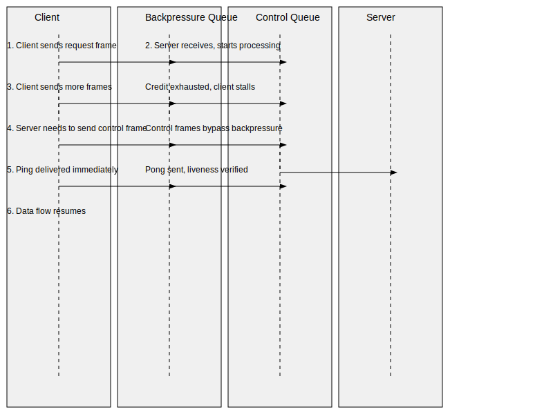

# RFC 0003 — Litany Wire (HCP transport & framing)

- **Status:** Draft
- **Created:** 2026-06-09
- **Track:** Protocol

## Abstract

**Litany Wire** is the transport and framing layer of HCP (the Harness Control
Protocol). It carries [`hcpbin`](./0002-hcplang.md)-encoded **Votive Frames**
between two HCP peers over an abstract bidirectional byte-stream. This RFC fills
in the wire portion of the umbrella RFC [`0001-hcp.md`](./0001-hcp.md) §2: it
defines the **transport contract** the wire requires of any substrate, the
**canonical frame delimitation** that turns a byte-stream into a sequence of
Votive Frames, the **handshake / version negotiation** that pins which
`.hcplang` schemas a connection speaks, the **session lifecycle** (`chapterd`'s
chapters and the multiplexing of correlated exchanges), **liveness** (`candled`
heartbeats), **flow control** (a credit scheme that keeps the **connection and
its control plane** deadlock-free), and the
distinction between **transport-level faults** (which tear down a connection)
and **frame-level failures** (the `error` Votive Frame, which terminates one
exchange).

This RFC **references but does not redefine** the Votive Frame model and the
frame header (`0001-hcp.md` §1, [`0002-hcplang.md`](./0002-hcplang.md) §4) or the
`hcpbin` byte encoding ([`0002-hcplang.md`](./0002-hcplang.md) §6). Litany Wire
treats a frame body as an opaque, self-delimiting `hcpbin` blob and supplies the
frame header (`kind`/`corr`/`stream`/`seq`/`end`, the reserved `@0` space) around
it. Litany Wire is **transport-agnostic** — it is specified over an abstract
octet duplex and given non-normative binding profiles for `stdio`, unix domain
sockets, and `vsock` (§12); it mandates no single baseline.

Litany Wire is also **MCP-agnostic.** `mcp-brokerd` is an ordinary HCP peer that
translates to and from MCP only at its own boundary; no frame class, control
verb, or wire type in this RFC is MCP-shaped. The wire knows only Votive Frames.

Like the rest of HCP, Litany Wire is **small, deterministic, and
evidence-oriented** (see the [language manifesto](../../docs/language/0001-language-manifesto.md)
and [`docs/context/PROJECT_CONTEXT.md`](../../docs/context/PROJECT_CONTEXT.md)):
the framing is canonical (exactly one byte string per frame stream), and only a
frame whose **full `frame-bytes` (header and body) is strictly canonical** per
[`0002-hcplang.md`](./0002-hcplang.md) §6.8 is admitted to the hash-chained
[`eventd`](../../docs/runtime/README.md) log, so a captured connection replays
deterministically under `litanyreplay`.

## Terminology

This table is aligned with [`0001-hcp.md`](./0001-hcp.md),
[`0002-hcplang.md`](./0002-hcplang.md), and
[`docs/protocol/README.md`](../../docs/protocol/README.md). Terms introduced by
this RFC are marked **(new)** and are mirrored into the protocol README.

| Term | Definition |
|------|------------|
| HCP | This protocol. |
| Litany Wire | The on-the-wire byte protocol (framing + transport rules) — this RFC. |
| Votive Frame | A single HCP message in the frame model ([`0002-hcplang.md`](./0002-hcplang.md) §4). |
| Frame header | The implicit, reserved fields every Votive Frame carries (`kind`, `corr`, `stream`, `seq`, `end`); supplied and validated by the wire layer ([`0002-hcplang.md`](./0002-hcplang.md) §4.2). |
| Frame class | One of the five Votive Frame roles: `request`, `response`, `event`, `control`, `error`. |
| `.hcplang` | Schema / IDL describing frame and message types ([`0002-hcplang.md`](./0002-hcplang.md)). |
| `hcpbin` | Canonical binary encoding of frames ([`0002-hcplang.md`](./0002-hcplang.md) §6). |
| Schema digest | The `hash` of a schema's `litanyfmt`-canonical normalised form; pins which `.hcplang` a frame was encoded against ([`0002-hcplang.md`](./0002-hcplang.md) §8). |
| Transport contract **(new)** | The minimal abstract byte-stream interface Litany Wire requires of a substrate (§3). |
| Frame record **(new)** | The on-stream unit: a length prefix framing one `hcpbin`-encoded Votive Frame (header + body) (§4). |
| Connection **(new)** | One instance of the transport contract — a single bidirectional byte-stream between two peers, end to end (§3, §6). |
| Chapter **(new)** | A `chapterd`-managed session/segment over a connection; the scope of correlated exchanges (§6). |
| Stream **(new)** | A multi-frame exchange within a chapter, identified by the header `stream` id (§6.3); distinct from "byte-stream" / connection. |
| Credit **(new)** | A flow-control grant: the number of further frames (or octets) a peer may send on a stream before pausing (§8). |
| Preamble **(new)** | The fixed magic + version + capability exchange that opens a connection before any Votive Frame (§5). |

Daemons referenced by this RFC use the established roster from
[`docs/protocol/README.md`](../../docs/protocol/README.md) — protocol daemons
`chapterd` / `preceptord` / `reliquaryd` / `candled` / `petitiond` / `oraclefd`
— and the runtime daemons from
[`docs/runtime/README.md`](../../docs/runtime/README.md): `agent-supervisord`
(Erlang/OTP control plane), `mcp-brokerd` (brokered MCP calls), and `eventd`
(hash-chained, tamper-evident event log). Tooling: `litanyctl`, `litanydump`,
`litanyfmt`, `litanyreplay`.

The key words **MUST**, **MUST NOT**, **REQUIRED**, **SHALL**, **SHOULD**,
**MAY** are used as in RFC 2119/8174.

## 1. Design goals & non-goals

**Goals.**

- **Transport-agnostic.** Define the wire over an abstract octet duplex (§3) so a
  single framing/handshake/flow-control design serves stdio, unix sockets, vsock,
  and any future reliable stream. No transport is privileged as *the* baseline.
- **Canonical, unambiguous framing.** A byte-stream decodes to exactly one
  sequence of Votive Frames; there is one and only one valid framing of a given
  frame sequence (§4). This is the foundation of the `eventd` hash chain and
  `litanyreplay`.
- **Deadlock-free connection & control plane.** A slow or stalled peer never
  forces the other to buffer without bound, and the **connection and its control
  plane** never deadlock (§8): control frames (`credit`/`pause`/`resume`/`ping`/
  `pong`/`goaway`) are guaranteed forward progress independent of data credit,
  on a send path that data backpressure cannot block (§8.3). This is a
  guarantee about the **connection**, not about every stream: a stream may be
  left permanently un-replenished as a *deliberate backpressure outcome* (§8.4),
  which is an application-layer condition, not a wire-level forward-progress
  failure.
- **Clean fault separation.** Transport faults end a *connection*; frame faults
  end an *exchange*. The two are never conflated (§9).
- **Evidence preservation.** A frame is admitted to the `eventd` chain **only**
  if its full `frame-bytes` (header and body) is strictly canonical `hcpbin`
  ([`0002-hcplang.md`](./0002-hcplang.md) §6.8); a non-canonical body is a
  frame-level `error` and is **not** chained as a valid frame, so the wire feeds
  `eventd` and replays deterministically (§10, §13).

**Non-goals.**

- **Not** a redefinition of Votive Frames or `hcpbin` — those are
  [`0002-hcplang.md`](./0002-hcplang.md). This RFC owns only what surrounds a
  frame body on the stream.
- **Not** an authority model. *Whether* a peer may open a chapter or invoke a
  service is `preceptord`'s decision, enforced above the wire (§13). Litany Wire
  carries the frames; it does not adjudicate them.
- **Not** an authentication/encryption layer. The wire assumes an
  authenticated, confidential substrate (a WireGuard tailnet, local socket
  permissions, or a vsock host/guest channel) and adds no crypto of its own
  (§13).
- **Not** MCP-aware. MCP terminates at `mcp-brokerd` (§Abstract, §13).

## 2. Layering

```text
  ┌─────────────────────────────────────────────┐
  │ services / authority  (preceptord, chapterd) │  ← above the wire
  ├─────────────────────────────────────────────┤
  │ Votive Frame model + header   (0002 §4)      │  ← frame semantics
  │ hcpbin frame body             (0002 §6)      │  ← canonical bytes
  ├─────────────────────────────────────────────┤
  │ LITANY WIRE  (this RFC)                       │
  │   preamble · framing · chapters · streams ·   │
  │   liveness · flow control · fault handling    │
  ├─────────────────────────────────────────────┤
  │ transport contract  (abstract octet duplex)  │  ← §3
  ├─────────────────────────────────────────────┤
  │ substrate  (stdio | unix socket | vsock)     │  ← §12, non-normative
  └─────────────────────────────────────────────┘
```

Litany Wire sits below frame *semantics* and above the *substrate*. It moves
opaque `hcpbin` frame records and manages the connection; it never inspects a
frame body's tagged fields. The frame header it does read and write, because the
header (`kind`/`corr`/`stream`/`seq`/`end`) is "supplied and validated by the
Litany Wire layer" per [`0002-hcplang.md`](./0002-hcplang.md) §4.2.

## 3. Transport contract

Litany Wire is defined over an **abstract bidirectional byte-stream**. A
substrate satisfies the **transport contract** iff it provides an octet duplex
with the following properties. A binding profile (§12) is the prose showing how
a concrete substrate meets each clause.

**T1 — Reliable.** Every octet handed to the transport for sending is either
delivered intact to the peer or the connection fails; octets are never silently
dropped or corrupted in transit. (Confidentiality and authenticity are the
substrate's job, not the wire's — §13.)

**T2 — Ordered / in-order.** Octets are delivered in the exact order sent. The
duplex is two independent ordered octet flows (one per direction); ordering is
per-direction, and the two directions are not mutually ordered.

**T3 — Length-unframed (octet stream, not message stream).** The transport
preserves no message boundaries. A `write` of *n* octets may arrive as any
number of `read`s totalling *n* octets, in order. **All framing is the wire's
responsibility** (§4); the wire MUST NOT assume a transport read aligns to a
frame boundary. (A datagram substrate that does preserve boundaries still
satisfies the contract as long as it is reliable and ordered; the wire simply
ignores the boundaries and re-frames per §4. Unreliable or unordered datagram
transports do **not** satisfy the contract and are out of scope.)

**T4 — Full-duplex.** Both directions may carry octets simultaneously and
independently. Neither peer is "the client" at the transport layer; the
handshake (§5) assigns the asymmetric *initiator* / *responder* roles.

**T5 — Close & half-close.** The transport MUST expose:

- **Orderly close (half-close / EOF):** a peer signals "I will send no more
  octets" on its outbound direction. The peer's inbound direction continues to
  deliver any octets already in flight, terminated by an EOF indication. A
  substrate that cannot signal *directional* EOF (only full close) satisfies the
  contract by mapping full close onto both directions' EOF simultaneously; the
  graceful-shutdown handshake in §6.4 then degrades to a best-effort `bye`
  followed by close.
- **Abortive close (reset):** a peer (or the substrate) tears the connection down
  immediately; further `read`/`write` fail. The wire treats this as a transport
  fault (§9.1).

**T6 — Connection identity.** One instance of the transport contract is one
**connection**, with a well-defined start (the point both directions are usable)
and end (both directions closed or an abort). Chapters and streams (§6) live
*inside* a connection and never span connections.

**What the contract deliberately does NOT require.** Message framing (the wire
adds it, §4); flow control or backpressure semantics (the wire defines its own,
§8 — the wire does not rely on transport-level window behaviour for correctness);
multiplexing (the wire multiplexes chapters/streams over the single duplex, §6);
authentication, encryption, or peer identity (the substrate provides these,
§13); record/datagram boundaries (ignored if present, T3).

These six clauses are the *entire* substrate dependency. Any substrate meeting
T1–T6 can carry Litany Wire unchanged.

## 4. Frame delimitation

This is the **canonical, unambiguous framing** of Votive Frames on the
byte-stream. It is the highest-stakes correctness property of the wire: because
the framing is canonical, a byte-stream decodes to exactly one frame sequence,
and a frame sequence encodes to exactly one byte-stream — which is what lets
`eventd` hash a frame deterministically and `litanyreplay` reproduce a captured
connection.

### 4.1 The frame record

After the preamble (§5), each direction of the connection is a contiguous,
gap-free sequence of **frame records**. A frame record is:

```text
frame-record := length  frame-bytes

  length      := varint(byte-len of frame-bytes)      # see 4.2
  frame-bytes := header-bytes  body-bytes             # one whole Votive Frame
```

- `frame-bytes` is **exactly one** `hcpbin`-encoded Votive Frame: the frame
  header (§4.4) followed immediately by the `hcpbin` body
  ([`0002-hcplang.md`](./0002-hcplang.md) §6). The wire treats `frame-bytes` as
  opaque except for parsing the header it itself wrote.
- `length` counts the octets of `frame-bytes` only — it does **not** include its
  own bytes. A length of `0` is illegal (every frame has a non-empty header) and
  is a framing violation (§4.5).
- Frame records are written back-to-back with **no padding, separators, or
  alignment** between them. The next record's `length` begins at the octet
  immediately after the previous record's final `frame-bytes` octet.

### 4.2 Length prefix — exact form

The `length` prefix is an **unsigned LEB128 varint**, reusing `hcpbin`'s varint
convention verbatim ([`0002-hcplang.md`](./0002-hcplang.md) §6.1): 7 bits per
byte, little-endian, high bit = continuation, encoded in the **minimal** number
of bytes.

Reusing one varint convention across the framing and the body keeps a single
codec path and removes any second integer encoding from the protocol.

**Strict (canonical) decode — normative.** A decoder MUST reject a non-minimal /
overlong length varint exactly as `hcpbin` mandates for body varints
([`0002-hcplang.md`](./0002-hcplang.md) §6.1): a `length` whose final byte is a
`0x00` continuation-cleared group that could have been elided is a **framing
violation** (§4.5). Because the only legal `length` values are the minimal
encodings of integers in `1 .. max_frame` (§4.3 — `max_frame` is a negotiated
protocol constant, and a `length` of `0` is illegal per §4.1), a `length` varint
encoded in **more bytes than the minimal encoding of `max_frame`** is overlong by
construction and is likewise a framing violation. The bound is the minimal width
of `max_frame`, not the implementation's internal integer width. This is what
makes the framing canonical: there is exactly one byte string for any frame
length, so two byte-streams can never decode to the same frame sequence and one
frame sequence can never encode two ways.

### 4.3 Max-frame-size guard

Each peer advertises a **maximum frame size** `max_frame` (in octets, counting
`frame-bytes`) during the handshake (§5.3). After the handshake, a peer MUST NOT
send a frame record whose `length` exceeds the value the *receiver* advertised,
and a receiver MUST treat a `length` greater than its own advertised `max_frame`
as a framing violation (§4.5) **without reading the body** — it has already been
lied to about the frame size, so it stops.

`max_frame` bounds a receiver's per-frame buffer so a hostile or buggy peer
cannot force unbounded allocation by claiming an enormous length. A peer with a
payload larger than the negotiated `max_frame` MUST chunk it across multiple
frames on a `stream` using the header `seq`/`end` mechanism
([`0002-hcplang.md`](./0002-hcplang.md) §4.2) — chunking is a frame-model
concern, and the wire never reassembles bodies. Default and floor values for
`max_frame` are in §5.3.

### 4.4 The frame header on the wire

The frame header is **not redefined here**; its fields and meaning are
[`0002-hcplang.md`](./0002-hcplang.md) §4.2 (`kind`/`corr`/`stream`/`seq`/`end`,
occupying the reserved `@0` tag space). This RFC fixes only *where* it sits in a
frame record: the header is the leading portion of `frame-bytes`, encoded with
the same `hcpbin` rules as the body and **prepended by the wire layer** ahead of
the body's author tags (`>= @1`), exactly as §4.2 / §6.2 of
[`0002-hcplang.md`](./0002-hcplang.md) describe ("the frame header is encoded by
the wire layer ahead of the body's tagged fields"). The wire reads
`kind`/`corr`/`stream`/`seq`/`end` to route and multiplex (§6); it does not read
the body.

### 4.4.1 Frame header encoding detail

The frame header is a record encoded under `hcpbin` canonicality (§4.2 of
[`0002-hcplang.md`](./0002-hcplang.md)). Its fields are:

| Tag | Name | Type | Meaning |
|-----|------|------|---------|
| @0 | `kind` | enum (u8: 0–4) | Frame class: 0=request, 1=response, 2=event, 3=control, 4=error |
| @1 | `corr` | uuid (16 bytes) | Correlation id: unique per request; echoed in response/error; subscription id for events |
| @2 | `stream` | u64? | Multi-frame stream id (optional; present only in chunked exchanges). Even ids allocated by initiator, odd by responder. |
| @3 | `seq` | u64? | Per-stream monotonic sequence number (optional; present only if stream is present). |
| @4 | `end` | bool | Terminal frame of stream (default false; omitted when false per §6.2 of [`0002-hcplang.md`](./0002-hcplang.md)) |

**Canonical encoding (normative):**
- Fields emitted in ascending tag order: `kind` (@0), then `corr` (@1), then `stream` (@2) if present, then `seq` (@3) if present, then `end` (@4) if true.
- `kind`: encoded as LEB128 varint, value 0–4.
- `corr`: 16 raw bytes (RFC 4122 UUID in big-endian byte order); not length-prefixed.
- `stream`: if present, encoded as LEB128 varint.
- `seq`: if present, encoded as LEB128 varint.
- `end`: bool field; if true (non-default), encoded as single byte `0x01`; if false (default), omitted entirely per RFC 0002 §6.2 default omission rule.
- Optional fields (`stream`, `seq`, `end`) are **omitted** (not encoded at all) if absent or false.

**Wire layer guarantees (§4.2 of [`0002-hcplang.md`](./0002-hcplang.md)):**
Because the wire layer prepends the header (never the application), the wire MUST ensure:
- Every correlation `corr` is a valid UUID (generated by the originating peer).
- `stream` ids do not collide within a connection (enforced by the initiator/responder parity rule).
- `seq` is monotonic per stream (each chunk increments by 1 or error).
- `end` is set exactly once per stream (final chunk only).
- Optional fields are omitted (not encoded with null/zero markers) if not needed.

**Decoder invariant:**
A decoder reading the header from `frame-bytes` MUST:
1. Read and validate `kind` is in range 0–4; out-of-range is a framing violation (§4.5).
2. Read 16-byte `corr` UUID.
3. If next tag is @2, read `stream` (u64); otherwise stream is absent (default None).
4. If next tag is @3, read `seq` (u64 varint).
5. If next tag is @4, read `end` (bool: 0x00 or 0x01). **Normative rule:** @4 is valid if @2 is
   present (for streaming-end-without-explicit-sequence use case, future extensibility).
   @3 is optional. @4 is INVALID if @2 is absent (no streaming, no end flag).
   Out-of-order tags (@4 before @2) or multiple @4 tags are framing violations.
6. Any tag > @4 begins the frame body (@1+ tags), not the header. Decoder has finished the header.
7. Default values: if @2, @3, or @4 are absent, use stream=None, seq=None, end=false respectively (per RFC 0002 §6.2 default omission).

**Example: single-shot request** (no stream/seq/end fields):
```text
  00                 # tag @0, kind=0 (request)
  01 xxxxxxxx...     # tag @1, corr (16-byte UUID)
  # next tag > @4 is body
```

**Example: multi-frame event with seq** (stream + seq + end):
```text
  02                 # tag @0, kind=2 (event)
  01 xxxxxxxx...     # tag @1, corr (16-byte UUID)
  02 <stream varint> # tag @2, stream id
  03 <seq varint>    # tag @3, seq number
  04 01              # tag @4, end=true (set on final frame only)
  # next tag > @4 is body
```

### 4.5 Resynchronization & abort on violation

A **framing violation** is any of: a non-minimal/overlong `length` varint (§4.2),
a `length` exceeding the advertised `max_frame` (§4.3), a `length` of `0` (§4.1),
a `frame-bytes` whose **header** fails to `hcpbin`-decode against the negotiated
schema set ([`0002-hcplang.md`](./0002-hcplang.md) §6.8) — i.e. the leading
`@0` header fields cannot be parsed at all, so the wire cannot route the record —
or a transport EOF in the middle of a partially-read frame record.

A framing violation is strictly about the **record envelope and the header**:
the receiver could not even establish what exchange the record belongs to, or
could not trust the byte-stream's frame alignment. A `frame-bytes` whose header
parses cleanly but whose **body** is malformed or **non-canonical** is a
different thing — the byte-stream is still well-aligned and the exchange is
known — and is a *frame-level* failure handled in §9.2, **not** a framing
violation. The boundary between the two is the §9.3 decision rule.

A length-prefixed framing has no in-band sync marker to scan forward to, and
inventing one would create a second, ambiguous framing (a payload byte could
masquerade as the marker) and break §4's canonicality. Therefore:

> **The wire does NOT attempt mid-stream resynchronization. A framing violation
> is unrecoverable: the receiver MUST abort the connection** (emit a transport
> fault per §9.1, append it to `eventd`, and abortively close — §6.4). The
> connection is the unit of framing trust; once the byte-stream's frame alignment
> is in doubt, every subsequent octet is suspect.

This is deliberate: resync is a *frame-level* recovery (`error` frames terminate
an exchange and the connection survives, §9.2), never a *framing-level* one.
Framing is all-or-nothing per connection. A peer that wants to recover simply
reconnects and re-runs the handshake (§5); chapters can be resumed across a new
connection if `chapterd` supports it (§6.5, Open question 3).

### 4.6 Worked framing example

A `ToolCallRequest{ tool = "fs.read", args = <0x6b6579> }` (the
[`0002-hcplang.md`](./0002-hcplang.md) §10 example) carried on a single-shot
request (no `stream`/`seq`, so those optional header fields are omitted per
§6.3):

```text
  <len>          # varint(byte-len of header-bytes ++ body-bytes)
  <header-bytes> # hcpbin of {kind=request, corr=<uuid>}  (stream/seq omitted, end=false omitted)
  01 07 66 73 2e 72 65 61 64   # body tag @1, string len 7, "fs.read"
  02 03 6b 65 79               # body tag @2, bytes len 3, 0x6b 0x65 0x79
```

The receiver reads `<len>`, then reads exactly `<len>` octets, then decodes the
header to learn this is a `request` on correlation `corr`, hands the body to the
frame layer, and resumes reading the next record's `<len>` at the very next
octet. `eventd` chains `H(prev || frame-bytes)`; `litanydump` renders
`frame-bytes` against the negotiated schema digest. Any conforming sender
produces byte-identical `frame-bytes` (§6.8 of [`0002-hcplang.md`](./0002-hcplang.md))
and, by §4.2 here, a byte-identical `length`.

## 5. Handshake & version negotiation

Before any frame record, a connection runs a fixed **preamble** exchange. The
preamble is the only part of the wire that is *not* a Votive Frame, so that
incompatible peers fail fast and cheaply, and so that a non-HCP byte-stream is
rejected immediately.

### 5.1 Roles

The transport contract is symmetric (T4), so the wire assigns roles: the peer
that begins the connection is the **initiator**; the other is the **responder**.
(For stdio this is the spawning process; for a socket/vsock it is the
`connect()` side; see §12.) Role determines who sends the preamble first (§5.2)
and is used to break ties in id allocation (§6.3).

### 5.2 Preamble sequence

```text
  initiator → responder :  magic  HELLO
  responder → initiator :  HELLO-ACK   (or  REFUSE, then close)
```

The connection opens with **four raw magic octets**, written by the initiator
**directly onto the byte-stream, before the first `hcpbin` record of any kind**:

```text
  magic := 0x48 0x43 0x50 0x00      # "HCP\0"  — 4 raw leading octets, NOT a frame record
```

The magic is **not** a frame record and **not** a `@N`-tagged field inside the
`HELLO`: it is a fixed 4-octet literal prefix on the wire, present so a decoder
can recognise the protocol *before it possesses any schema* (it cannot yet
`hcpbin`-decode anything, since which schema to decode against is itself
established by the preamble). A responder MUST read and verify exactly these four
octets first; a byte-stream that does not begin with them is not Litany Wire and
the connection is aborted (§9.1) without a `REFUSE` (there is no peer known to
understand one).

**Immediately after** the four magic octets, and with no padding, the initiator
writes the `HELLO` as an ordinary frame record (§4): a `length` prefix followed by
the `hcpbin` bytes of a **wire-control preamble record** defined by the reserved
`hcp.wire` schema (§5.6), carried as a `control`-class Votive Frame. The
`HELLO-ACK` (and any `REFUSE`) is likewise an ordinary `hcp.wire` frame record,
with **no** magic prefix — the connection is already identified by the time the
responder replies. So the very first octets a responder consumes are
`magic ++ length ++ hcpbin(HELLO)`, and from the `length` onward everything on
the connection is canonical frame records (§4).

### 5.3 Contents of HELLO / HELLO-ACK

The `HELLO` / `HELLO-ACK` body carries (encoded as `hcpbin` against `hcp.wire`).
The magic is **not** among these fields — it is the raw 4-octet prefix that
precedes the `HELLO` frame record on the byte-stream (§5.2), not a `hcpbin`
field:

| Field | Meaning |
|-------|---------|
| `wire_version` | Litany Wire protocol version (this RFC = `1`). Semver-major; see §5.5. |
| `max_frame` | The **receiver-side** maximum frame size this peer will accept (§4.3). MUST be ≥ the floor (below). |
| `schema_digests` | The set of `.hcplang` schema digests ([`0002-hcplang.md`](./0002-hcplang.md) §8) this peer is prepared to speak, each a `hash`. |
| `capabilities` | An extensible set of optional feature flags (e.g. credit-based flow control vs. stream-pause, half-close support). Unknown flags are ignored (forward-compat, §5.5). |

`max_frame` **floor:** every peer MUST accept frames of at least **64 KiB**
(`65536` octets) of `frame-bytes`; advertising a smaller `max_frame` is illegal.
The default advertised `max_frame` if a peer has no reason to choose otherwise is
**1 MiB**. The negotiated per-direction limit is *the receiver's advertised
value* (each direction is bounded by the side that must buffer it).

### 5.4 Schema-digest negotiation

`schema_digests` ties version negotiation to
[`0002-hcplang.md`](./0002-hcplang.md)'s **schema-digest authority** (§8): a frame
on the wire pins its schema by digest, `oraclefd` resolves a digest to a schema,
and `preceptord` may scope authority by digest. On the wire:

- The connection's **agreed schema set** is the intersection of the two peers'
  advertised `schema_digests`. A frame whose body is encoded against a digest
  **outside** the agreed set MUST NOT be sent.
- A receiver that reads a frame header referencing a digest outside the agreed
  set treats it as a **frame-level** failure (`error`, §9.2) if the connection is
  otherwise healthy — the offending exchange is rejected, the connection
  survives. (A digest mismatch is about *one* frame's schema, not the
  byte-stream's integrity, so it is not a framing violation.)
- If the intersection is **empty**, the peers share no common vocabulary; the
  responder sends `REFUSE` with reason `no-common-schema` and closes (§5.7). The
  initiator MAY retry after acquiring a digest the responder advertised
  (resolution via `oraclefd` is out of band).
- A peer MAY carry the *digest* without holding the schema source; `oraclefd`
  resolves digests to `.hcplang` for `litanydump` and for `preceptord` policy.
  The wire only compares digests for equality.
- The reserved `hcp.wire` control schema (§5.6) is **not** part of this
  intersection: its digest is a well-known pinned constant every implementation
  embeds, and is implicitly agreed on every connection. `schema_digests` and the
  intersection above govern only **service-level** schemas; digest-equality for
  the control schema is satisfied by construction against the §5.6 pinned value.

### 5.5 Preamble field requirements and compatibility (CRITICAL)

**MANDATORY fields in HELLO and HELLO-ACK:**

The `trust_domain` field (@5) in HELLO and HELLO-ACK is **REQUIRED** for RFC 0003 v1
conformance (see RFC 0006 §1.6 for the security rationale: SPIFFE trust domain
validation). Every implementation MUST:
1. Populate `trust_domain` with the SPIFFE ID trust domain extracted from the
   TLS peer certificate SAN.
2. Validate the responder's `trust_domain` against the TLS-authenticated peer
   identity, rejecting mismatches with `REFUSE{trust-domain-mismatch}`.

**Compatibility note:** This RFC 0003 is still in development; there are no
deployed v1 implementations yet. Trust domain validation is a **mandatory
security feature** of wire_version=1. Any hypothetical older v1 draft
implementations that predate trust domain support are not conformant to this
final RFC 0003 specification and MUST be updated.

**Schema exception:** Although @5 appears as the fifth field in HELLO/HELLO-ACK,
it is **exempt from RFC 0002 §6.2 default-field-omission rule**. A peer MUST
always encode trust_domain (@5), even if the value equals a default. This
exception exists because trust domain validation is a critical security property
that must be present to prevent downgrade attacks.

### 5.5.1 Version negotiation

`wire_version` is a single semver-major integer for the *framing/handshake*
protocol (this RFC = `1`); it is **distinct** from any `.hcplang` schema version
(those live entirely in `schema_digests`).

- If the responder's `wire_version` differs in **major** from the initiator's,
  the responder MUST `REFUSE` with reason `wire-version` and the highest
  `wire_version` it supports, and close. There is no minor/patch field at the
  framing layer in v1: framing changes that are not byte-compatible are
  major-version events, and feature additions ride `capabilities` instead.
- **Capabilities** are the forward-compatible extension point. A peer offers a
  set; the effective set is the intersection; an unknown capability flag is
  ignored (never an error). This lets v1 grow optional behaviour (e.g. a future
  flow-control mode) without a version bump, mirroring `.hcplang`'s
  "adding-is-minor, unknown-is-preserved" discipline
  ([`0002-hcplang.md`](./0002-hcplang.md) §8).

### 5.6 The `hcp.wire` reserved schema

The preamble records (`HELLO`/`HELLO-ACK`/`REFUSE`), plus the wire-control verbs
in §6–§9 (`open`, `close`, `bye`, `ping`, `pong`, `credit`, `pause`, `resume`,
`goaway`), are defined by a reserved `.hcplang` schema **`hcp.wire`**, carried as
`control`-class Votive Frames once the connection is up. Pinning them in a schema
(rather than ad-hoc bytes) means the wire's own control traffic is the same
canonical `hcpbin`, hashes into `eventd` the same way, and is rendered by
`litanydump` like any other frame.

**`hcp.wire` is normative.** Its field layout is fixed by the **normative
`hcp.wire` appendix** to this RFC (whose exact field layout is still being settled
— Open question 1), and its **schema digest is a well-known pinned constant**:
the `hash` of that appendix's `litanyfmt`-canonical normalised form
([`0002-hcplang.md`](./0002-hcplang.md) §8), **pinned in the `hcp.wire` appendix
(value TBD until the layout lands)**. Every conforming implementation embeds this
one constant. This is what gives §5.4's digest-equality a defined input for the
control schema: `hcp.wire`'s digest is **implicitly in the agreed set** on every
connection (a peer need not list it in `schema_digests`, and it never enters the
intersection computation in §5.4), because a Litany Wire implementation is defined
to speak exactly this pinned `hcp.wire` by construction. A peer that somehow
presents a *different* digest for the control schema is not speaking this version
of the wire and is handled as a `wire-version` incompatibility (§5.5). (The
appendix doubles as the home for the conformance vectors of §11; whether it is
literally an appendix to this RFC or a separately digest-pinned file like
[`hcp-core.hcplang`](../hcplang/examples/hcp-core.hcplang) is the remaining part
of Open question 1 — but it is normative either way.)

### 5.7 Failure modes (handshake)

| Condition | Result | Category |
|-----------|--------|----------|
| Bad/absent magic | Abort connection, no `REFUSE` (§5.2). | Transport fault (§9.1) |
| Malformed preamble (`hcpbin` decode fails) | Framing violation → abort. | Transport fault (§4.5, §9.1) |
| Preamble timed out (no HELLO-ACK within handshake deadline) | Abort connection. | Transport fault (§7.4, §9.1) |
| `wire_version` major mismatch | `REFUSE{wire-version, supported}`, graceful close. | Negotiation refusal (§9.1a) |
| Empty schema-digest intersection | `REFUSE{no-common-schema}`, graceful close. | Negotiation refusal (§9.1a) |
| `max_frame` below floor | `REFUSE{bad-max-frame}`, graceful close. | Negotiation refusal (§9.1a) |
| HELLO `trust_domain` does not match TLS peer identity (RFC 0006 §1.2) | `REFUSE{trust-domain-mismatch}`, graceful close. | Negotiation refusal (§9.1a) |

The first three are **faults** (the byte-stream is not trustworthy Litany Wire);
the last three are **orderly negotiation refusals** — the stream is well-formed,
the peers simply do not match (§9.1a). `REFUSE` is a `control` frame on
`hcp.wire`; it is the **only** frame a responder sends before `HELLO-ACK`, and it
is always followed by an **orderly** close (§6.4, §9.1a), never an abort. After a
successful `HELLO`/`HELLO-ACK`, the connection is **open** and chapters may be
created (§6).

### 5.8 Worked handshake example (success case)

Two peers open a connection and exchange a service-level schema. Initiator
supports wire v1, max frame 1 MiB, and schema digest X (a tool-call schema);
responder supports the same. The handshake succeeds; frame exchange begins.

```text
Initiator                             Responder
─────────────                         ─────────
                    [transport open]
48 43 50 00   ──────────────────────→  [magic bytes: "HCP\0"]
              ← magic verified, now expecting frame record
<len=54>      ──────────────────────→  [frame length: HELLO is 54 bytes]
01 01         ──────────────────────→  [tag @0: kind=1 (control)]
01 xxxxxxxx...──────────────────────→  [tag @1: corr (UUID)]
              (rest of HELLO hcpbin:   [tag @2: wire_version=1]
              wire_version=1,          [tag @3: max_frame=1048576]
              max_frame=1048576,       [tag @4: schema_digests=[hash(X)]]
              schema_digests=[X],      [tag @5: capabilities=["credit"]]
              capabilities=["credit"]  [no more tags > @5]
              )
                                      [Responder decodes HELLO]
                                      [Responder's config: also v1, max 1 MiB,
                                       supports X, capabilities: ["credit"]]
              ←<len=54>                [frame length: HELLO-ACK is 54 bytes]
              ←01 01                   [tag @0: kind=1 (control)]
              ←01 yyyyyyyy...          [tag @1: corr (same UUID, echoed)]
              ← (rest of HELLO-ACK:    [tag @2: wire_version=1]
              wire_version=1,          [tag @3: max_frame=1048576]
              max_frame=1048576,       [tag @4: schema_digests=[hash(X)]]
              schema_digests=[X],      [tag @5: capabilities=["credit"]]
              capabilities=["credit"]  [no more tags]
              )
              [Initiator verifies HELLO-ACK corr matches HELLO corr]
              [Connection established; chapters/streams may now open]
```

**Key points:**
- Magic is **raw 4 bytes** (not a frame record).
- HELLO/HELLO-ACK are Votive Frames with frame header and body (both encoded
  as `hcpbin` against `hcp.wire`).
- Correlation id (`corr`) is echoed by the responder in HELLO-ACK to let the
  initiator match the response (idempotency, RFC 0003 §6.3).
- Both peers advertise identical capabilities → negotiated set is `["credit"]`.
- Schema digest intersection is `{X}` (nonempty, success).
- After HELLO-ACK, the wire layer is ready to carry service-level frames.

## 6. Session lifecycle

`chapterd` owns sessions and segments — **chapters** — over a connection
([`docs/protocol/README.md`](../../docs/protocol/README.md): "Session/segment
('chapter') lifecycle over a connection"). The wire provides the multiplexing
substrate; `chapterd` provides the lifecycle policy.

### 6.1 Connection vs. chapter vs. stream

Three nested scopes, smallest last:

- **Connection** (§3, T6): one transport-contract instance; bounded by the
  preamble (§5) and close (§6.4).
- **Chapter:** a `chapterd`-managed session/segment *within* a connection. A
  connection carries one or more chapters; chapters may be sequential or
  concurrent. A chapter is the scope `preceptord` authority and `eventd`
  segmentation attach to.
- **Stream:** a multi-frame exchange *within* a chapter, identified by the header
  `stream` id ([`0002-hcplang.md`](./0002-hcplang.md) §4.2). Single-shot
  request/response exchanges use **no** `stream` (the `stream`/`seq` header fields
  are absent, §4.6); only multi-frame exchanges allocate one.

> "Stream" (a logical multi-frame exchange) is distinct from the connection's
> two byte-stream directions (§3). Where ambiguity is possible this RFC says
> "byte-stream" for the transport and "stream" for the exchange.

### 6.2 Opening & closing a chapter

A chapter is opened by an `open` control frame (`hcp.wire`, §5.6) and closed by a
`close` control frame, both carrying a **chapter id** (a `uuid`). `open` is
subject to `preceptord` admission above the wire (§13) — the wire delivers the
`open`; authority decides whether the chapter lives. `close` is acknowledged by a
`close` from the peer (or is implied by connection teardown). Frames belonging to
a chapter carry that chapter's context; the binding of frames to chapters is by
the chapter id established at `open` and the correlation/stream ids within it
(§6.3). Outstanding exchanges in a chapter at `close` are terminated as if by
`error{chapter-closed}` (§9.2).

### 6.3 Multiplexing correlated exchanges

Multiple exchanges share one connection concurrently. The wire multiplexes them
using **only** the frame header ([`0002-hcplang.md`](./0002-hcplang.md) §4.2) — it
introduces no additional wire-level exchange id:

- **`corr` (correlation id, `uuid`).** Identifies an exchange. A `request`
  carries a fresh `corr`; its terminal `response` or `error` echoes it; an
  `event` carries its subscription's `corr`. The receiver demultiplexes replies
  to outstanding requests by `corr`.
- **`stream` (`u64?`).** Present on multi-frame exchanges; groups the frames of
  one logical stream. Absent on single-shot request/response.
- **`seq` (`u64?`).** Monotonic per-`stream` sequence number; gives chunk
  ordering within a stream. Because the transport is in-order per direction (T2),
  `seq` is for *chunk identity and gap detection*, not reordering: a receiver that
  sees a gap in `seq` within a stream has detected loss or a sender bug and raises
  a frame-level `error` (§9.2).
- **`end` (`bool`).** Set on the terminal frame of a stream (the final chunk, or
  the `event` that ends a subscription per [`0002-hcplang.md`](./0002-hcplang.md)
  §4.3). After `end`, the `stream` id is retired and MUST NOT be reused within the
  chapter.

**Id allocation & collision avoidance.** `corr` and chapter ids are `uuid`s
(collision-resistant by construction). `stream` ids are `u64` and allocated by
the frame's *originator*; to keep two peers from colliding when both originate
streams on one connection, the **initiator allocates even `stream` ids, the
responder allocates odd** (the §5.1 role breaks the tie). This is the standard
parity split and needs no extra negotiation.

### 6.4 Connection close & half-close

Two ways a connection ends:

- **Orderly (graceful):** a peer sends a `bye` control frame (`hcp.wire`),
  signalling "no new chapters/exchanges; I will finish what's open and then
  half-close my send direction" (maps to transport half-close, T5). The peer
  reciprocates: in-flight responses drain, then both directions reach EOF and the
  connection ends. A `goaway` MAY precede `bye` to advertise intent to shut down
  (e.g. "draining, deadline `t`") so the peer stops opening new chapters early.
- **Abortive:** on a transport fault or framing violation (§9.1), a peer
  abortively closes (transport reset, T5). All chapters/streams are torn down;
  outstanding exchanges are failed locally as `error{connection-lost}`.

If the substrate cannot signal directional EOF (T5 note), `bye` is best-effort
and is followed by a full close; the peer detects the close and finalises.

### 6.5 Chapter resumption (working decision)

A chapter is scoped to a connection (§6.1). If a connection drops, its chapters
end. Whether a *new* connection may **resume** a prior chapter (re-attaching to
`chapterd` state by chapter id, so a dropped tailnet hop does not lose session
context) is a `chapterd` policy concern. **Working decision:** v1 does **not**
define cross-connection resumption — a dropped connection ends its chapters, and
a client re-opens. Resumption is flagged for a future capability (§5.5) and is
Open question 3.

## 7. Liveness

`candled` is the liveness / presence / heartbeat plane
([`docs/protocol/README.md`](../../docs/protocol/README.md): "Liveness / presence
/ heartbeat (vigil)"). Liveness detects a dead or wedged peer without ever
deadlocking on data flow.

### 7.1 Heartbeat (`ping` / `pong`)

Either peer MAY send a `ping` control frame (`hcp.wire`) carrying an opaque nonce;
the peer MUST reply with a `pong` echoing the nonce. `ping`/`pong` are
`control`-class Votive Frames and are accounted by `candled`.

### 7.2 Liveness is independent of data flow control (no deadlock)

**Critical invariant:** `ping`/`pong` and all `hcp.wire` control frames are
**exempt from data flow control** (§8). They are never blocked by exhausted
stream credit and never queued behind data frames for flow-control reasons. This
is what guarantees liveness cannot deadlock: even a peer that is fully
data-paused (§8) can still answer `ping` with `pong`, so the other side can always
distinguish "slow / backpressured" from "dead." A peer MUST process and respond
to control frames promptly regardless of the state of any data stream.

**Sender-side obligation (normative).** A sender MUST NOT let an outbound control
frame (`credit`/`pause`/`resume`/`ping`/`pong`/`goaway`, and the lifecycle
verbs `open`/`close`/`bye`) sit behind a **data** write that is blocked on
flow-control credit (§8) or on transport write-readiness. Control frames
therefore take a **separate / priority send path** that a stalled data write
cannot occupy: an implementation MUST be able to emit a control frame onto the
byte-stream even while one or more data frames are buffered and unsendable. (This
is the send-side counterpart to the receive-side drain obligation in §8.3(3) and
§11 (Conformance); together they, not any out-of-band channel, are what make the
bypass in §8.3(1) real — control frames travel the same byte-stream as data, but
never *queued behind* blocked data.)

### 7.3 Idle detection

Each peer runs an **idle timer**. If no frame (data *or* control) arrives within
the idle interval, the peer SHOULD send a `ping`; if no `pong` (or any other
frame) arrives within the **liveness deadline** after that, the peer declares the
connection dead and abortively closes (§9.1, reason `liveness-timeout`). Recommended
defaults: idle interval **15 s**, liveness deadline **30 s**; both are
implementation-tunable and MAY be advertised as capabilities (§5.5). The timers
are local; the protocol does not negotiate a single global value (a peer is free
to probe more aggressively than its partner).

### 7.4 Handshake & shutdown timers

The **handshake deadline** bounds the preamble: the responder must answer `HELLO`
with `HELLO-ACK`/`REFUSE` before it expires, or the initiator declares a transport
fault and closes (§5.7, §9.1). Liveness timers (§7.3) are **local and un-agreed at
handshake time** — no `capabilities` have been exchanged yet, so a peer cannot
assume the other's idle/liveness values — therefore the handshake deadline cannot
be defined as "the liveness deadline." Instead, **the initiator's handshake
deadline governs**: the initiator is the only party that has committed to the
connection at preamble time, so its locally-chosen handshake deadline is the
authoritative bound, and the responder, having no agreed timer to appeal to,
SHOULD answer as promptly as it can. (Recommended default: the same **30 s** as
the liveness-deadline default of §7.3, but as a *local initiator constant*, not as
a negotiated or responder-side value. This is a provisional choice — see Open
question 6.) A **drain deadline** bounds graceful close (§6.4): after `bye`, a peer
waits at most the drain deadline for outstanding exchanges before abortively
closing. No timer is allowed to block forward progress of control frames (§7.2).

### 7.5 Heartbeat interaction with control-plane pause (RFC 0005 integration)

When a target agent is paused via a `PauseControl` frame (RFC 0005 §2.1), the
pause affects **scheduling state only** — it does not pause the underlying
network connection or the `candled` liveness layer. Concretely:

- **Idle timer continues.** The connection's idle timer (§7.3) is **not** reset or
  suspended by a pause at the agent level. If no frame (data or control) arrives
  on the connection for the idle interval, `candled` still sends a `ping`.
- **Pause does not suppress heartbeat.** A paused agent continues to respond to
  `ping` frames with `pong`; the connection remains demonstrably live.
- **Heartbeat does not resume a paused agent.** Conversely, the arrival of a
  `ping`/`pong` does not wake a paused agent. Pause/resume are agent-level
  control (RFC 0005), not connection-level; they are orthogonal to liveness.

This separation ensures that pause/resume and liveness are independent concerns:
a paused agent is not mistaken for a dead peer, and liveness probes never
inadvertently resume an agent.

## 8. Flow control / backpressure

The flow-control scheme MUST keep **the connection and its control plane
deadlock-free** — the second-highest-stakes correctness property after canonical
framing. A slow consumer must never force the producer into unbounded buffering,
and the mechanism must never wedge the *connection*: control frames and every
other stream must keep making progress no matter how stalled any one stream is.



This is deliberately scoped to the **connection**, not to every individual
stream. Credit replenishment is a SHOULD (§8.1, §8.3(2)), so a receiver MAY leave
a single stream **permanently un-replenished**. That is a *deliberate
backpressure outcome* — the application/`chapterd` layer decided to stop
draining that stream — and is **not** a wire-level forward-progress failure. From
the wire's vantage a permanently-paused stream is indistinguishable from a dead
peer only by data flow; the two are told apart by **liveness** (§7), which keeps
the connection demonstrably live (`ping`/`pong` still flow), and ultimately by an
application/`chapterd` timeout that decides the stalled stream is no longer worth
keeping open. The wire's guarantee is narrower and sharper: the *connection* never
deadlocks, and a stalled stream is always *observably* stalled rather than
silently wedged.

### 8.1 Mechanism: per-stream credit, with a connection-level guard

Litany Wire uses **receiver-granted credit** (a flow window), applied
**per-stream**, with a coarse connection-level cap as a backstop. This is the
default; a `stream-pause` mode is the negotiated alternative (§8.5).

- A receiver grants a sender **credit** for a stream: the number of further
  **frames** the sender may transmit on that stream before it MUST stop. (Credit
  is counted in *frames*, not octets, in v1 — frame count is simpler to reason
  about and `max_frame` (§4.3) already bounds each frame's octets, so
  frames × `max_frame` bounds buffered octets. An octet-granularity window is a
  capability, §8.6 / Open question 4.)
- Credit is issued by a `credit` control frame (`hcp.wire`) carrying
  `(stream, delta)`: "you may send `delta` more frames on `stream`." Credit is
  **additive** and **cumulative**; a receiver replenishes by sending more
  `credit` as it consumes.
- A sender MUST NOT send a data frame on a stream for which it holds **zero**
  credit. When credit reaches zero the sender **pauses** that stream and waits for
  more `credit`.

### 8.2 Initial credit

On stream open, the sender starts with an **initial per-stream credit** advertised
by the receiver (a `capabilities` value, §5.5; default **16 frames**). This lets
the first chunks flow without a round-trip. For single-shot request/response (no
`stream`), no credit accounting applies — a single request and its single
response are always permitted (bounded by `max_frame` and by `preceptord`
admission); credit governs **multi-frame streams**, which are the only unbounded
case.

### 8.3 Why this is deadlock-free

The deadlock hazard in any windowed scheme is a cycle where each peer is blocked
sending and neither can send the message that would unblock the other. Litany
Wire breaks every such cycle:

1. **Control frames bypass blocked data — by discipline, not by magic.** Control
   frames travel the *same* byte-stream as data; the bypass is guaranteed by two
   concrete obligations, not by any out-of-band channel:
   - **(a) Sender side (§7.2):** a sender MUST keep a control frame off the back of
     a data write that is blocked on credit or transport write-readiness — control
     frames take a separate/priority send path, so a `credit` grant can **always**
     be *emitted* even when every data stream in both directions is at zero credit.
   - **(b) Receiver side (§8.3(3), §11):** a receiver MUST continuously read frame
     records off the byte-stream and process inbound control frames promptly
     regardless of any stream's state, so a `credit` grant can **always** be
     *received* and acted on.

   `credit`, `ping`/`pong`, `pause`/`resume`, `close`, `bye`, and `error` are also
   never *charged* against data credit. Together (a)+(b) mean the grant that
   breaks a stall can never itself be blocked behind the stall it would lift.
2. **Credit is per-stream, multiplexed over one duplex.** One stalled stream
   (zero credit) does not block other streams; the receiver keeps reading the
   byte-stream and dispatching by header (§6.3), so a paused stream cannot
   head-of-line-block the connection. (A sender SHOULD interleave fairly across
   its streams; a receiver SHOULD grant credit so as not to starve a stream it
   intends to keep open.)
3. **The byte-stream is always drained.** A receiver MUST continue reading frame
   records off the transport even while application consumers are slow: it reads
   the frame, accounts it against the stream's credit, and either buffers a
   bounded amount (≤ outstanding granted credit × `max_frame`) or, if a consumer
   is too slow, stops *granting* new credit (never stops *reading*). Because the
   receiver never stops reading, the transport's own buffers never back up to the
   point of stalling the sender's control frames. Backpressure is expressed by
   **withholding credit**, not by refusing to read — the latter would reintroduce
   transport-level head-of-line blocking and a deadlock risk.
4. **Bounded outstanding.** A sender never has more than `granted` frames
   in flight per stream, so the receiver's per-stream buffer is bounded by
   `granted × max_frame`. The receiver chooses `granted`, so it chooses its own
   memory bound.

Together: backpressure (withhold credit) never blocks the channel that lifts
backpressure (control frames), and no single stream can wedge the connection.
What this argument establishes is therefore a **connection-and-control-plane**
property: the connection always makes progress, and control frames always flow.
It does **not** promise that every stream is eventually replenished — a receiver
that chooses never to grant more credit (§8.1 makes replenishment a SHOULD) leaves
that one stream permanently paused **on purpose**. Such a stream is a deliberate
backpressure outcome, not a wedged connection: liveness (§7) still proves the peer
is alive, so the stall is *observable*, and it is the application/`chapterd`
timeout — not the wire — that decides to abandon it. The only way the *connection*
makes no progress at all is a genuinely dead peer, which liveness (§7) detects and
resolves by teardown.

### 8.4 Overrun = fault

If a sender transmits a data frame on a stream for which the receiver has granted
**zero** credit (a credit-protocol violation), the receiver treats it as a
**transport fault** and tears down the connection (§9.1, reason
`credit-overrun`) — a peer that ignores credit cannot be trusted to respect the
receiver's memory bound, so the connection (not just the exchange) is ended. This
keeps the memory bound in §8.3(4) a hard guarantee rather than an honour system.

### 8.4.1 Worked flow-control example

Two peers exchange a multi-frame stream (e.g., a large file download) with credit-based flow control. Initiator starts at initial credit (default 16 frames per §8.2); when half consumed, receiver replenishes. Later the receiver pauses to apply backpressure.

**Initial credit grant (implicit, at stream open).** No explicit `credit` control frame sent; the responder (receiver) has advertised initial credit (e.g., 16 frames) in the handshake (§5.3). The initiator (sender) may now send up to 16 data frames on the stream.

**Scenario sequence:**

```text
Initiator (sender)                    Responder (receiver)
──────────────────────────            ──────────────────────────

open stream_id=0x01
   data frame (seq=1)
   (credit remaining: 15)    ──────→
   data frame (seq=2)
   (credit remaining: 14)    ──────→
   ...
   data frame (seq=8)
   (credit remaining: 8)     ──────→
                                    [Receiver reads 8 frames,
                                     decides to replenish]
                             ←───── credit{stream=0x01, delta=10}
   (credit remaining: 18)           [Initiator reads grant;
   data frame (seq=9)                now has 18 total]
   (credit remaining: 17)    ──────→
   data frame (seq=10)
   (credit remaining: 16)    ──────→
   ...
   data frame (seq=24)
   (credit remaining: 2)     ──────→
                                    [Receiver application is slow]
                             ←───── pause{stream=0x01}
   (sends nothing; waits)           [Initiator receives pause,
                                     stops sending on stream 0x01]
   
   [After timeout or app signal]
                             ←───── resume{stream=0x01}
   (credit now: 2)                  [Initiator receives resume,
   data frame (seq=25)                may resume]
   (credit remaining: 1)     ──────→
   ...
```

**Guaranteed properties:**

- Even while the initiator is stalled on stream 0x01 (credit exhausted or paused), the responder **can still receive and process** a `ping` / `pong` or `credit` control frame from the initiator (§7.2, §8.3(1)): the control frames bypass the data-flow blockage.
- The initiator **can still send** a `ping` or `credit` or `close` control frame to the responder even while stream 0x01 is at zero credit or paused (§7.2): control frames take a separate send path and are never queued behind blocked data writes.
- The responder **continues reading** the byte-stream even while the application is slow on stream 0x01 (§8.3(3)): if the initiator sends frames on *other* streams (say stream 0x03), the responder reads and buffers them up to their respective credit limits, without blocking stream 0x01 from eventually draining.

### 8.5 Negotiated alternative: stream-pause

Some substrates (notably constrained vsock/unikernel peers, §12.3) prefer an even
simpler explicit signal. A `stream-pause` capability (§5.5), when both peers
offer it, replaces per-stream credit with `pause(stream)` / `resume(stream)`
control frames: a receiver sends `pause` to ask the sender to stop a stream and
`resume` to restart it. `pause`/`resume` are control frames and so bypass data
flow control (§7.2), preserving the connection-level no-deadlock property by the
same argument as §8.3(1) — and, like credit, a `resume` that never arrives leaves
that stream deliberately paused without wedging the connection. The trade-off is a
round-trip of latency at each pause boundary versus credit's pipelining; both
modes keep the connection and control plane deadlock-free, and the default is
credit (§8.1).

### 8.6 What flow control does NOT do

It does not provide reliability or ordering (the transport does, T1/T2); it does
not fragment payloads (the frame model chunks via `seq`/`end`, §4.3); it does not
apply to single-shot request/response (§8.2). Octet-granularity windows,
auto-tuned initial credit, and priority across streams are deferred (Open
question 4).

## 9. Errors

Litany Wire draws a hard line between **transport-level faults** (which end a
*connection*) and **frame-level failures** (which end one *exchange* and leave
the connection healthy). Conflating the two is a classic wire-protocol bug; HCP
keeps them in separate mechanisms.

### 9.1 Transport-level faults → connection teardown

A **transport fault** is a violation of the wire's own invariants or of the
substrate. It is **not** representable as a Votive Frame to the peer (the
byte-stream's integrity is in doubt), so it tears down the connection. The set:

| Fault | Cause | Section |
|-------|-------|---------|
| Framing violation | bad/overlong length, `length > max_frame`, zero length, header decode failure, mid-frame EOF | §4.5 |
| Bad magic / malformed preamble | not Litany Wire, or `hcpbin` preamble decode fails | §5.2, §5.7 |
| Liveness timeout | no `pong`/frame within the deadline | §7.3 |
| Credit overrun | data frame sent with zero credit | §8.4 |
| Substrate abort | transport reset / unexpected EOF | §3 T5 |

(A handshake **`REFUSE`** is **not** in this table: it is an orderly, frame-
representable negotiation outcome, not a fault — see §9.1a. A **bad/absent magic**
or a **malformed preamble** *is* a fault, because there the byte-stream is not
trustworthy Litany Wire at all.)

Handling: the faulting peer (a) records the fault to `eventd` as a connection-end
event with a reason code (§10), (b) where the byte-stream is still writable and a
peer might still parse it, MAY send a final `goaway` control frame naming the
reason, then (c) abortively closes (§6.4). All chapters and streams on the
connection end; outstanding exchanges fail locally as `error{connection-lost}`
(those local `error`s are surfaced to the application, not sent on the dead wire).
**A transport fault always ends exactly one connection and never silently
continues on a desynchronised stream.**

### 9.1a Negotiation refusal → orderly close (`REFUSE`)

A handshake **`REFUSE`** is a distinct, third category — neither a transport fault
(§9.1) nor a live-connection frame-level `error` (§9.2). It is the **orderly**
outcome of preamble negotiation when the peers are well-formed Litany Wire but
incompatible: a `wire_version` major mismatch, an empty schema-digest intersection,
or a `max_frame` below the floor (§5.5–5.7). In every such case the byte-stream is
perfectly well-framed and the refusal is itself a frame-representable `hcp.wire`
`control` frame, so the responder:

1. sends a single `REFUSE{reason, …}` `control` frame on `hcp.wire` (the **only**
   frame it sends before `HELLO-ACK`, §5.7), then
2. performs a **graceful close** (§6.4) — not an abortive reset.

`REFUSE` is recorded to `eventd` as a connection-end event like any orderly close.
The distinction matters under the §9.3 decision rule: a fault means *the
byte-stream cannot be trusted* (abort), whereas a `REFUSE` means *the byte-stream
was fine, the peers simply do not match* (orderly close). Bad/absent magic and a
malformed preamble are **not** `REFUSE` cases — they remain faults (§9.1), because
there the stream is not trustworthy Litany Wire and there is no peer known to
understand a `REFUSE` (§5.2).

### 9.2 Frame-level failures → exchange termination (the `error` Votive Frame)

A **frame-level failure** is a typed failure of one *exchange* whose byte-stream
is intact. It is expressed as an **`error` Votive Frame** — the fifth frame class
([`0002-hcplang.md`](./0002-hcplang.md) §4), promoted precisely so "a typed
failure is a frame in its own right (terminating either a `request` or a
stream)." The wire transmits an `error` frame like any other frame record (§4); it
is the **frame layer**, not the wire, that mints it.

- An `error` echoes the failed exchange's `corr` and terminates that
  request/response or stream — and **only** that exchange. Other exchanges on the
  same chapter/connection are unaffected.
- A tool-level failure (a `ToolFault`-style result from `mcp-brokerd`,
  cf. the `ToolResult`/`ToolCallResponse` shapes in
  [`0002-hcplang.md`](./0002-hcplang.md) §10) is carried as an `error` (or as a
  failure arm of the response union) — a *frame-level* outcome that ends the call,
  not the connection. The wire does not distinguish a "tool said no" `error` from
  any other `error`; both are ordinary frame records.
- Causes that are frame-level (connection survives): a schema digest outside the
  agreed set (§5.4); a body that fails `hcpbin` decode, **or a body that decodes
  but is not strictly canonical**, against its pinned schema
  ([`0002-hcplang.md`](./0002-hcplang.md) §6.8) — *after* the header parsed
  cleanly; an unknown service/method or a `preceptord` denial (authority lives
  above the wire, §13); a `seq` gap within a stream (§6.3); a `chapter-closed` /
  `stream-reset` condition (§6.2).

**Non-canonical bodies are frame-level, and are never chained (normative).**
[`0002-hcplang.md`](./0002-hcplang.md) §6.8 requires a decoder to reject a body
that is decodable but not strictly canonical — a non-minimal/overlong varint
(§6.1), out-of-order or duplicate tags (§6.2), a non-optional field equal to its
default that was *not* omitted or an absent optional that *was* emitted (§6.3), or
a `bool` byte other than `0x00`/`0x01` (§6.4). When the header has parsed cleanly
(so the byte-stream alignment is sound and the exchange is identified) but the
body is non-canonical in any of these ways, the receiver MUST treat it as a
**frame-level `error`** echoing the offending `corr` (the exchange fails, the
connection survives). Its `frame-bytes` are **NOT** admitted to the `eventd`
chain as a valid frame (§10): admission requires strictly-canonical
`frame-bytes` end to end, and a non-canonical record fails that test, so chaining
it would let two distinct byte-strings stand for one logical frame and defeat the
"exactly one byte string per frame" tamper-evidence invariant. A peer **MAY**
escalate **repeated** non-canonical frames from a partner to connection teardown
as a local policy (a peer that cannot produce canonical `hcpbin` is buggy or
hostile), but a single non-canonical frame does not by itself end the connection.

### 9.2.1 Frame-level error taxonomy

When a frame-level error is generated, the `error` Votive Frame carries an
**`error_kind`** field (defined in `hcp.wire` schema, Appendix A) that categorizes
the failure. Common error kinds (provisional; the normative set is in the
`hcp.wire` schema):

| Error kind | Meaning | Recovery |
|------------|---------|----------|
| `malformed_frame` | Header parsed, body failed `hcpbin` decode or is non-canonical per RFC 0002 §6.8 | Caller may retry with corrected frame |
| `schema_digest_mismatch` | Frame's schema digest (pinned in header) not in agreed set from handshake (§5.4) | Caller must use a schema in the agreed set |
| `unknown_service` | Frame's service name (inferred from schema digest) is not registered | Caller must use a service name this runtime supports |
| `unknown_method` | Frame targets a service that exists, but method name is unknown | Caller must use a method name in this service |
| `authority_denied` | `preceptord` policy denied the principal authority for this action | Caller's principal (SPIFFE ID) lacks the capability; check policy |
| `seq_gap` | Multi-frame stream received out-of-order (a `seq` number was skipped) or duplicated | Sender must retransmit the entire stream starting from the gap |
| `chapter_closed` | Frame targets a chapter that has already closed | Caller must open a new chapter or use an existing open one |
| `stream_reset` | Frame targets a stream that was previously terminated with `end=true` (§6.3) | Caller must open a new stream for further exchanges |
| `invalid_correlation` | Frame references a correlation id that has no outstanding request on this connection | This is usually benign (late response after local timeout); ignore |

An `error` frame echoes the offending frame's `corr` and (if the cause is
clear) its `error_kind`. The offending frame is **not** admitted to `eventd`
(§10). The connection survives; other exchanges proceed normally.

### 9.3 Decision rule

The dividing question is **"is the byte-stream's frame alignment still
trustworthy?"** If **no** (we cannot reliably find the next frame boundary, or a
peer has proven it ignores the wire's invariants — e.g. a framing violation §4.5
or a credit overrun §8.4) → transport fault, tear the connection down (§9.1). If
**yes**, two sub-cases follow:

- During the **preamble**, a trustworthy byte-stream whose peers are simply
  *incompatible* (version/schema/max-frame, §5.5–5.7) → **orderly** negotiation
  refusal: send `REFUSE`, graceful close (§9.1a). The stream was fine; the peers
  did not match.
- On an **open connection**, a whole, well-framed record whose failure is about
  *that frame's* schema, authority, or content — including a **header-clean body
  that is malformed or non-canonical** ([`0002-hcplang.md`](./0002-hcplang.md)
  §6.8) → frame-level `error`, end the exchange, keep the connection (§9.2). The
  non-canonical record is **not** admitted to the `eventd` chain (§9.2, §10).

Framing trust is the line between fault and not-fault; among not-faults,
*preamble incompatibility* (orderly `REFUSE`) is distinct from a *live-connection
exchange failure* (`error`).

## 10. Determinism, evidence & replay

Litany Wire inherits HCP's evidence story
([`0002-hcplang.md`](./0002-hcplang.md) §9) and adds the connection-level events:

- **Canonical stream.** Because the framing is canonical (§4) and frame bodies are
  canonical `hcpbin` ([`0002-hcplang.md`](./0002-hcplang.md) §6.8), a connection's
  octet sequence is a deterministic function of its frame sequence. A capture can
  be re-emitted byte-for-byte.
- **Tamper-evidence (`eventd`).** A frame is **admitted** to `eventd`'s
  append-only hash chain **only if its full `frame-bytes` (header and body) is
  strictly canonical** per [`0002-hcplang.md`](./0002-hcplang.md) §6.8. An
  admitted frame is appended as `H(prev || frame-bytes)` — over the exact
  `frame-bytes` the wire delimited (§4.1), so the chain covers header and body
  together. A record that is *not* strictly canonical is **never** admitted as a
  valid frame: a framing violation aborts the connection and is recorded only as
  a connection-end fault (§9.1), and a header-clean-but-non-canonical body is a
  frame-level `error` whose offending `frame-bytes` are excluded from the chain
  (§9.2). This is precisely what keeps "exactly one byte string per frame" true
  over the chain — admitting a non-canonical record would let two byte-strings
  represent one logical frame. Connection-lifecycle moments (`open`, `close`,
  `bye`, `goaway`, transport faults with reason, §9.1) are also recorded, so the
  audit spine shows not just frames but the shape of the connection that carried
  them.
- **Replay (`litanyreplay`).** A captured Litany Wire log replays because every
  frame record is canonical and every body is `hcpbin` decoded against a
  digest-pinned schema ([`0002-hcplang.md`](./0002-hcplang.md) §8). Replayed
  frames are **re-admitted under current `preceptord` policy** — replay is not a
  way to bypass authority ([`0002-hcplang.md`](./0002-hcplang.md) §11).
- **Inspection (`litanydump`).** `litanydump` reads frame records, decodes each
  `frame-bytes` against the negotiated schema digest, and renders header + body;
  the handshake's `schema_digests` (§5.3) tell it which schema each frame was
  encoded against.

## 11. Conformance

A conforming Litany Wire implementation MUST:

1. Frame exactly per §4 (minimal varint length prefix bounded by the minimal width
   of `max_frame`, strict overlong rejection, `max_frame` guard, no inter-record
   padding) and produce byte-identical framing for a given frame sequence (§4.2).
2. Abort the connection on any framing violation and never attempt mid-stream
   resync (§4.5).
3. Open every connection with the four raw magic octets `HCP\0` *before* the first
   `hcpbin` record, then run the §5 preamble (`wire_version`, `max_frame` ≥ 64 KiB,
   schema-digest intersection) and refuse incompatible peers via an orderly
   `REFUSE` + graceful close (§9.1a) — distinct from a fault.
4. Speak `hcp.wire` control frames (§5.6) — embedding the pinned `hcp.wire` schema
   digest — and supply/validate the frame header (§4.4) without redefining the
   frame model or `hcpbin`.
5. **Continuously read frame records off the byte-stream** and process inbound
   control frames promptly regardless of any stream's flow-control state: a
   receiver expresses backpressure **only** by withholding credit (or sending
   `pause`), **never** by ceasing to read (§8.3(3)). Ceasing to read is
   non-conforming — it reintroduces transport head-of-line blocking and a deadlock
   risk.
6. **Never block an outbound control frame** (`credit`/`pause`/`resume`/`ping`/
   `pong`/`goaway`/`open`/`close`/`bye`) behind a flow-control-paused or
   transport-blocked **data** write: control frames take a separate/priority send
   path (§7.2). Items 5 and 6 are what make the §8.3(1) bypass real.
7. Exempt all control frames from data flow control (§7.2) and implement at least
   the credit scheme of §8 (a peer MAY additionally offer `stream-pause`), holding
   the per-stream memory bound of §8.3(4) as a hard guarantee (§8.4). The
   *connection and control plane* are kept deadlock-free; a permanently
   un-replenished stream is a permitted deliberate-backpressure outcome (§8), not a
   conformance violation.
8. Keep transport faults (§9.1), orderly negotiation refusals (§9.1a), and
   frame-level `error`s (§9.2) strictly separate, applying the §9.3 decision rule.
9. Admit a frame to the `eventd` chain **only if its full `frame-bytes` (header and
   body) is strictly canonical** per [`0002-hcplang.md`](./0002-hcplang.md) §6.8:
   feed `eventd` canonical `frame-bytes` and connection-lifecycle events (§10),
   treat a header-clean-but-non-canonical body as a frame-level `error` that is
   **not** chained (§9.2), and re-admit replayed frames under current `preceptord`
   policy.

Conformance vectors (golden framings, handshake transcripts, a credit-stall
scenario, and a non-canonical-body rejection case) accompany this RFC as a
companion artifact (Open question 1), validated by `litanydump` / `litanyreplay`.

## 11. Chapter & connection lifecycle state machine

The connection and its chapters progress through defined states. This diagram shows
the state machine for a single chapter within a connection (the connection itself
has OPEN/CLOSED states managed by the transport; chapters are nested within OPEN).

```text
                        ┌─────────────┐
                        │    OPEN     │  ← chapter opened by "open" control frame
                        └──────┬──────┘
                               │
                      ┌────────┼────────┐
                      │                 │
              ┌───────▼────────┐  ┌────▼────────┐
              │   STREAMING    │  │   PAUSED    │  ← PauseControl applied
              │ (frames flow)  │  │(scheduler off)
              └───────┬────────┘  └────┬────────┘
                      │                │
                      │◄───────────────┘ (ResumeControl)
                      │
                      │ (pause request)
                      ▼
              ┌───────────────┐
              │  REWINDING    │  ← RewindControl: dependencies re-verify
              └──────┬────────┘
                     │
         ┌───────────┼───────────┐
         │                       │
    ┌────▼────────┐     ┌───────▼──────┐
    │  RUNNING    │     │  PAUSED      │  ← stale_dependency
    │ (resume OK) │     │ (operator    │
    └────┬────────┘     │  intervention)
         │              └───────┬──────┘
         │ (close frame)        │ (explicit recovery)
         │                      │
         └──────────┬───────────┘
                    ▼
           ┌────────────────┐
           │    CLOSED      │  ← chapter ended
           └────────────────┘
```

**State meanings:**
- **OPEN:** Chapter is active; frames may arrive.
- **STREAMING:** Normal operation; `pause`/`resume` verbs are scheduling-only.
- **PAUSED:** Scheduler is off (PauseControl applied); in-flight requests drain; new ones queue.
- **REWINDING:** Producer has rewound; dependents are paused, then restarted for verification.
- **RUNNING:** Post-rewind verification passed; resume is safe.
- **PAUSED (stale_dependency):** Cold-start or rewind verification failed; requires explicit recovery.
- **CLOSED:** Chapter has ended; frames referencing this chapter are rejected with `chapter-closed` error.

---

## 12. Chapter multiplexing worked example

Two independent chapters (chapters A and B) share one connection. They are
multiplexed by their chapter ids (assigned at `open` frame). The wire can
interleave frames from both chapters; the frame header's chapter id routes each
frame.

```text
Initiator                                Responder
──────────────────────────────────────────────────
open { chapter_id: A_uuid }  ──────→    [creates chapter A]
                             ←────── open { chapter_id: A_uuid }

open { chapter_id: B_uuid }  ──────→    [creates chapter B]
                             ←────── open { chapter_id: B_uuid }

request {                    ──────→
  chapter: A_uuid,
  corr: req1_uuid,
  method: "fetch"
}
                                        [processes request on chapter A]
request {                    ──────→
  chapter: B_uuid,
  corr: req2_uuid,
  method: "list"
}
                                        [processes request on chapter B]
                             ←────── response {
                                        chapter: B_uuid,
                                        corr: req2_uuid,
                                        body: [items...]
                                      }

                             ←────── response {
                                        chapter: A_uuid,
                                        corr: req1_uuid,
                                        body: [data...]
                                      }

pause { chapter: A_uuid }    ──────→    [pauses chapter A only]
                                        [chapter B continues]

request {                    ──────→
  chapter: B_uuid,
  corr: req3_uuid,
  method: "update"
}
                             ←────── response { ... }  [B still works]

close { chapter: A_uuid }    ──────→    [closes chapter A]
                             ←────── close { chapter: A_uuid }
                                        [B is unaffected]
```

**Key points:**
- Each chapter is independent; pause on A doesn't affect B.
- Frame routing is by chapter id in the header (implicit, not in body).
- Responses must echo the request's chapter id and correlation id.
- Closing chapter A has no effect on chapter B.

---

## 13. Transport binding profiles (non-normative)

These profiles are **non-normative**: they describe how three concrete substrates
satisfy the §3 transport contract. None is *the* baseline — a conforming peer
picks whichever the deployment provides. (This resolves
[`0002-hcplang.md`](./0002-hcplang.md) Open question 1's "defer the baseline
choice to the Litany Wire RFC": the answer is **transport-agnostic, no mandated
baseline**.)

### 13.1 `stdio` — concrete spawn & handshake example

A parent process launches a child agent under `agent-supervisord`:

```bash
# Parent (responder)
child_pid = spawn("./agent-binary", stdin=parent_read, stdout=parent_write, stderr=log_fd)
conn = Litany.open(reader=parent_read, writer=parent_write, role=responder)

# Child (initiator)
conn = Litany.open(reader=stdin, writer=stdout, role=initiator)
conn.send_hello(wire_version=1, max_frame=1048576, schemas=[...])

# Parent receives HELLO, sends HELLO-ACK
parent_hello = conn.recv_hello()
conn.send_hello_ack(...)

# Both sides proceed with frame exchange
```

**Practical notes:**
- The parent and child agree on roles before spawn (via launch contract).
- No address/naming needed; the OS pipes are the channel.
- On spawn, both stdin/stdout are inherited; they are the connection.
- If child crashes, `agent-supervisord` sees the process exit and tears down the
  connection (transport fault, §9.1).

### 13.2 Unix domain socket — concrete bind & accept example

A daemon (`petitiond`) listens on a unix socket; a client connects:

```bash
# Daemon (responder)
socket = socket(AF_UNIX, SOCK_STREAM)
socket.bind("/var/run/vaked/petitiond.sock")
socket.listen(backlog=128)
socket.chmod(0o700)  # owner-only access

while True:
  client_sock, _ = socket.accept()
  conn = Litany.open(reader=client_sock, writer=client_sock, role=responder)
  handle_connection(conn)

# Client (initiator)
client_sock = socket(AF_UNIX, SOCK_STREAM)
client_sock.connect("/var/run/vaked/petitiond.sock")
conn = Litany.open(reader=client_sock, writer=client_sock, role=initiator)
conn.send_hello(...)
```

**Practical notes:**
- Permission-based security: only processes that can read/write the socket file
  can connect.
- Listening daemon is the responder; clients are initiators.
- Multiple clients can connect; each gets its own socket and connection.
- The path is a well-known daemon socket (similar to systemd user sockets).

### 13.3 `vsock` — concrete VM/host example

A host daemon listens on a `vsock` port; a guest unikernel connects:

```bash
# Host (responder)
sock = socket(AF_VSOCK, SOCK_STREAM)
sock.bind(VMADDR_CID_ANY, port=5000)  # VMADDR_CID_ANY = all guests
sock.listen()

(guest_cid, guest_port), _ = sock.accept()
conn = Litany.open(reader=sock, writer=sock, role=responder)
handle_guest(conn, guest_cid)

# Guest unikernel (initiator)
sock = socket(AF_VSOCK, SOCK_STREAM)
sock.connect(VMADDR_CID_HOST, port=5000)  # VMADDR_CID_HOST = the host
conn = Litany.open(reader=sock, writer=sock, role=initiator)
conn.send_hello(...)
```

**Practical notes:**
- `vsock` is a hypervisor-mediated socket; no networking stack needed.
- Host CID is a well-known constant (`VMADDR_CID_HOST`); guest CID is assigned
  by the hypervisor.
- Used for sealed unikernel ↔ host enforcement boundaries (RFC 0010).
- Security is the hypervisor isolation (not a network hop).

---

## 14. Security considerations

### 14.1 Substrate authentication & confidentiality

- **The wire assumes an authenticated, confidential substrate.** Litany Wire adds
  no encryption or peer authentication of its own; it relies on the substrate: a
  WireGuard tailnet for remote connections, unix-socket filesystem permissions for
  local ones, or the host/guest trust boundary of a vsock channel (§13). A
  deployment that exposes Litany Wire over an unauthenticated, cleartext transport
  is misconfigured — the magic (§5.2) is a *format* check, never an *auth* check.
- **Multi-host deployments (RFC 0006)** use mTLS (SPIFFE/SPIRE) at the TLS layer,
  which provides identity-verified channels before any Litany frame is parsed.

### 14.2 Authority & policy enforcement

- **Authority is `preceptord`'s, enforced above the wire.** The wire delivers
  `open`/`request`/subscription frames; *whether* a peer may open a chapter or
  invoke a service is a `preceptord` decision
  ([`0002-hcplang.md`](./0002-hcplang.md) §9, §11). A denied request is a
  frame-level `error` (§9.2), never a wire concept. The wire MUST NOT be a way to
  bypass authority: e.g. a frame referencing a schema digest outside the agreed
  set is rejected (§5.4), and replayed frames are re-admitted under current policy
  (§10).

### 14.3 Tamper-evidence via canonical encoding

- **Tamper-evidence rests on canonicality.** §4's canonical framing and
  `hcpbin`'s canonical bodies are what make the `eventd` chain meaningful; a
  non-canonical framing — *or admitting a non-canonical body* — would let two
  byte-streams stand for one logical frame and break the chain
  (cf. [`0002-hcplang.md`](./0002-hcplang.md) §11). This is why admission to the
  chain requires strictly-canonical `frame-bytes` end to end and a non-canonical
  body is a frame-level `error` that is **never** chained (§9.2, §10): conformance
  to §4 *and* to `0002` §6.8 is a security property, not merely a correctness one.

### 14.4 Resource-exhaustion DoS resistance

- **Resource limits bound DoS:** `max_frame` (§4.3) bounds per-frame allocation
  (prevents huge length claims); per-stream credit (§8) bounds per-stream buffering
  (prevents unbounded queuing on one stream); the connection-level liveness guard
  (§7.3) bounds idle-peer resource consumption (detects & closes dead connections).
- **Peer violations are terminal:** A peer that violates framing (§9.1) or credit
  (§8.4) is torn down immediately — the connection cannot be trusted. A peer that
  repeatedly sends non-canonical bodies (§9.2) MAY be torn down as local policy
  (a peer that cannot produce canonical `hcpbin` is buggy or hostile).

### 14.5 Control-plane deadlock-free guarantee

- **Control frames bypass data backpressure (§7.2, §8.3):** This is a security
  property: the control plane (pause/resume/rewind, credit grants, liveness) is
  guaranteed to make progress even when a data stream is paused or stalled. A
  slow application cannot starve the control plane, which is essential for
  operator intervention (e.g. pausing a runaway agent).
- **`@redact` is honoured end to end.** Fields marked `@redact`
  ([`0002-hcplang.md`](./0002-hcplang.md) §11) still participate in encoding and
  hashing (the chain covers the real value) but are elided from `litanydump`
  output and `eventd` projections; the wire neither logs nor exposes frame bodies
  beyond what those tools, honouring `@redact`, render.
- **No confused-deputy via unknown content.** Unknown tags/arms/algorithms in a
  body are preserved as opaque bytes for round-trip, never executed
  ([`0002-hcplang.md`](./0002-hcplang.md) §11); the wire, which never interprets
  the body at all, cannot be a path for this.
- **MCP at the edge.** MCP is terminated and translated by `mcp-brokerd` at its
  boundary; Litany Wire carries only Votive Frames. No MCP-shaped frame reaches
  the wire, so MCP-specific risks are contained at the broker, not on the wire
  (§Abstract, §1).

## Appendix A: The `hcp.wire` normative control schema

This appendix defines the reserved `hcp.wire` `.hcplang` schema used for the
preamble (§5) and all wire-control verbs (§6–§8). It is **normative** per §5.6:
the exact field layout below is the source of the pinned schema digest that every
implementation embeds. The schema version is **`0.1.0`** (semver-minor bumps to
this schema are allowed without a `wire_version` bump in the preamble, as long as
the digest is updated; major incompatible changes to the control model would
require a `wire_version` bump, §5.5).

```hcplang
schema hcp.wire {
  version = "0.1.0"

  /// The preamble exchange frames are their own exception: they use a
  /// stripped-down framing (magic + 4-octet prefix) and this schema.
  /// These three frames (HELLO/HELLO-ACK/REFUSE) are marked here
  /// with (preamble) for reference, though they follow the same
  /// @0–@4 header rules as all Votive Frames.

  /// Initiator → responder: handshake announcement of capability.
  frame HELLO control {
    wire_version:    u8         @1   # Version 1
    max_frame:       u32        @2   # Max frame size receiver will accept (bytes); ≥ 65536
    schema_digests:  vec<hash>  @3   # Hashes of supported schemas (not including hcp.wire)
    capabilities:    vec<string>@4   # Optional feature flags: ["credit", "stream-pause", …]
    trust_domain:    string     @5   # REQUIRED: SPIFFE trust domain (extracted from TLS SAN cert); MUST be present and validated by responder.
  }

  /// Responder → initiator: ack with negotiated values.
  frame HELLO-ACK control {
    wire_version:    u8         @1   # Echo of initiator's version
    max_frame:       u32        @2   # Responder's max frame size (sender will use min of both)
    schema_digests:  vec<hash>  @3   # Responder's supported schemas
    capabilities:    vec<string>@4   # Intersection of initiator + responder capabilities
    trust_domain:    string     @5   # REQUIRED: SPIFFE trust domain (extracted from TLS SAN cert); responder echoes initiator's validated trust domain
  }

  /// Responder → initiator: negotiation failure (preamble).
  frame REFUSE control {
    reason:          enum {
      wire-version   @1
      no-common-schema @2
      bad-max-frame  @3
      trust-domain-mismatch @4  # HELLO trust_domain does not match TLS peer identity
    } @1
    supported_wire_version: u8? @2  # If reason=wire-version, highest version responder supports
    message:         string?     @3  # Optional diagnostic (e.g., expected trust domain)
  }

  /// Chapter lifecycle: open a session/segment within this connection.
  frame open control {
    chapter_id:      uuid       @1   # Unique identifier for this chapter (responder's role)
    chapter_epoch:   u64?       @2   # Topology epoch at open (optional)
  }

  /// Close a chapter: no new exchanges; existing ones finish.
  frame close control {
    chapter_id:      uuid       @1   # Which chapter to close
    reason:          string?    @2   # Optional reason
  }

  /// Half-close signal: no new chapters after this; finish in-flight, then close.
  frame bye control {
    reason:          string?    @1   # Optional: why we are closing
  }

  /// Liveness probe: peer must respond with pong echoing the nonce.
  frame ping control {
    nonce:           bytes      @1   # Opaque nonce (peer echoes in pong)
  }

  /// Liveness response: echo the ping's nonce.
  frame pong control {
    nonce:           bytes      @1   # Echo of ping nonce
  }

  /// Flow control grant: increase credit on a stream.
  frame credit control {
    stream:          u64        @1   # Which stream
    delta:           u32        @2   # Number of additional frames granted
  }

  /// Flow control: request sender to stop transmitting on a stream.
  frame pause control {
    stream:          u64        @1   # Which stream to pause
  }

  /// Flow control: permit sender to resume transmitting on a stream.
  frame resume control {
    stream:          u64        @1   # Which stream to resume
  }

  /// Connection shutdown intent: closing soon; stop opening new chapters.
  frame goaway control {
    reason:          string?    @1   # Why we are going away
    deadline:        timestamp? @2   # Deadline for graceful drain (optional)
  }
}
```

**Schema digest pinning:** The canonical `litanyfmt` form of this schema (with
normalized whitespace, comment preservation, tag alignment) is hashed with
SHA-256 to produce the well-known digest value **[TBD: computed after RFC exits
Draft]**. Every implementation MUST embed this pinned digest value; it is the
source of truth for the `hcp.wire` control schema across all peers and all
versions of the wire protocol v1. The digest is used in two places:

1. During handshake (§5.4): peers **do not** exchange the `hcp.wire` digest in
   the `schema_digests` field of `HELLO`/`HELLO-ACK`. It is implicitly agreed
   (every v1 wire implementation knows it).
2. During frame processing (§9.2): if a frame header claims to be encoded under
   a schema digest that is known to be the `hcp.wire` digest value, the wire
   layer decodes it as a control frame (preamble + `open`/`close`/`ping`/etc.);
   otherwise it is a service-level schema and the frame is routed to `petitiond`.

## Open questions

These are genuinely-undecided choices. This RFC makes a working decision where
one is needed to stay internally consistent, and flags it here. Several connect to
[`0001-hcp.md`](./0001-hcp.md) and [`0002-hcplang.md`](./0002-hcplang.md) open
questions.

1. **The `hcp.wire` companion schema.** This RFC names a reserved `hcp.wire`
   `.hcplang` schema for the preamble and control verbs (`open`/`close`/`bye`/
   `ping`/`pong`/`credit`/`pause`/`resume`/`goaway`/`REFUSE`, §5.6) but does not
   give its field layout, nor the conformance vectors (§11). *Working decision
   (provisional, forced by I3):* `hcp.wire` is **normative** (§5.6) — its digest
   is a well-known pinned constant every implementation embeds, which is what gives
   §5.4's digest-equality a defined input — and its field layout + digest value are
   defined in the `hcp.wire` appendix before this RFC leaves Draft, alongside
   [`hcp-core.hcplang`](../hcplang/examples/hcp-core.hcplang). The remaining open
   part is only the **form**: should the normative `hcp.wire` be literally an
   appendix to *this* RFC, or its own file digest-pinned like any other schema?
   (Either way it is normative and the digest is pinned; the layout — hence the
   concrete digest value — is still TBD.)

2. **Credit granularity: frames vs. octets.** §8.1 counts credit in **frames**
   (simple; `max_frame` bounds octets per frame). A byte-window (like HTTP/2/QUIC)
   gives finer memory control for streams with wildly varying frame sizes.
   *Working decision:* frame-granularity credit in v1, octet-window as a future
   capability (§5.5). Is frame-granularity sufficient for the streaming workloads
   (large `reliquaryd` artifact transfers, long event subscriptions) HCP actually
   carries?

3. **Cross-connection chapter resumption.** §6.5 declines to define resuming a
   `chapterd` chapter on a new connection after a drop. *Working decision:* no
   resumption in v1; reconnect and re-open. Should resumption be a capability
   (§5.5) — important if a flaky tailnet hop (§13) drops connections under live
   sessions — and if so, how does re-admission interact with `preceptord` and the
   `eventd` chain across the seam?

4. **Initiator/responder role on stdio.** §12.1 leaves the stdio role
   (parent-initiates vs. child-initiates) to "the launch contract." *Working
   decision:* child-initiates (child sends `HELLO` on startup) as the common case.
   Should the role be fixed normatively for stdio, or stay a per-launch agreement
   set by `agent-supervisord` / `sandboxd`?

5. **`max_frame` floor & default.** §5.3 sets a 64 KiB floor and 1 MiB default.
   Are these right for the real payload distribution (small control + tool frames,
   occasional large artifact chunks), or should the default be lower (push large
   payloads to chunking sooner) or higher?

6. **Heartbeat & timer defaults vs. negotiation.** §7.3 uses local, unnegotiated
   timers (15 s idle / 30 s liveness). *Working decision:* local timers, optional
   capability advertisement. Should the wire negotiate a single agreed
   keepalive interval (predictable for both peers) or keep timers purely local
   (each peer probes to its own taste)? This is the wire-level analogue of
   [`0001-hcp.md`](./0001-hcp.md)'s liveness (`candled`) open surface.
   *Provisional choice forced by M3:* because no timer is agreed at handshake time,
   §7.4 makes the **initiator's** local handshake deadline authoritative (default
   30 s, a local constant) rather than "the liveness deadline." If this question
   resolves toward a negotiated keepalive, the handshake deadline should be
   revisited too (it cannot be negotiated *before* the handshake completes, so it
   would likely become a pinned protocol constant instead).

7. **Hash algorithm over `frame-bytes` for `eventd`.** §10 chains
   `H(prev || frame-bytes)` but inherits the *default algorithm* question from
   [`0002-hcplang.md`](./0002-hcplang.md) Open question 4 (working default
   SHA-256, `0x01`). The wire does not re-decide it; it only fixes *what* is
   hashed (the canonical `frame-bytes`). Confirm the chain hashes the delimited
   `frame-bytes` (header + body) and not the length prefix. *Provisional choice
   forced by C1 (resolved, not left open):* a frame is admitted to the chain
   **only if its full `frame-bytes` is strictly canonical** per `0002` §6.8; a
   header-clean-but-non-canonical body is a frame-level `error` and is **not**
   chained (§9.2, §10), and a peer **MAY** escalate repeated non-canonical frames
   to teardown as policy. This closes the soundness hole where a decodable-but-
   non-canonical body could otherwise enter the chain; it is a decided behaviour,
   listed here only because it sharpens *what counts as* an admitted frame for the
   hash this question is about.

## References

- [`protocol/rfcs/0001-hcp.md`](./0001-hcp.md) — umbrella HCP RFC; §2 (Litany
  Wire) and the daemon roster.
- [`protocol/rfcs/0002-hcplang.md`](./0002-hcplang.md) — Votive Frame model and
  frame header (§4), `hcpbin` canonical encoding (§6), schema-digest authority
  and versioning (§8), determinism/evidence (§9), security (§11). Referenced, not
  redefined, by this RFC.
- [`docs/protocol/README.md`](../../docs/protocol/README.md) — HCP / Litany
  overview, vocabulary, daemon roster (`chapterd`/`preceptord`/`reliquaryd`/
  `candled`/`petitiond`/`oraclefd`), tools.
- [`docs/runtime/README.md`](../../docs/runtime/README.md) — runtime daemon
  roster (`agent-supervisord`, `eventd`, `mcp-brokerd`, …).
- [`docs/context/PROJECT_CONTEXT.md`](../../docs/context/PROJECT_CONTEXT.md) —
  canonical project overview, mantra, membranes.
- [`docs/language/0001-language-manifesto.md`](../../docs/language/0001-language-manifesto.md)
  — Vaked principles (small, typed, deterministic, source-mapped) HCP inherits.
- [`docs/language/0010-mirageos-unikernel-surface.md`](../../docs/language/0010-mirageos-unikernel-surface.md)
  — vsock / sealed-unikernel transport surface (§12.3).
- [`protocol/hcplang/examples/hcp-core.hcplang`](../hcplang/examples/hcp-core.hcplang)
  — the five core Votive Frames and a worked brokered tool-call exchange (Open
  question 1).
