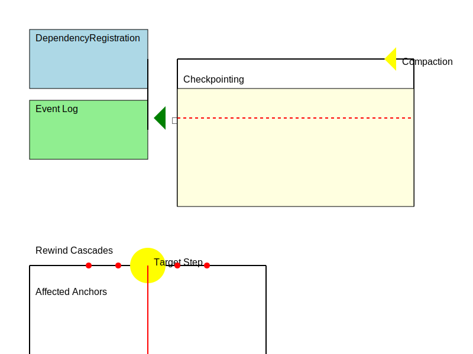
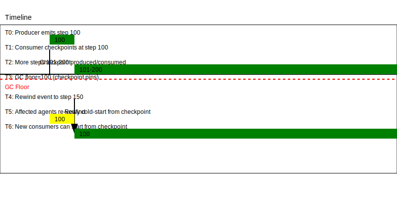

# RFC 0004 — Multi-Agent State Dependency (registration, GC, rewind)

- **Status:** Draft
- **Created:** 2026-06-12
- **Track:** Protocol
- **Alias:** referred to as **"RFC 0005"** in the 2026-06-12 owner design
  sessions (numbered 0004 here: next in the series). External notes citing
  "RFC 0005" mean this document.

## Abstract

This RFC defines the **state-dependency layer** of HCP: how a consumer agent
durably registers a causal dependency on a producer agent's step output, and
the three **non-optional invariants** that make a multi-agent cluster's history
safe to compact, its topology safe to run, and its restarts safe to trust:

1. **Log GC is dependency-aware** — no agent may truncate producer history
   still referenced by any downstream consumer checkpoint (§4).
2. **State-consumption topology is a DAG per topology epoch** — enforced
   before runtime by the compiler, over typed edges (§5).
3. **Cold start verifies dependency freshness before RUNNING** — an agent
   pauses on stale anchors instead of sprinting into corrupt history (§6).

Every dependency artifact carries the **topology epoch** that authorized it
(§7), so "was this dependency legal under the topology that created it?" stays
answerable forever. These are invariants of the protocol, not implementation
notes: a conforming runtime MUST enforce all three.

The compiler counterpart is
[`docs/language/0013-mlir-topology-compilation.md`](../../docs/language/0013-mlir-topology-compilation.md)
(the `hcp` dialect lowers `vaked.consume` to the frames defined here); the
durable substrate is `eventd`
([design](../../docs/superpowers/specs/2026-06-12-eventd-design.md), the
hash-chained per-runtime log) and the content-addressed arena. Lifecycle
transitions are owned by `agent-supervisord`
([runtime roster](../../docs/runtime/README.md)).

## Terminology

| Term | Definition |
|------|------------|
| Producer / consumer | The agent whose step output is read / the agent reading it. One agent may be both, for different edges. |
| Step / `StepId` | One entry in an agent's hash-chained event log (`eventd` seq). |
| `StepHash` | The eventd entry hash of a step — the cryptographic anchor a dependency pins. |
| Dependency anchor | The `(producer, producer_step, producer_step_hash)` triple a consumer's state is built on. |
| `DependencyRegistration` | The write-ahead control frame declaring an anchor **before** consumption (§3). |
| `ConsumerCheckpoint` | A consumer's durable acknowledgement of how far its dependency on a producer has been folded into its own committed state (§4). |
| GC floor (`producer_gc_floor`) | The lowest producer step still pinned by any downstream checkpoint; compaction is legal only strictly below it (§4). |
| Topology epoch | A monotonically increasing version of the state-dependency graph; bumped on any change to it (§7). |
| `RewindEvent` | The event frame announcing that a producer's canonical history was rewound past anchors consumers may hold (§3.3). |
| `stale_dependency` | The paused lifecycle state entered when a cold-start anchor check fails (§6). |
| Edge kind | The typed class of a graph edge: `state_dependency`, `observation`, `control_signal`, `metrics` (§5). |

Terms shared with the overview live in
[`docs/protocol/README.md`](../../docs/protocol/README.md); both tables are
kept aligned.

## 1. Dependency model

Agent B consuming agent A's step-N output creates a **causal anchor**: B's
downstream state is only meaningful while A's step N remains part of A's
canonical history. Three artifacts manage that anchor's lifecycle:

```text
DependencyRegistration   (write-ahead: BEFORE consumption — §3)
        │ pins (producer, step, hash, epoch)
        ▼
ConsumerCheckpoint       (after fold: "I committed past it" — §4)
        │ releases history below min_required_step
        ▼
producer_gc_floor        (compaction boundary — §4)

RewindEvent              (exception path: the anchor itself moved — §3.3)
```

All three are events on the hash-chained `eventd` log, so the dependency
record is itself tamper-evident and replayable.

## 2. Frames (`.hcplang`)

Normative shapes, in the RFC-0002 schema language. Header fields
(kind/corr/stream/seq/end) are implicit; tags begin at `@1`.

```hcplang
schema hcp.statedep {
  version = "0.1.0"

  /// Why a supervisor refused the RUNNING transition (§6).
  record StaleDependency {
    producer:        uuid    @1   # producer AgentId
    expected_step:   u64     @2
    expected_hash:   hash    @3
    observed_tip:    u64?    @4   # producer's canonical tip, if reachable
    topology_epoch:  u64     @5
  }

  /// Write-ahead declaration of a causal anchor. MUST be durably logged
  /// (eventd) before the consumer reads the producer's step output (§3).
  frame DependencyRegistration control {
    consumer:           uuid  @1
    producer:           uuid  @2
    consumer_step:      u64   @3   # consumer step that will consume it
    producer_step:      u64   @4
    producer_step_hash: hash  @5
    topology_epoch:     u64   @6   # the epoch that authorized this edge (§7)
  }

  /// Durable acknowledgement: the consumer's committed state has folded the
  /// producer dependency up to consumer_checkpoint_step (§4).
  frame ConsumerCheckpoint control {
    consumer_agent:           uuid       @1
    producer_agent:           uuid       @2
    min_required_step:        u64        @3   # lowest producer step still needed
    consumer_checkpoint_step: u64        @4
    topology_epoch:           u64        @5
    last_heartbeat_at:        timestamp  @6   # liveness lease (candled — §4.2)
  }

  /// A producer's canonical history was rewound to rewind_to_step; anchors
  /// above it are void. Consumers MUST re-verify (§3.3).
  frame RewindEvent event {
    producer:        uuid  @1
    rewind_to_step:  u64   @2
    rewind_to_hash:  hash  @3
    topology_epoch:  u64   @4
  }
}
```



## 3. Write-ahead discipline

### 3.1 Registration precedes consumption

A consumer MUST durably log `DependencyRegistration` **before** fetching or
folding the producer's step output. The compiler makes this structural rather
than manual: the `hcp` dialect's lowering of `vaked.consume`
(0013 Pass 2) injects `create_registration_token → write_ahead_log →
fetch_canonical_data` — hand-written registration is a conformance smell.

### 3.2 Verification on registration

The registration's `producer_step_hash` MUST be checked against the producer's
canonical chain (or a retained accumulator, §4.1-2) at registration time. A
mismatch is a protocol error, not a warning.

### 3.3 Rewind

When a producer's history is rewound (Track-D control), it MUST emit
`RewindEvent` before serving any post-rewind step. Consumers holding anchors
above `rewind_to_step` MUST treat them as void and re-enter dependency
verification (§6) — running state built on a voided anchor is the precise
failure this RFC exists to prevent.

### 3.3.1 RewindEvent scope & cascade semantics (provisional)

When a producer P rewinds to step R, the scope of affected anchors is **all
downstream consumers C that hold a DependencyRegistration on P for any step >
R**. RewindEvent is emitted to `eventd` and broadcast (via NATS pub/sub, RFC
0006 §3, or via Litany Wire if the discovery mechanism prefers point-to-point
unicast to each subscriber — TBD in RFC 0006). Consumers handle the event as
follows:

- **Immediate effect:** Any outstanding `ConsumerCheckpoint` for P that
  references `producer_step > rewind_to_step` is **invalidated immediately**.
  The consumer MUST NOT use such a checkpoint to justify further compaction of
  P's history.
- **Cold-start re-entry:** On next cold-start (agent restart or state
  verification cycle), the consumer runs §6 verification and discovers the stale
  anchor via the `ConsumerCheckpoint` check (§6, step 3): if the anchored step
  hash is no longer in P's canonical history (it was rewound away), the check
  fails and the consumer pauses in `stale_dependency`.
- **Cascade rule (discovery-based, NOT broadcast-based):** If consumer C depends on
  producer P, and C's output is depended on by consumer D, is D affected by P's
  rewind? **Working decision:** D is **not** directly paused by P's rewind.
  Instead, D discovers the problem transitively:
  
  1. P rewinds → C's anchor becomes stale
  2. C runs cold-start or scheduled verification → detects stale anchor → pauses
  3. D runs next verification → detects that C is paused or C's checkpoint is stale
     (via `ConsumerCheckpoint` check in RFC 0004 §6) → D pauses (`stale_dependency`)
  
  **Safety argument:** This is safe because:
  - Cold-start (§6) is **mandatory** on restart, so C will eventually pause.
  - D's verification (§4.2.1) runs periodically, so D will eventually detect C's pause.
  - The chain is verified end-to-end: if C's checkpoint anchors to P's rewind point,
    and that point is now stale in P's eventd, D's verification detects it.
  - No missed notifications: if D misses NATS notification of P's rewind, it still
    discovers via C's pause state (observable in eventd or C's agent state).
  
  **Rationale:** Avoids cascading pause broadcasts across potentially unrelated
  dependency trees; cost is bounded discovery latency (max one verification cycle).

### 3.3.2 RewindEvent acknowledgement (provisional)

**Working decision:** RewindEvent is **fire-and-forget** (no acknowledgment).
A consumer receiving RewindEvent notification (via NATS) schedules a verification
run at its next cycle. However, if the notification is lost (broker unavailable,
subscription not yet open), the consumer **MUST** discover the stale anchor
via cold-start verification (mandatory) and scheduled verification cycles.

Discovery is guaranteed by:
- **Cold-start verification (mandatory):** On agent restart, cold-start (§6) checks all anchors against producer's current eventd state. Stale anchors are detected immediately.
- **Scheduled verification cycle:** RFC 0004 §4.2.1 requires periodic verification (default ~1000 steps). On each cycle, consumers verify their anchors.
- **Bounded discovery delay:** Maximum bounded delay = max(restart latency, verification interval, ~1000 steps).

This is simpler than two-phase rewind with acknowledgment, and it is safe because
the **eventd chain is authoritative**, not the notification layer. Notifications
are best-effort optimization; cold-start and scheduled verification are the
fail-safe mechanisms.

## 4. Invariant I — dependency-aware log GC

> No agent may truncate producer history that is still referenced by any
> downstream consumer checkpoint.

### 4.1 The GC floor

```text
producer_gc_floor =
  min( all downstream consumers'
       acknowledged min_required_step[producer_agent_id] )
```

A producer may compact or truncate log entries **strictly below**
`producer_gc_floor`, and only when all three hold:

1. **Checkpointed past.** Every registered downstream consumer has
   checkpointed beyond the referenced `producer_step`.
2. **Proof retained.** The `producer_step_hash` of every surviving anchor
   remains verifiable: included in a retained snapshot, a Merkle accumulator,
   or the canonical segment footer (retained artifacts are relics —
   `reliquaryd`). Compaction MUST preserve the cryptographic proof chain for
   surviving anchors — no "cryptographic hostage evicted from disk."
3. **Epoch auditable.** The topology epoch that created the dependency edge
   is still available for audit (§7).

### 4.2 Dead consumers & checkpoint liveness

A consumer that stops checkpointing pins the floor forever — a denial-of-
compaction hazard. `last_heartbeat_at` (fed by `candled` liveness) is the
lease: a consumer silent past the configured lease window MAY be evicted from
the floor computation **only** by an explicit, logged operator/supervisor
action — never silently. Eviction voids that consumer's anchors; if it
returns, cold-start verification (§6) pauses it as `stale_dependency` rather
than letting it run on history that no longer exists.

### 4.2.1 Checkpoint emission trigger policy (provisional)

**Working decision:** A producer SHOULD emit a `ConsumerCheckpoint` (or trigger
the consumer to emit one) under **both** periodic and on-demand conditions:

- **Periodic (default 1000 steps):** Every N steps of producer work, the producer
  or consumer (whichever is policy-assigned) emits a checkpoint. Default N = 1000
  is a provisional tuning constant; it balances GC floor granularity (higher N
  means coarser pinning, more history kept) with checkpoint overhead (lower N
  means more frames logged). Producers with high step rates (streaming) may use
  N = 10,000; low-rate consumers may use N = 100. The constant is per-dependency
  (or per-consumer), not global.
- **On-demand:** An operator, application, or `agent-supervisord` policy may
  request an immediate checkpoint (e.g., before a scheduled GC or before
  operator intervention). This is a `ConsumerCheckpoint` frame sent immediately
  with the consumer's current committed state.

**Default-if-absent (requires operator approval):** If a producer reaches 10× the
periodic threshold without receiving a checkpoint (consumer never caught up), it
issues a **backpressure warning to eventd** and MUST await explicit operator
action before dropping history. The operator may:

1. **Issue `ConsumerCheckpointEvicted` command** — explicitly evicts the silent
   consumer from the GC floor computation (logged to eventd), allowing the
   producer to compact. This is the safe path.
2. **Inspect the silent consumer** — via `oraclefd` or debugging, determine if
   the consumer is actually dead and should be evicted or restarted.

The producer MUST NOT silently drop history to break the backpressure deadlock.
This prevents data loss and preserves audit trail of evictions. The operator is
responsible for deciding whether the consumer is dead or merely slow.

### 4.2.2 Checkpoint lease duration & eviction (provisional)

**Working decision:** A consumer's checkpoint is considered **active** (holds the
GC floor) if its `last_heartbeat_at` is within the **lease window**. Default
lease window: **24 hours**. After 24 hours of silence (no new checkpoint, no
heartbeat), a `ConsumerCheckpoint` MAY be evicted from the GC floor
computation. Eviction is **not automatic** — it is triggered by:

- An operator command (logged as a `ConsumerCheckpointEvicted` event in `eventd`).
- An automated supervisor policy (e.g., `agent-supervisord` marks dead agents as
  `stale_dependency` on restart, which voids their checkpoints).
- **Never silently.** The eviction is an explicit, audited action so operators
  can see who lost the right to pin history.

After eviction, if the consumer later restarts:
1. Its old checkpoint is no longer pinning the floor, so P may have compacted
   history below the old anchor.
2. Cold-start verification (§6) checks the anchored step hash against P's
   canonical tip — it will not be found (compacted away).
3. Verification fails → consumer is paused `stale_dependency` (§6, case 4).
4. Operator must re-anchor the consumer (e.g., via an explicit
   `ConsumerCheckpoint` at a new, valid step) before the consumer can resume.

**Lease duration is tunable:** The 24-hour default is provisional. Deployments
may adjust via `agent-supervisord` policy (shorter for aggressive GC, longer for
conservative anchoring). The constant is global, not per-edge.

## 5. Checkpoint & rewind worked example



A producer P evolves from step 100 to step 120, with a downstream consumer C anchored
at step 95 (which C has already folded into its committed state). The sequence shows:

```text
Producer P                          Consumer C                  eventd (chain)
──────────                          ──────────                  ──────────
step: 100
  [step 95 hash in history] ✓
                                  DependencyRegistration ──→  DependencyRegistration
                                  {consumer: C, producer: P,   (write-ahead before
                                   producer_step: 95}          consumption)
                                  [C reads step 95 output]
                                  [C folds into state]

[C has now consumed P-95]

                                  ConsumerCheckpoint ────→    ConsumerCheckpoint
                                  {min_required_step: 95,      (C committed past 95)
                                   consumer_checkpoint_step: 200}
[P advances]
step: 101, 102, ..., 120

[P decides to compact]
[P computes GC floor = min(all downstream checkpoints)]
[GC floor ≥ 95 (from C), so P may truncate history < 95]
[GC floor < 95 would mean P cannot compact]

[Later: operator or supervisor decides to rewind P to step 50]
                              
RewindControl requested ────→  [applied by supervisor]
{producer: P, rewind_to_step: 50, topology_epoch: N}

RewindEvent emitted ────────→  RewindEvent
{producer: P, rewind_to_step: 50, {producer: P,
 rewind_to_hash: H(50),          rewind_to_step: 50,
 topology_epoch: N}              rewind_to_hash: H(50),
                                 topology_epoch: N}
                                 [NATS pub: agent.P.rewind]

[P is now at step 50; history 51-120 is gone]
[C's checkpoint {min_required_step: 95} is now stale
 (95 > 50: it's above the rewind point)]

[C receives RewindEvent notification (async, via NATS)]
                                  [C schedules state verification]
                                  [On next verification cycle,
                                   C reads its checkpoint
                                   {min_required_step: 95}]
                                  [C tries to fetch P's step 95]
                                  [Step 95 does not exist
                                   (compacted/rewound away)]
                                  [Verification fails]
                                  [C pauses: stale_dependency]
                                  [C waits for operator action
                                   or re-anchoring]

[Operator manually re-anchors C to step 50 (P's new tip)]

ConsumerCheckpoint update ─→     ConsumerCheckpoint update
{min_required_step: 50,          {min_required_step: 50,
 consumer_checkpoint_step: 300}  consumer_checkpoint_step: 300}

[C resumes from paused state]
```

**Key insights:**
- Write-ahead logging (DependencyRegistration before consumption) ensures recovery is auditable.
- GC floor computation prevents compaction from orphaning live anchors.
- RewindEvent is published via NATS (best-effort notification).
- Consumer discovers stale anchor via cold-start verification, not by trusting the notification.
- No automatic recovery; operator/supervisor must explicitly re-anchor or clear the pause.

### 4.3 Garbage collection floor computation & pinning algorithm

The GC floor is computed dynamically at compaction time from the set of all active
checkpoints. The algorithm is:

```
Algorithm: compute_gc_floor(producer_uuid)

1. Fetch ConsumerCheckpoint entries from eventd for this producer
   (use pagination if > 1000 checkpoints to avoid OOM; window size tunable)
   that are:
   - Within the active lease window (last_heartbeat_at > now - 24h)
   - Not marked as evicted
   
2. For each page of checkpoints:
   - Extract min_required_step from each checkpoint
   - Track the minimum across all pages
   
3. GC_floor = minimum(all extracted steps across all pages)

4. Producer may compact/truncate log entries strictly below GC_floor

5. Retain proofs for all steps >= GC_floor (in snapshot, accumulator, or footer)
```

**Implementation notes:**
- **Pagination:** For deployments with many downstream consumers (>1000), split
  the fetch into pages to avoid loading all checkpoints into memory at once.
  Configuration (from producer config or agent-supervisord policy):
  - **Default page size:** 100 checkpoints per page (tunable)
  - **Threshold:** Pagination triggered when active checkpoints > 1000
  - **Source:** Configured per-producer or per-supervisor via agent-supervisord config
  - **Maintain a running minimum** across all pages to compute GC floor
- **Staleness:** The set of active checkpoints may change during the fetch
  (new consumers anchor, old ones checkpoint deeper, leases expire). The GC
  floor computed is a **snapshot** valid at computation time; it is safe to
  use for compaction even if checkpoints change afterward (the floor only
  gets higher/more conservative as checkpoints advance or expire).
- **Frequency:** Compaction should be infrequent (e.g., daily) to reduce
  recomputation overhead and allow checkpoint batching. A producer typically
  computes the floor once and compacts a range, then waits before recomputing.

---

## 5. Invariant II — the state-dependency subgraph is a DAG

> Dependency edges used for **state consumption** MUST form a DAG per
> topology epoch.

Not all edges are equal; the graph carries **edge kinds**:

| Edge kind | Cycles |
|-----------|--------|
| `state_dependency` | **forbidden** — the subgraph MUST be acyclic |
| `observation` | allowed (metrics, surfaces, chat) |
| `control_signal` | allowed with guardrails (supervision is inherently cyclic: supervise ↓ / signal ↑) |
| `metrics` | allowed |

The hard rule:

```text
subgraph(edge.kind == state_dependency) MUST be acyclic   (per topology epoch)
```

Enforcement is **before runtime** — the compiler pass
`VerifyStateDependencyDAG` (0013 Pass 1) takes the agent graph + dependency
registration edges + epoch and rejects the build on a cycle. The Stage-0 form
already ships in `vakedc`: a `workflow`'s step edges are `state_dependency`
edges and are rejected cyclic (`E-WORKFLOW-CYCLE`,
[0015](../../docs/language/0015-workflow.md)); mesh delegation edges are an
authority axis (attenuation-checked, not state-consuming); surface `input`
edges are `observation`. This section generalizes that split to all runtime
dependency edges, so feedback loops stay possible without ever becoming
state-consumption deadlock.

### 5.1 Cycle detection & prevention (provisional)

At compile time, the `VerifyStateDependencyDAG` pass performs a topological sort
of the state-dependency subgraph:

```
Algorithm: verify_state_dependency_dag(agent_graph, epoch)

1. Build subgraph G = {agents, state_dependency edges}
   (exclude observation, control_signal, metrics edges)

2. Perform topological sort (Kahn's algorithm or DFS-based)
   - Mark all nodes unvisited
   - For each node with in_degree == 0:
     - Perform DFS; mark visited
     - If back edge detected (node visits itself): CYCLE FOUND
   
3. If cycle found:
   - Extract cycle path: A → B → C → A
   - Report compile error (E-CYCLE-DETECTED)
   - Suggest remediation: change one edge to observation or control_signal
   
4. If no cycle: pass; emit augmented AST with topology_epoch
```

**Runtime safeguard:** At registration time (RFC 0004 §3.1), even though the
compiler has already verified the build-time graph, a runtime check may verify
that the registering edge does not close a loop:

```
Algorithm: verify_registration_acyclic(consumer, producer, current_edges)

1. Hypothetically add edge: consumer → producer
2. Check if producer can reach consumer via existing edges
   (depth-limited BFS; limit = num_agents)
3. If reachable: REJECT registration (would create cycle)
4. Else: ACCEPT (registration proceeds)
```

This second check is conservative (allows the already-verified build graph) but
catches any dynamic topology changes that might have slipped past the compiler.

## 6. Invariant III — cold start verifies before RUNNING

> An agent cannot transition to RUNNING until its direct dependency anchors
> are validated against the last committed dependency state.

Boot sequence (transitions owned by `agent-supervisord`):

```text
STOPPED -> BOOT_SCANNING -> DEPENDENCY_VERIFYING -> RUNNING
                                       └----------> PAUSED(stale_dependency)
```

The verification scan is **read-only and cheap** — for each direct producer
dependency:

1. read the last committed `ConsumerCheckpoint`;
2. read the producer's canonical tip / retained accumulator;
3. verify the anchored `producer_step_hash` is present and canonical;
4. missing / stale / divergent / unresolved ⇒ `PAUSED(stale_dependency)`
   with the `StaleDependency` record (§2) as the pause reason;
5. otherwise ⇒ RUNNING.

A paused agent resumes only through explicit recovery (re-anchor, rewind
fold, or operator action) — never by timeout. This closes the "cluster wakes
up and sprints into corrupt history" failure mode.

### 6.1 Cold-start verification algorithm (provisional)

**For each direct producer dependency:**

```
Algorithm: verify_anchor(consumer, producer_uuid, anchored_step_hash, topology_epoch)

1. Fetch ConsumerCheckpoint for this (producer, consumer) pair
   from consumer's durable log (eventd)
   if not found: PAUSED(stale_dependency) — never checkpointed
   
2. Extract min_required_step from checkpoint

3. Fetch producer's canonical tip
   via oraclefd or direct eventd query
   if producer unreachable: PAUSED(stale_dependency) — producer down
   
4. Verify topology_epoch is current
   if epoch < current_epoch: PAUSED(stale_dependency) — stale graph
   
5. Verify anchored_step_hash exists in producer's history
   check retained proofs (snapshot, accumulator, segment footer)
   OR scan producer's eventd up to min_required_step
   if hash not found: PAUSED(stale_dependency) — anchor lost to compaction
   if hash found but divergent (collision): PAUSED(stale_dependency) — fork
   
6. Return: VERIFIED

Aggregate result:
  if ANY dependency fails → consumer enters PAUSED(stale_dependency)
  if ALL dependencies verify → consumer enters RUNNING
```

**Rationale:** Verification is idempotent and discovery-based (consumer
learns the truth from the producer's log, not from implicit state). Failed
verification is not an error; it's a safe, auditable pause that operator
must explicitly resolve. The cost is verification latency on restart (O(n)
dependencies, O(1) per dependency if proofs are cached); the safety gain is
that a consumer never sprints into corrupt state.

## 7. Topology epochs

Every dependency artifact (`DependencyRegistration`, `ConsumerCheckpoint`,
`RewindEvent`, `StaleDependency`) carries the **topology epoch** that
authorized the edge. The epoch is bumped on **any change to the
state-dependency subgraph** (agent added/removed, edge added/removed/rekinded)
and the authorizing graph for each epoch is retained (an arena-anchored
artifact referenced from the eventd log), so the audit question — *"was this
dependency legal under the topology that existed when it was created?"* —
remains answerable after arbitrary graph evolution. Cross-epoch anchors are
not implicitly valid: a consumer resuming under a newer epoch re-verifies (§6)
against the edge set of the **current** epoch.

### 7.1 Epoch synchronization (provisional)

**Working decision — Epoch is supervisor-assigned, never caller-asserted:**

- **Epoch management:** `agent-supervisord` owns the topology epoch counter.
  The epoch is **immutable per connection** — it is set at chapter open
  (`open` frame, RFC 0005 §2.1) and is valid for the lifetime of that chapter.
- **Epoch bumps:** The supervisor increments the epoch on any change to the
  state-dependency graph:
  - Agent added or removed
  - DependencyRegistration edge added
  - Edge kind changed (state_dependency ↔ observation, etc.)
  - Policy/authority changes affecting edge validity
  
  The bump is **logged to eventd before effect** (write-ahead discipline);
  the new epoch is then announced to all peers (via NATS pub/sub or direct
  notification).

- **Stale epoch handling:** A frame carrying a `topology_epoch` that is not
  the current epoch is **refused as `stale_epoch`** (control frames) or
  triggers verification against the old epoch's graph (state-dependency frames).
  The frame itself is not executed; the caller must re-send with the current
  epoch. This prevents a replayed or stale frame from creating a dependency
  under an invalidated topology.

- **Cross-node epoch synchronization:** In a multi-node fabric (RFC 0006),
  each node has its own `agent-supervisord` with an independent epoch
  counter. Epoch synchronization is **eventual** — nodes may diverge briefly
  when topology changes are announced. A remote consumer sending a dependency
  frame with an old epoch is refused; it retries with the latest epoch it
  learned (via gossip or oraclefd query). This is eventual consistency, not
  strong consistency.

---

## 8. Implementation order

| Order | Component | Why this position |
|-------|-----------|-------------------|
| 1 | `DependencyRegistration` WAL frame | core causal anchor |
| 2 | `RewindEvent` schema | recovery signal |
| 3 | `stale_dependency` supervisor pause state | prevent bad runtime transitions |
| 4 | O(1) dependency lookup index | makes rewind matching practical (AOT index, 0013 Pass 3) |
| 5 | DAG validation compiler pass | prevents cascading deadlock (Stage-0 shipped for `workflow`) |
| 6 | Dependency-aware GC floor | prevents history loss |
| 7 | Cold-start verifier | makes restart semantics safe |
| 8 | Zero-copy scan path (Cap'n-Proto-style layout) | optimize **after** correctness |

## Security considerations

- **Tamper evidence.** All three artifacts are eventd entries; a forged or
  reordered registration breaks the hash chain. Verification on boot is
  mandatory (eventd design: broken chain = hard error).
- **Authority.** Who may register a dependency on a producer, emit a rewind,
  or evict a dead consumer from the GC floor is a `preceptord` policy
  decision; none of these are open operations. Registration against a
  producer the consumer holds no capability for MUST be denied.
- **Denial of compaction.** A malicious or wedged consumer pinning
  `producer_gc_floor` is the resource-exhaustion vector; the §4.2 lease +
  explicit logged eviction is the mitigation. Eviction itself must be
  authorized (preceptord) and logged (eventd) — silent eviction would convert
  a liveness problem into an integrity problem.
- **Epoch forgery.** An artifact claiming a stale epoch to dodge current-graph
  validation MUST fail §6 re-verification; epochs are assigned by the
  supervision plane, never self-reported by agents.

## Open questions

- Lease duration for dead-consumer eviction (§4.2) — fixed, per-edge, or
  budget-derived (#28)?
- Proof retention representation (§4.1-2): Merkle accumulator vs canonical
  segment footers — decide with eventd's compaction design (its "rotation
  without breaking the chain" open question).
- Cross-node anchors: how `DependencyRegistration` rides Litany Wire between
  hosts, and where the SHM-arena graft boundary (#16) falls back to
  serialized payloads.
- The zero-copy scan path (order 8): vendor a Cap'n-Proto-style layout or
  reuse the arena's position-independent encoding (#16 open Q1)?
- Does `RewindEvent` need consumer acknowledgement (two-phase rewind), or is
  cold-start re-verification (§6) sufficient for all recovery paths?
