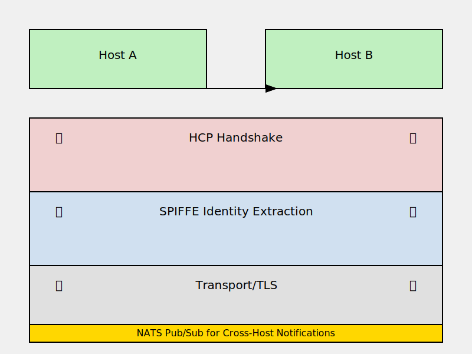

# RFC 0006 — Transport Identity & Distribution (the inter-host fabric)

- **Status:** Draft
- **Created:** 2026-06-13
- **Track:** Protocol

## Abstract

RFCs 0001–0003 define *what* an HCP message is and how its bytes are framed on
a single connection (Litany Wire). This RFC defines the **inter-host fabric** —
how frames and event notifications travel *between* hosts in a multi-node
agentfield: **who a peer is** (SPIFFE/SPIRE transport identity) and **how
broadcasts fan out** (NATS subject distribution). It composes RFCs 0004 (state
dependency) and 0005 (control), adding two layers beneath them and **changing
neither's source of truth**: the per-runtime hash-chained `eventd` log remains
the single authority; this fabric carries identity-proven point-to-point frames
and best-effort notifications + verifiable proofs, never a competing event
store. Triaged in [0016](../../docs/language/0016-substrate-candidates.md)
(slot, issue #52).

## Terminology

| Term | Definition |
|------|------------|
| Trust domain | A SPIFFE trust root scoping one fleet's identities (e.g. `spiffe://agentfield.example`). |
| SVID | A SPIFFE Verifiable Identity Document — the short-lived X.509 cert SPIRE issues to a workload. |
| SPIFFE ID | The identity URI inside an SVID, e.g. `spiffe://agentfield.example/runtime/agent-field/agent/coder`. |
| Workload API | The local SPIRE-agent socket a workload calls to fetch/rotate its SVID — no secrets on disk. |
| Subject | A NATS publish/subscribe address, e.g. `agent.<id>.rewind`; supports `*`/`>` wildcards. |
| Fabric | The combination of SPIFFE identity + NATS distribution defined here. |
| Notification | A best-effort fabric message announcing that something happened (its proof/truth lives elsewhere). |

Shared vocabulary lives in [`docs/protocol/README.md`](../../docs/protocol/README.md);
the dependency machinery is [RFC 0004](./0004-multi-agent-state-dependency.md),
control is [RFC 0005](./0005-control-frames.md), the wire is
[RFC 0003](./0003-litany-wire.md).

## 1. Transport identity (SPIFFE/SPIRE)

### 1.1 Every agent is a workload with an SVID

Each agent (and each daemon) obtains an SVID from a local SPIRE agent via the
Workload API — no long-lived key on disk, automatic rotation. The SPIFFE ID
encodes the agent's place in the topology:
`spiffe://<trust-domain>/runtime/<runtime>/agent/<name>`.

### 1.2 Identity is checked before the frame is parsed

A cross-host HCP connection is mutually authenticated with SVIDs. A
`DependencyRegistration` (RFC 0004 §2) arriving from consumer B to producer A's
host is **validated at the TLS layer before a byte of the frame is parsed**:
the peer's SPIFFE ID must match the `consumer` the frame claims. This is
defense in depth, **not** a replacement for `preceptord` authority (RFC 0005
security model) — preceptord still decides *what* the proven principal may do.
The `control_action.actor` field (RFC 0005 §3), taken on faith today, becomes
the verified SPIFFE ID.

### 1.3 SPIFFE ID is the canonical AgentId

This answers RFC 0005's open question — *"name→AgentId resolution is the
supervisor's roster (oraclefd surface)"*: the SPIFFE ID **is** the canonical
AgentId, and `oraclefd` resolves declared names ⇄ SPIFFE IDs. The RFC 0004
`uuid` agent identifiers are the local handle; the SPIFFE ID is the network
identity they bind to in a multi-host fleet.

### 1.4 Identity vs topology epoch

SVID rotation (lifetime, on the order of an hour) and topology epochs (RFC 0004
§7, bumped on graph change) are **orthogonal**: identity is per agent instance,
the epoch is per dependency graph. A frame carries both — its SVID proves the
sender, its `topology_epoch` fences which graph authorized the edge. Rotation
mid-epoch is normal and must not invalidate in-flight epoch-valid frames.

### 1.5 SPIFFE credential refresh & SVID rotation (provisional)

**Working decision — Automatic SVID rotation via Workload API:**

Each workload (agent, daemon) obtains an SVID from a local SPIRE agent via the
Workload API. SVIDs have a finite lifetime (typically 1 hour, but configurable
per SPIRE deployment). When an SVID is about to expire:

- **Rotation trigger:** The workload (Litany Wire implementation) monitors SVID
  expiry and proactively fetches a new SVID from the Workload API before the
  current one expires. No explicit operator action needed — rotation is automatic.

- **Connection impact:** When a Litany Wire connection is established, the
  current SVID is used for mTLS handshake (TLS layer, before frame parse). If
  the SVID expires mid-connection:
  - **On outbound:** A peer wishing to send a new frame fetches a fresh SVID
    and, if the current certificate is expiring within a window (e.g., < 5 min
    to expiry), closes the connection and reconnects with the new SVID.
  - **On inbound:** The peer's current SVID is already used for the connection;
    the connection is unaffected by the peer's internal rotation. No renegotiation
    happens mid-connection.

- **Chapter continuity:** A chapter (session, RFC 0003 §6.1) is scoped to a
  connection; if a connection closes due to SVID rotation, the chapter ends.
  Whether chapters can be resumed across a new connection is RFC 0003 §6.5
  (working decision: no resumption in v1).

- **Identity consistency:** A rotated SVID carries the same SPIFFE ID (same
  topology place, e.g. `spiffe://domain/runtime/rt/agent/coder`), so the
  identity is stable across rotations — peers on the other side see no change
  except a brief connection drop. Re-connection with the new SVID restores
  service. In a high-latency or flaky network, multiple rotations (each
  closing a connection) might occur; this is normal and safe.

### 1.6 Trust domain validation at handshake (provisional)

**Working decision — Trust domain verified at TLS layer, optional handshake exchange:**

The SPIFFE trust domain (the root of the identity URI, e.g. `spiffe://agentfield.example`)
is embedded in the SVID's X.509 certificate. The TLS handshake validates the
certificate; the SPIFFE ID (including the trust domain) is extracted from the
certificate and made available to the frame layer.

- **TLS-layer validation:** Before any Litany Wire frame is parsed (§1.2), the
  peer's SVID certificate is validated:
  - Certificate is signed by a trusted SPIRE server.
  - Certificate is not expired.
  - Subject Alt Name (SAN) contains the SPIFFE ID URI.

- **Frame-layer validation (MANDATORY, ordered after TLS completion):** Only after
  successful TLS peer validation, the responder processes the `HELLO` frame.
  The `HELLO` frame MUST carry the initiator's trust domain (extracted from TLS
  SAN certificate). The responder validates that the `HELLO` trust domain matches
  the TLS-authenticated SPIFFE ID trust domain; a mismatch is a frame-level error
  (`REFUSE{trust-domain-mismatch}`). This prevents downgrade attacks where an
  attacker could spoof a peer's trust domain in the `HELLO` (TLS completion is
  the ordering guarantee that prevents the race).
  
- **Authoritative identity chain:** TLS layer validates the certificate; frame
  layer validates the trust domain field in `HELLO` against the TLS peer
  identity. The `HELLO` trust domain is the **authoritative identity** for the
  frame layer (independent of TLS peer name).

- **Mismatched trust domain:** If a peer's `HELLO` trust domain does not match
  the TLS-authenticated SVID trust domain, the responder sends a frame-level
  `REFUSE{trust-domain-mismatch}` and closes the chapter. This is a frame-level
  error, not a transport-layer rejection, to ensure observability and audit
  trails. The connection may remain open for other chapters if policy permits.



### 2.1 Subject taxonomy

The subject token for an agent is its **`uuid` handle** (RFC 0004), **not** the
SPIFFE URI: NATS treats `.` as the subject-hierarchy separator and `*` as a
*single-token* wildcard, so a dotted `spiffe://…/agent/coder` ID would expand
into many tokens and defeat `agent.*.rewind`. The dot-free uuid is exactly one
token; the SPIFFE ID authenticates the connection (§1.2), the uuid keys the
subject.

| Subject | Carries | Pattern |
|---------|---------|---------|
| `agent.<uuid>.rewind` | a `RewindEvent` notification (RFC 0004 §3.3) | publish per rewind |
| `agent.<uuid>.step` | step-progress notifications (optional, for surfaces) | publish per step |

A supervisor subscribes `agent.*.rewind` — **wildcard interest gives
near-constant matching with no per-peer cluster bookkeeping**: a cross-host
consumer learns a producer rewound without polling the producer's log.

**The fabric carries events and proofs only — never privileged request/response.**
Control frames (RFC 0005) and `DependencyRegistration` (RFC 0004) are
identity-proven, acknowledged point-to-point frames: they ride mTLS Litany
connections (§1), *not* NATS. This is the §3 boundary made concrete in the
transport split — nothing that mutates state travels the best-effort fabric.

### 2.2 Retained accumulators over JetStream

RFC 0004 §4.1's retained proofs (snapshot / Merkle accumulator / segment
footer) are transported across hosts via JetStream KV / object store — so a
remote consumer can fetch the proof a producer's GC floor references without a
direct connection to the producer's `reliquaryd`.

### 2.3 Event propagation & control action distribution (provisional)

**Working decision — Litany Wire is control plane; NATS is fan-out:**

The distinction between **identity-proven point-to-point frames** (Litany Wire)
and **best-effort notifications** (NATS) is architectural:

- **Point-to-point (Litany Wire, RFC 0003):** `DependencyRegistration` (RFC 0004
  §3.1), `ConsumerCheckpoint` (RFC 0004 §4), `control_action` events (RFC 0005
  §3), and control-plane requests (RFC 0005 §1) are **acknowledged Litany Wire
  frames**. They carry identity (SPIFFE ID, mTLS), correlation ids, and are
  logged to the local `eventd` (single source of truth). These are never lost
  (Litany Wire guarantees delivery on a live connection) and never replayed
  incorrectly.

- **Best-effort notifications (NATS):** `RewindEvent` (RFC 0004 §3.3) is **also
  published to NATS** on the `agent.<producer-id>.rewind` topic. This is a
  **notification only** — the producer writes `RewindEvent` to its local eventd,
  and simultaneously publishes the notification. Downstream consumers subscribe
  `agent.*.rewind` and are notified asynchronously that a producer rewound;
  they do not act on the notification alone, but use it as a prompt to run their
  cold-start verification (RFC 0004 §6), which re-checks the eventd log and
  proofs.

**Rationale:** `RewindEvent` is broadcast (affects many consumers) and urgent
(consumers should re-verify quickly), so NATS fan-out is lower-latency than
waiting for each consumer to poll. But NATS is not authoritative (it may be
stale, lost, or duplicated), so a consumer that never receives the notification
is not corrupted — it learns of the rewind on next verification. This two-layer
design (Litany for mutation, NATS for notification) keeps NATS safe as a
secondary, non-critical channel.

**Control actions are not published to NATS.** The `control_action` event (RFC
0005 §3) is logged only to the executing runtime's eventd (write-ahead,
before effect); it is **not** replicated to other nodes via NATS. Cross-host
observers of a control action (e.g., a surface watching all control events) must
poll the executor's eventd or request the event via a Litany Wire query — not
via NATS.

### 2.4 RewindEvent propagation across hosts (provisional)

**Working decision — Producer initiates broadcast:**

When a producer's history is rewound (RFC 0005 `RewindControl` applied):

1. **Local write (durable):** The producer's `agent-supervisord` appends `RewindEvent` to
   its local eventd (write-ahead, before effect — RFC 0004 §3.1). This write is
   **durable** and **irrevocable**; the rewind is now part of the canonical history.

2. **NATS publish (conditional):** Only **after** the eventd write completes
   successfully, the supervisor publishes the `RewindEvent` to NATS subject
   `agent.<producer-uuid>.rewind`. The event is the same `RewindEvent` record
   (fields: producer, rewind_to_step, rewind_to_hash, topology_epoch).
   If NATS publish fails (broker unavailable, network partition), the producer
   logs the failure and **does not retry**; consumers will discover staleness
   via cold-start verification (below).
3. **Consumer subscription:** Any consumer holding a dependency on the producer
   subscribes `agent.<producer-uuid>.rewind` (or wildcard patterns).
   On receiving the notification, the consumer schedules a state-verification
   run (RFC 0004 §6) to check its own anchors **asynchronously** (not immediately).
4. **Re-verification (fail-safe):** The consumer's verification reads its own
   checkpoints and queries the producer's eventd/proofs. The verification
   discovers that the anchor step is stale (no longer in producer's history).
   If stale, the consumer pauses itself (`stale_dependency`) and waits for
   operator re-anchoring.

**Failure tolerance:** The producer does not wait for consumer acks. If a
consumer never receives the NATS notification (broker down, subscription not
yet open, network partitioned), it will discover the stale anchor **no later
than** its next scheduled verification (RFC 0004 §4.2.1) or on cold-start
(which always verifies, RFC 0004 §6). The NATS layer is **best-effort
notification only**; the eventd chain is the **source of truth**.


## 3. The boundary (normative)

> The fabric distributes **notifications and proofs only**. The per-runtime
> hash-chained `eventd` log is the single source of truth (RFC 0004
> single-writer).

Concretely: a node receiving an `agent.<id>.rewind` notification MUST NOT act
on the notification alone. It re-verifies against its own folded state
(`eventd state`, the cold-start verifier, RFC 0004 §6) and the fetched proof
(§2.2); the notification is only a *prompt to re-verify*, never evidence. A lost
or duplicated NATS message can therefore never corrupt state — at worst it
delays or redundantly triggers a re-verification that is idempotent. This is
what makes NATS safe to use here despite at-most/at-least-once delivery: it is
never load-bearing for correctness. Privileged effects (control, dependency
registration) never traverse the fabric at all — they are identity-proven,
acknowledged Litany frames (§2.1), so "act on a fabric message alone" cannot
arise for them.

## Security considerations

- **mTLS before parse** (§1.2) shrinks the attack surface: an unidentified peer
  never reaches the frame parser. Combined with preceptord authority, identity
  and authorization are separate gates (a stolen-then-rotated SVID closes
  fast; preceptord limits the blast radius in between).
- **Trust-domain boundary** is the fleet boundary; cross-domain federation
  (ZKP-proven rewinds across orgs, 0016) is explicitly out of scope here.
- **NATS subject authorization** maps onto the `mcp`/capability model: an
  agent may publish only `agent.<own-id>.*` and subscribe per its granted
  interest — a per-subject permission set issued with the SVID.
- **Notifications are not evidence** (§3): the fabric cannot be used to forge a
  rewind or a dependency state, because every consumer re-verifies against the
  tamper-evident log + proof. This is the single most important security
  property of the design.

## 4. Authority model across hosts (provisional)

**Working decision — Local per-host authority with SPIFFE identity:**

When a peer from host A (with SPIFFE ID `spiffe://domain/agent/X`) sends a frame
to host B (targeting an agent Y on host B), host B's `preceptord` evaluates
authority **locally per host** using the peer's SPIFFE ID and the target agent's
properties. The principal (X's SPIFFE identity) is verified at TLS time (§1.2)
and is then passed to `preceptord` for policy evaluation. Policies may reference:

- **SPIFFE attributes:** trust domain, org, agent name, role
- **Target:** agent Y's name, topology epoch
- **Action:** verb (pause, rewind, etc.) or capability (read eventd, fetch
  proofs)

**Example:** Policy on host B might be: "any agent in domain `spiffe://domain` may
pause an agent in the same domain," or "only `spiffe://domain/supervisor` may
rewind," or "cross-domain pause is denied by default."

**Per-host authority is final:** Each host enforces its own policy independently.
If host A's `preceptord` allows a control action but host B's `preceptord` denies it:

- **Action not performed on B:** The action (e.g., pause/rewind) is not applied to
  B's agents, and B's `preceptord` returns a `ControlRefusal{denied}` to the requester.
- **Divergent state is observable:** The producer (on host A) may rewind, creating a
  `RewindEvent` in A's eventd. Consumers on B read the `RewindEvent` via NATS or
  cold-start verification but are paused by B's policy (or lack thereof) — B's
  supervisor does not execute the rewind locally.
- **Consumers verify independently:** B's consumer verification (RFC 0004 §6) checks
  the producer's eventd hash chain; if the producer rewound (per A's eventd), the
  consumer's anchor may be stale. B's consumer pauses itself (`stale_dependency`)
  regardless of whether B's policy would have allowed the rewind locally.
- **This is safe:** The design relies on cryptographic verification of the eventd
  chain, not on policy consensus. Host divergence does not create security issues;
  it reflects organizational policy differences, which are observable in logs and
  agent states. Operators must synchronize policy if uniform enforcement is
  required (out of scope for this RFC; deployment concern).

**Future:** Cross-host authority consensus (two-phase commit, voting, ZKP proofs)
is a deployment-specific concern outside the scope of this RFC. Deployments that
need consistency may enforce it at policy authoring time (synchronized preceptord
configs) or via a policy oracle that responds to all hosts.

## 5. Worked example: cross-host DependencyRegistration

A consumer C on host A depends on producer P on host B. C registers the
dependency and folds P's output into its state.

```
Host A                                Host B
───────────────────────────────────────────────
Consumer C (SPIFFE ID:
  spiffe://domain/runtime/rtA/agent/C)

[C decides to consume P's step 100]

1. [C opens Litany connection to host B / oraclefd lookup]
   [oraclefd resolves P's hostname/IP]
   
2. [TLS handshake with P's host]
   [C's cert: spiffe://domain/runtime/rtA/agent/C]
   [P's host validates C's cert (trust domain match)]
   [Connection open; chapters may be created]
   
3. [C sends DependencyRegistration request (RFC 0004 §3)]
   DependencyRegistration {
     consumer: C_uuid,
     producer: P_uuid,
     producer_step: 100,
     producer_step_hash: <H(step-100)>,
     topology_epoch: 5
   }
   ────────────────────────────→
                               [P's host receives frame]
                               [preceptord checks: does C have
                                permission to consume P?]
                               if ALLOWED:
                                 [P's agent-supervisord logs
                                  DependencyRegistration to eventd]
                                 [Responds with ControlAck{applied:true}]
                               if DENIED:
                                 [Responds: ControlAck{applied:false,
                                  reason:authority_denied}]
   
   ←──────────────────────────
   ControlAck {
     applied: true,
     logged_seq: 9876
   }
   
4. [C fetches P's step 100 output]
   [If step 100 is retained (not compacted):
    C reads output, folds into state, emits ConsumerCheckpoint]
   
5. [Later: P rewinds to step 50 (via operator RewindControl on host B)]
   [P emits RewindEvent to eventd]
   [P publishes RewindEvent to NATS: agent.<P_uuid>.rewind]
   
6. [C subscribes to NATS agent.*.rewind (receives notifications)]
   [C receives RewindEvent notification]
   [C schedules state verification (RFC 0004 §6)]
   
7. [On next verification, C queries P's eventd (via host B connection)]
   [C verifies step 100 hash against P's current state]
   [Step 100 is no longer in history (compacted/rewound)]
   [C discovers stale anchor, pauses itself: stale_dependency]
   [C signals operator or awaits re-anchoring]
```

**Key points:**
- Identity is verified at TLS layer before any frame is parsed.
- DependencyRegistration is an identity-proven, acknowledged Litany Wire frame.
- Authority is checked by preceptord on the producer's host.
- RewindEvent notification arrives via NATS (best-effort; not authoritative).
- Consumer discovers stale anchor via verification, not by trusting the
  notification alone.
- If C and P are on different hosts, the mechanism is unchanged — only the
  transport and topology details differ. RFC 0006 assumes single-host RFCs
  0003–0005 and adds the multi-host layer.

## 6. NATS subscription management & cleanup (provisional)

Agents subscribe to NATS topics to receive notifications (e.g. `agent.*.rewind`
for RewindEvent broadcasts). Subscription lifecycle management:

- **Startup:** On `agent-supervisord` startup, the supervisor creates subscriptions
  for the agent: `agent.<self-uuid>.rewind` and optionally `agent.<self-uuid>.step`
  (if enabled for metrics). These are durable subscriptions (persisted in JetStream
  if available, so messages are not lost during broker outages).
  
- **Dependency registration:** When a consumer registers a dependency on a producer
  (RFC 0004 §3.1), the consumer may also subscribe `agent.<producer-uuid>.rewind`
  (per-producer topic) to be notified of that specific producer's rewind events.
  Alternatively, the consumer subscribes `agent.*.rewind` (wildcard) and filters
  locally on the producer UUID in the event body.
  
- **Cleanup on shutdown:** When an agent shuts down or a dependency is revoked,
  subscriptions are unsubscribed. For per-producer subscriptions, cleanup is
  explicit. For wildcard subscriptions, cleanup is implicit (the subscription
  survives the agent, but delivered messages to a dead consumer are lost).
  
- **Resource bounds:** A NATS broker has a finite number of subscription slots.
  Per-producer subscriptions (O(n) where n = number of producers) should be
  avoided if possible; wildcard subscriptions (O(1)) scale better for large
  dependency graphs. The tradeoff is per-producer specificity vs. global scalability.

---

## 7. Relic distribution across hosts via JetStream (provisional)

`reliquaryd` (RFC 0001) stores relics (retained proofs, snapshots, accumulators)
locally. In a multi-host fabric (RFC 0006), a remote consumer may need to fetch a
relic from a producer's host. Distribution is via NATS JetStream KV or Object Store:

- **Local relic storage:** Each host's `reliquaryd` stores relics in JetStream KV:
  - Key: `relic:<hash>` (e.g. `relic:sha256:abc123...`)
  - Value: the relic bytes (proof, snapshot, etc.)
  
- **Cross-host relic fetch:** A remote consumer that needs to verify a GC floor
  proof (RFC 0004 §4.1) fetches the relic by hash from the local JetStream KV.
  If the relic is not local, the consumer may trigger a fetch from the producer's
  host via:
  - Direct Litany Wire query to the producer's `reliquaryd` (if Litany connection
    is open).
  - Or, a background daemon replicates relics from producer hosts to a shared
    JetStream bucket (out of scope here; deployment-specific).
  
- **Relic lifecycle & retention:** A relic is retained as long as it is pinned by
  an active checkpoint (RFC 0004 §4.2). Once all checkpoints move past the relic's
  step, the relic MAY be deleted. Deletion is explicit (operator or daemon-driven),
  never automatic, to ensure audited retention.

---

## Open questions

1. **RFC 0003 integration**: is NATS a *Litany Wire transport* (frames tunnel
   over NATS) or a *parallel* notification plane beside point-to-point Litany
   connections? Lean: parallel — Litany for request/response identity-proven
   frames, NATS for event fan-out — but a unified "Litany-over-NATS" transport
   is worth evaluating.
2. **SPIRE deployment**: one SPIRE server per fleet with per-host agents
   (standard) vs nested trust domains per runtime.
3. **Subject taxonomy vs Votive Frame classes**: finalize the mapping
   (request/response ⇄ request-reply; event ⇄ subject; control ⇄ ?).
4. **CCN/NDN** (0016) is the further generalization — content-named anchors
   (`/agent/<id>/step/<hash>`) where a rewind invalidates the name in routing
   itself; revisit if the subject model outgrows point-to-point fan-out.
