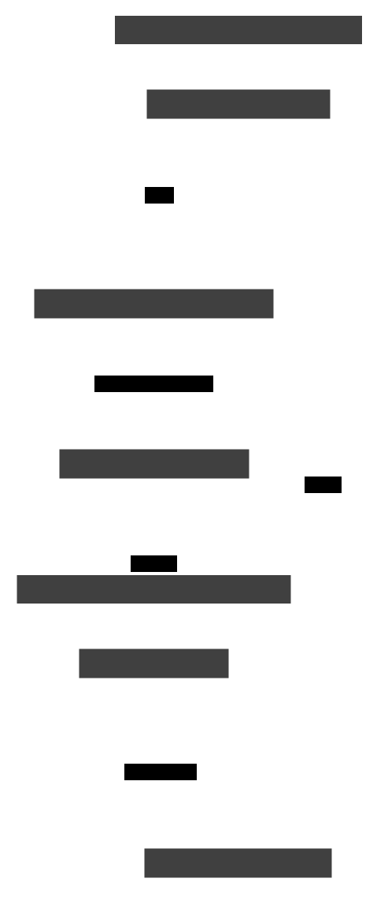

# RFC 0007 — Post-Quantum Litany & Sealed Image-as-Code Attestation

- **Status:** Draft / exploration
- **Created:** 2026-06-13
- **Track:** Protocol

## Abstract

RFCs 0001–0006 define *what* an HCP message is, how its bytes are framed
(Litany Wire), and how peers prove identity across hosts (SPIFFE/SPIRE). Two
properties were deliberately deferred: **confidentiality of the wire itself**
and **resistance to a quantum adversary**. RFC 0003 §14 states the wire *"adds
no crypto of its own"* and assumes a confidential substrate; RFC 0006 binds
identity to **classical** X.509 SVIDs. Both are vulnerable to *harvest-now,
decrypt-later* capture and to a future cryptographically-relevant quantum
computer.

This RFC proposes that Vaked be **encryption-baked-in** and **post-quantum by
default**, and that this discipline extend past the wire to the *materialized
image*. Three moves:

1. **The wire carries its own confidentiality and integrity** — a hybrid
   handshake (X25519 + ML-KEM-768) and an AEAD session, so a Votive Frame is
   sealed by construction rather than by trusting the substrate (§3).
2. **Identity and attestation are post-quantum** — SVIDs and votive seals are
   signed with ML-DSA (hybrid during migration), so a proven principal stays
   proven against a quantum forger (§4).
3. **Image-as-code** — every materialized image (NixOS closure, OCI image, or
   MirageOS unikernel) is a content-addressed artifact whose `provenance.json`
   is PQC-signed; the *only* way to change a running system is a code change
   that re-derives and re-signs the image. Sealed-image attestation supplies the
   evidence that "eBPF testifies" cannot give a unikernel, answering the open
   question in [0010](../../docs/language/0010-mirageos-unikernel-surface.md)
   (§5).

Post-quantum cryptography is treated as a **substrate candidate promoted to a
default**, in the spirit of [0016](../../docs/language/0016-substrate-candidates.md):
classical algorithms remain available only inside a **hybrid** construction, and
the design is crypto-agile so a primitive can be retired without a protocol
break (§6). Nothing here changes the source-of-truth: the per-runtime
hash-chained `eventd` log remains authoritative (RFC 0004); this RFC adds
confidentiality, post-quantum signatures, and image attestation *beneath and
around* it.

## Terminology

| Term | Definition |
|------|------------|
| PQC | Post-quantum cryptography — algorithms believed secure against a quantum adversary. |
| ML-KEM | Module-Lattice Key-Encapsulation Mechanism (FIPS 203, formerly Kyber). Used for key exchange. |
| ML-DSA | Module-Lattice Digital Signature Algorithm (FIPS 204, formerly Dilithium). Default signature. |
| SLH-DSA | Stateless Hash-based DSA (FIPS 205, SPHINCS+). Conservative signature for long-lived roots. |
| Hybrid | A construction combining a classical and a PQC primitive so the result is secure if *either* holds (e.g. X25519+ML-KEM, Ed25519+ML-DSA). |
| Harvest-now-decrypt-later | An adversary recording ciphertext today to decrypt once a quantum computer exists. |
| Sealed image | A materialized artifact (NixOS closure / OCI image / unikernel) that is deny-by-default by construction and addressed by content hash. |
| Image-as-code | The discipline that the only mutation path to a running system is a code change that re-derives and re-signs its image — no out-of-band mutation. |
| Votive seal | A PQC signature over a sealed image's measurement + provenance, recorded to `eventd`; the image's analogue of an SVID. |
| Attestation | Evidence that a measured image is the one its signed provenance describes, verifiable by `preceptord` and operator surfaces. |

Shared vocabulary lives in [`docs/protocol/README.md`](../../docs/protocol/README.md);
the wire is [RFC 0003](./0003-litany-wire.md), identity is
[RFC 0006](./0006-transport-identity-distribution.md), the dependency machinery
is [RFC 0004](./0004-multi-agent-state-dependency.md), and the materialization
pass is [0012 lowering](../../docs/language/0012-lowering.md).

## Design principles

1. **Encryption baked in.** Confidentiality and integrity are properties of the
   protocol and the image, not of the deployment substrate. The wire never
   relies on "assume a confidential substrate."
2. **Post-quantum by default; classical only inside hybrid.** A fresh deployment
   negotiates PQC. Classical primitives survive only as one half of a hybrid, so
   a break in either half is non-fatal during migration.
3. **Image-as-code.** A running system's state is a pure function of committed,
   signed code. There is no mutation path that is not a re-derivation — the
   strongest reading of "Vaked declares. Nix materializes."
4. **Crypto-agility.** Algorithms are named, versioned, and negotiated; retiring
   one is a parameter change recorded in `eventd`, never a wire rewrite.
5. **Deterministic & hermetic.** Signatures and measurements are taken over
   canonical encodings (`hcpbin`, content-addressed closures), so the same code
   yields the same measurement on any machine — a precondition for attestation.

## 1. Motivation & relationship to prior RFCs

Vaked's trust story has three layers, and each currently stops short of the
quantum threat model:

- **The wire (RFC 0003)** explicitly *"adds no crypto of its own"* (§14.1),
  deferring confidentiality to WireGuard / unix-socket permissions / vsock. That
  is sound against today's network attacker but offers nothing against
  harvest-now-decrypt-later, and the substrate's own crypto (WireGuard's
  Curve25519) is itself classical.
- **Identity (RFC 0006)** authenticates peers with SPIFFE SVIDs — X.509 certs
  signed with classical algorithms. A quantum forger that can sign as the SPIRE
  CA can mint a valid SVID for any agent.
- **The image** has no transport-independent integrity story at all. [0012](../../docs/language/0012-lowering.md)
  produces a content-addressed `provenance.json`, and [0010](../../docs/language/0010-mirageos-unikernel-surface.md)
  proposes sealed unikernels, but [0010 §"Open questions"] flags the gap directly:
  *"A unikernel has no host kernel to attach eBPF to. What replaces 'eBPF
  testifies' for a Mirage-materialized membrane — in-unikernel attestation?
  host-hypervisor evidence?"*

[0016](../../docs/language/0016-substrate-candidates.md) already lists ZKP /
post-quantum constructions as `reference` candidates "to revisit at a trigger."
The trigger is the combination of (a) long-lived audit logs (`eventd` is meant to
be permanent and tamper-evident — exactly the data an adversary harvests) and
(b) Vaked's ambition to be a *materialization* language, where the unit of
deployment is an image, not a process. This RFC promotes PQC from reference to
default and unifies the wire, identity, and image stories under one discipline.

## 2. Threat model

- **Harvest-now-decrypt-later.** A passive network adversary records Litany Wire
  traffic and `eventd` exports today and decrypts them once a CRQC exists. This
  is the dominant motivation: confidentiality must be *forward-secure against a
  future quantum computer*, which classical KEX cannot provide.
- **Quantum signature forgery.** An adversary with a CRQC forges ML-equivalent
  classical signatures — SVIDs (RFC 0006), control-action records (RFC 0005),
  and any image provenance signed classically.
- **Substrate compromise.** The "assume a confidential substrate" gap (RFC 0003
  §14.1): a compromised host, sidecar, or misconfigured tailnet exposes
  plaintext frames the wire chose not to protect.
- **Out-of-band image mutation.** An operator (or attacker with operator access)
  mutates a running system without a code change — `ssh` + hot-patch, a registry
  push, a manual `nixos-rebuild` from an unsigned closure. This breaks the
  provenance chain silently.

Out of scope: cross-organization federation (ZKP-proven rewinds across trust
domains — RFC 0006 §"Security considerations", 0016); side-channel resistance of
specific PQC implementations (an implementation concern, addressed by choosing
audited libraries).

## 3. Post-quantum wire layer (extends RFC 0003)

Litany Wire gains a confidentiality layer *below* the Votive Frame framing and
*above* the transport. It is mandatory for cross-host connections and negotiable
(but on by default) for local ones.

- **Hybrid key exchange.** The connection preamble (before the `HELLO` Votive
  Frame, ordered like RFC 0006 §1.6's TLS fence) performs a hybrid handshake:
  **X25519 + ML-KEM-768**. The session secret is the KDF of *both* shared
  secrets, so the channel is confidential if either primitive holds. This
  defeats harvest-now-decrypt-later: a recorded session cannot be decrypted
  without breaking ML-KEM.
- **AEAD session.** Frames are sealed with an AEAD (ChaCha20-Poly1305 or
  AES-256-GCM), keyed from the handshake. Integrity and confidentiality are now
  properties of the wire, so RFC 0003 §14.1's "assume a confidential substrate"
  becomes "defense in depth," not the only line.
- **Mutual transcript binding.** On a cross-host connection **both** peers sign
  the handshake transcript with their ML-DSA SVID key (§4): the responder proves
  its identity *and* the initiator proves possession of its SVID private key
  before the connection is accepted. This preserves RFC 0006 §1.2's "mutual SVID
  authentication before a byte of the frame is parsed" — a copied or observed
  SVID certificate without the matching private key cannot reach the
  `HELLO`/`preceptord` path as that principal — and binds both identities to the
  freshly negotiated channel, preventing downgrade and relay. (For a local
  single-peer connection the initiator signature MAY be omitted.)
- **Negotiation.** A `crypto_suite` field in the preamble names the KEM, AEAD,
  and signature algorithms with explicit versions. An initiator that offers only
  classical suites is refused on cross-host connections
  (`REFUSE{pq-required}`); the refusal is recorded to `eventd` (RFC 0006 §1.6).

This layer is orthogonal to *which* transport carries the bytes (TCP, vsock for
the sealed-unikernel boundary of [0010], or a Litany-over-NATS evaluation per
RFC 0006 §"Open questions"). The substrate may still add its own crypto; the
wire no longer *depends* on it.

## 4. Post-quantum identity & attestation (extends RFC 0006)

- **PQC SVIDs.** SPIRE issues SVIDs whose signatures are **hybrid Ed25519 +
  ML-DSA-65** during migration, **ML-DSA-65** once a deployment is PQC-only. The
  SPIFFE ID and rotation semantics (RFC 0006 §1.5) are unchanged; only the
  signature suite changes. The `control_action.actor` (RFC 0005 §3), already
  promoted to "the verified SPIFFE ID" by RFC 0006 §1.2, is now a
  quantum-resistant identity.
- **Long-lived roots use SLH-DSA.** The SPIRE trust-domain root — the key whose
  compromise is catastrophic and whose lifetime is years — is signed with
  **SLH-DSA** (hash-based, the most conservative assumption), even though
  per-agent SVIDs use the faster lattice ML-DSA.
- **Votive seals.** A *votive seal* is the image's analogue of an SVID: an
  ML-DSA signature over `{ closure_hash, provenance_hash, topology_epoch }`,
  recorded to `eventd`. Where an SVID answers "who is this peer," a votive seal
  answers "what image is this, and was it the one its code describes."
- **`preceptord` authority is unchanged.** Identity (now PQ) and authority stay
  separate gates (RFC 0006 §"Security considerations"): a PQC SVID proves *who*;
  `preceptord` still decides *what they may do*.

## 5. Image-as-code & sealed-image attestation

This is the novel contribution: extending the protocol's cryptographic
discipline to the *materialized artifact*, and supplying the evidence layer that
sealed unikernels lack.

**Image-as-code.** [0012 lowering](../../docs/language/0012-lowering.md) is
already pure, total, and hermetic: the same validated graph plus pinned inputs
yields byte-identical artifacts. RFC 0007 binds that property cryptographically:

- The lowering pass emits a `provenance.json` (0012 §6) over a **content-addressed
  closure** (NixOS store path, OCI digest, or unikernel image hash).
- That provenance is **PQC-signed** into a votive seal (§4) at materialization
  time.
- The deployment plane (`agent-supervisord`, `colmena`) admits an image **only
  if** its measured closure hash matches a votive seal whose signing key chains
  to the trust domain. An out-of-band mutation — hot-patch, manual rebuild from
  an unsigned closure, registry push — produces a measurement with no matching
  seal and is **refused**. The only path that produces a valid seal is a code
  change re-lowered through `vakedc`.

The result: a running system's state is a pure, signed function of committed
code. "Vaked declares. Nix materializes." becomes enforceable, not aspirational.

**Sealed-image attestation.** [0010](../../docs/language/0010-mirageos-unikernel-surface.md)
asks what testifies for a sealed unikernel that has no host kernel for eBPF. The
answer is attestation over the image measurement:

1. The host/hypervisor (the `vakedos` base host, or a mesh node) **measures** the
   sealed image as it loads it — the measurement is the content hash the
   votive seal already covers.
2. The image (or the hypervisor on its behalf) emits a **PQC attestation quote**:
   an ML-DSA signature over `{ measurement, nonce, topology_epoch }`.
3. The quote is **recorded to `eventd`** (write-ahead, before the image is
   admitted), so attestation becomes part of the tamper-evident history — the
   same shape as `control_action` (RFC 0005 §3).
4. `preceptord` and operator surfaces **verify** the quote and the measurement
   against the signed provenance, and admit or refuse the image.

For a Zig daemon on Linux, "eBPF testifies" and this attestation are
complementary (runtime evidence + load-time evidence). For a sealed unikernel,
attestation is the *replacement* for the missing eBPF testimony — closing the
0010 gap without abandoning the evidence principle.

## 6. Crypto-agility & migration

- **Named, versioned suites.** Every cryptographic choice (KEM, AEAD, SVID
  signature, votive-seal signature, attestation signature) is a named suite with
  an explicit version in the `crypto_suite` negotiation and in `provenance.json`.
- **Hybrid is the migration vehicle.** Deployments move classical → hybrid →
  PQC-only. A hybrid suite is secure if *either* half holds, so neither a
  classical break nor an early PQC weakness is fatal mid-migration.
- **Retirement is a recorded parameter change.** Dropping a primitive is a
  `crypto_suite` bump recorded to `eventd`, not a wire-format change. Old frames
  and old seals remain verifiable against their recorded suite for audit; new
  ones use the new suite.
- **Determinism preserved.** Suites are chosen so signatures and measurements
  stay deterministic over canonical encodings (`hcpbin`, content-addressed
  closures), keeping attestation reproducible.

## Security considerations

- **Forward secrecy against quantum capture (§3)** is the headline property: a
  recorded session is undecryptable without breaking ML-KEM, even if X25519
  later falls. This is what the "harvest-now-decrypt-later" adversary cannot
  defeat.
- **Hybrid degrades safely.** Because both KEX and signatures are hybrid during
  migration, a discovered weakness in *either* a classical or a PQC primitive
  does not by itself compromise the channel or an identity.
- **Attestation is evidence, not authority.** As in RFC 0006 §3, a votive seal or
  attestation quote is a *prompt to verify against the tamper-evident log*, never
  standalone proof of authorization — `preceptord` still gates effects, and a
  forged quote cannot survive `eventd` replay.
- **Image-as-code shrinks the operator attack surface.** With no valid
  out-of-band mutation path, a compromised operator credential cannot silently
  alter a running system; the change must appear as signed, reviewable code.
- **Root key conservatism.** SLH-DSA for the trust-domain root hedges against a
  structural break in lattice assumptions affecting per-agent ML-DSA keys.
- **Implementation risk.** PQC libraries are younger than classical ones; the
  hybrid construction is itself a mitigation, and suite-versioning lets a
  vulnerable implementation be retired without a protocol break.

## Open questions

1. **vsock & the sealed boundary.** For a [0010] unikernel reached over vsock
   (RFC 0003 §12.3), is the §3 wire layer redundant with a measured
   host↔guest boundary, or still required end-to-end? Lean: still required —
   the wire should not trust the boundary.
2. **Who measures.** In-unikernel self-measurement vs. hypervisor measurement
   vs. a TPM/TEE-backed quote — which is the v1 baseline for §5, and how does it
   bind to the `vakedos` host?
3. **SPIRE PQC support.** Does the chosen SPIRE deployment (RFC 0006 §"Open
   questions") issue ML-DSA SVIDs natively, or is a hybrid-cert shim needed?
4. **A `crypto`/`seal` capability domain.** Should suite selection and
   votive-seal authority be a first-class Vaked capability domain (POLA-attenuated
   like `mem`/`fs`), declared in the graph and lowered into the spine? This would
   make "encryption baked in" a *language* property, not just a protocol one —
   worth a separate language-track note before any grammar change.
5. **Next step (spike).** Take the §5 path for one membrane: lower a minimal
   `network` membrane to a content-addressed closure, PQC-sign its provenance,
   and verify a measured admit/refuse — mirroring 0010's "materialize one
   membrane both ways" spike, with the seal added.

---

*Cross-links:* wire [RFC 0003](./0003-litany-wire.md) · identity
[RFC 0006](./0006-transport-identity-distribution.md) · dependency/log
[RFC 0004](./0004-multi-agent-state-dependency.md) · control
[RFC 0005](./0005-control-frames.md) · sealed unikernels
[0010](../../docs/language/0010-mirageos-unikernel-surface.md) · lowering
[0012](../../docs/language/0012-lowering.md) · substrate triage
[0016](../../docs/language/0016-substrate-candidates.md) · runtime
[`docs/runtime/README.md`](../../docs/runtime/README.md).
